# Lecture 1. SQL Basics

*Assembled from `md_base/` (lessons 2–7 and 9) according to `course_curriculum.md`, section 1. PostgreSQL syntax.*

## Contents

- [0. Preliminaries: data types, CASE, aliases, code style](#0-preliminaries)
- [1.1 Filtering and sorting](#11-filtering-and-sorting)
- [1.2 Aggregate functions](#12-aggregate-functions)
- [1.3 Window functions](#13-window-functions)
- [1.4 Subqueries and CTE](#14-subqueries-and-cte)
- [1.5 Joins and unions](#15-joins-and-unions)
- [1.6 ACID and the execution plan](#16-acid-and-the-execution-plan)
- [Summary](#summary)

All examples run against the Rick & Morty demo schema: `characters`, `locations`, `episodes`, `char_ep`, `char_loc`.

---

## 0. Preliminaries

A short refresher on the vocabulary the rest of the lecture depends on.

### Data types

Most databases have four basic groups of types:

| Group | PostgreSQL types |
|---|---|
| Numeric | `SMALLINT`, `INTEGER`, `BIGINT`, `NUMERIC`/`DECIMAL`, `REAL`, `DOUBLE PRECISION` |
| Character | `CHAR`, `VARCHAR(n)`, `TEXT` |
| Date and time | `DATE`, `TIME`, `TIMESTAMP`, `TIMESTAMPTZ`, `INTERVAL` |
| Flag | `BOOLEAN` |

Plus additional types: arrays, `JSON`/`JSONB`, `UUID`, binary types, geodata.

Types matter because they:

- **ensure data integrity** — a numeric column will not accept string values;
- **optimize storage** — an integer takes less space than the same value as text;
- **optimize performance** — comparison and sorting are faster on numeric types than on character ones;
- **simplify working with data** — the schema becomes readable and self-documenting.

Types differ between DBMSs, so always check the documentation of the database you are working with.

### Operators and functions

A **function** is a subroutine that takes arguments, performs an operation and returns a result. Functions can be nested — the result of one becomes the argument of the next.

Numeric operators and functions:

| Operation | Operator | Examples |
|---|---|---|
| Addition | `+` | `3 + 2 → 5` · `3 + 2.0 → 5.0` |
| Subtraction | `-` | `3 - 2 → 1` |
| Multiplication | `*` | `3 * 2 → 6` |
| Division | `/` | `3 / 2 → 1` · `3 / 2.0 → 1.50` |
| Remainder | `%` | `3 % 2 → 1` |
| Exponentiation | `^` | `3 ^ 2 → 9` |
| Absolute value | `@` | `@ -3 → 3` |

| Purpose | Function | Examples |
|---|---|---|
| Remainder of division | `mod(numerator, denominator)` | `mod(5, 2) → 1` |
| Rounding | `round(number)` | `round(1.54) → 2` |
| Nearest larger integer | `ceil(number)` | `ceil(1.54) → 2` |
| Nearest smaller integer | `floor(number)` | `floor(1.54) → 1` |
| Exponentiation | `power(number, power)` | `power(3, 3) → 27` |
| Square root | `sqrt(number)` | `sqrt(1.5) → 1.22` |

> If you use only integers, the result is an integer. If one argument is fractional, the result is fractional too.

String functions:

| Purpose | Function | Examples |
|---|---|---|
| Concatenation | `concat(a, b, c)` | `concat('Valya had ', 2, ' oranges') → 'Valya had 2 oranges'` |
| String length | `length(string)` | `length('123') → 3` |
| Trimming spaces | `trim(string)` | `trim(' text ') → 'text'` |
| Substring search | `position(substring in string)` | `position('4' in '123') → 0` |
| Upper / lower case | `upper(text)`, `lower(text)` | `upper('text') → 'TEXT'` |

Date and time functions:

| Purpose | Function | Examples |
|---|---|---|
| Current date and time | `now()` | `now() → 2026-05-04 12:44:00` |
| Addition | `date + number` | `date '2001-09-28' + 7 → date '2001-10-05'` |
| Subtraction | `date - number` | `date '2001-09-28' - 7 → date '2001-09-21'` |
| Difference | `date - date` | `date '2001-10-01' - date '2001-09-28' → 3` |
| Part of a date | `extract(part from date)` | `extract(year from date '2001-10-01') → 2001` |

Boolean and comparison operators:

| Purpose | Operator | Examples |
|---|---|---|
| Logical NOT / AND / OR | `NOT`, `AND`, `OR` | `true AND false → false` |
| Comparison | `=`, `>`, `>=`, `<`, `<=`, `<>` | `7 > 5 → true` |
| Range | `BETWEEN` | `5 BETWEEN 3 AND 7 → true` |

**Operator precedence:** comparison operators are evaluated first, then `NOT`, then `AND`, and `OR` last.

### The CASE operator

`CASE` builds conditional expressions, much like `if-else` in a programming language:

```sql
CASE
     WHEN condition_1 THEN result_1
     WHEN condition_2 THEN result_2
     ...
     ELSE result_N
END
```

```sql
SELECT name,
       CASE WHEN dimension = 'Dimension C-137' THEN 'Earth'
            ELSE 'not Earth' END AS earth,
       type = 'Planet' AS is_planet,
       (type = 'Planet')::int AS is_planet_int
  FROM locations
 LIMIT 100;
```

| name | earth | is_planet | is_planet_int |
|---|---|---|---|
| Earth (C-137) | Earth | true | 1 |
| Abadango | not Earth | false | 0 |
| Citadel of Ricks | not Earth | false | 0 |

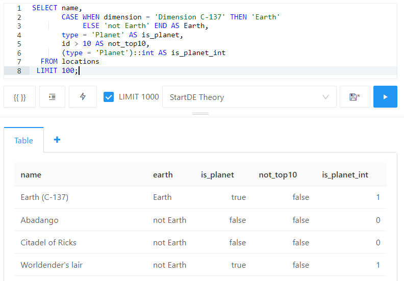

### Type conversion

Conversion can be **implicit** (the DBMS decides) or **explicit** (you decide), using `::` or `CAST`:

```sql
SELECT CAST('123' AS INTEGER) AS result_1,
       '123' :: INTEGER       AS result_2;
```

> 💡 "Explicit is better than implicit." Not all DBMSs share the same implicit-conversion rules, and implicit conversion can be slower.

### Aliases

`AS` gives a name to whatever an expression or function returns. Technically optional, but without aliases the readability of large queries suffers.

### Code style

- Keywords in capital letters (`SELECT`, `FROM`, `WHERE`, `ORDER BY`) — a convention, not a requirement, but a widely accepted one.
- Each clause starts on a new line.
- Align key elements — the "corridor" rule.
- Comment complex queries: `--` for a single line, `/* */` for several.

```sql
  SELECT *
    FROM locations
   WHERE type in ('TV', 'Fantasy town', 'Planet')
ORDER BY name LIMIT 10 OFFSET 10;
```

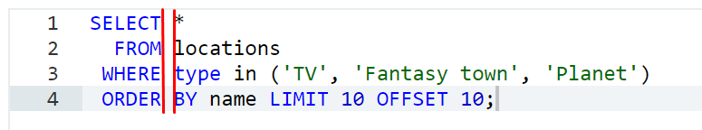

---

## 1.1 Filtering and sorting

### Filtering (WHERE)

Filtering selects rows by a condition, letting us concentrate only on the data we are interested in.

```sql
SELECT *              -- choose the fields
  FROM table          -- choose the table
 WHERE <condition>    -- the condition
```

The filter expression must return a boolean. Available tools:

- equality and inequality (`=`, `<>`);
- comparisons (`>`, `>=`, `<`, `<=`);
- `IN` — checks whether a value belongs to a list;
- `NOT` — inverts a condition (`NOT IN`, `NOT BETWEEN`, `NOT LIKE`, `IS NOT NULL`);
- `BETWEEN` — checks whether a value falls in a range.

Several conditions are combined with `AND` and `OR`; `AND` binds tighter than `OR`.

```sql
SELECT * FROM characters
 WHERE species = 'Human' AND status = 'Alive'
 LIMIT 10;
```

| id | name | status | species | gender |
|---|---|---|---|---|
| 1 | Rick Sanchez | Alive | Human | Male |
| 2 | Morty Smith | Alive | Human | Male |
| 3 | Summer Smith | Alive | Human | Female |

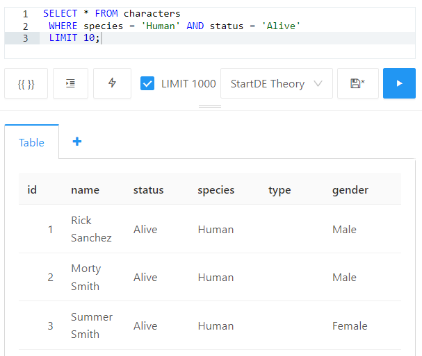

These two queries return the same result — all Sales employees, plus Marketing employees earning over 50000 — but the second one says so explicitly:

```sql
SELECT * FROM employees
 WHERE department = 'Sales' OR department = 'Marketing' AND salary > 50000;

SELECT * FROM employees
 WHERE department = 'Sales' OR (department = 'Marketing' AND salary > 50000);
```

Moving the parentheses changes the meaning — now both departments are filtered by salary:

```sql
SELECT * FROM employees
 WHERE (department = 'Sales' OR department = 'Marketing') AND salary > 50000;
```

> 💡 To avoid mistakes, set the precedence of logical operators explicitly with parentheses.

### Filtering text

**Equality / inequality:**

```sql
SELECT * FROM customers WHERE city = 'New York';
SELECT * FROM customers WHERE city != 'New York';
```

**`LIKE`** — search by pattern, where `%` replaces any number of characters (including zero) and `_` replaces exactly one:

```sql
SELECT * FROM customers WHERE name LIKE 'J%';            -- names starting with J
SELECT * FROM customers WHERE email LIKE '%@gmail.com';  -- gmail addresses
SELECT * FROM products  WHERE code LIKE 'A_1';           -- A, any one character, 1
```

**`ILIKE`** — the case-insensitive version (PostgreSQL):

```sql
SELECT * FROM customers WHERE name ILIKE 'j%';           -- j% or J%
```

**`IN`** — matches one of a list of values:

```sql
SELECT * FROM customers WHERE city IN ('New York', 'Los Angeles', 'Chicago');
```

**Text functions in the filter** — `LOWER()`, `UPPER()`, `TRIM()`, `SUBSTRING()`:

```sql
SELECT * FROM customers WHERE LOWER(name) = 'john doe';
SELECT * FROM courses   WHERE SUBSTRING(description, 1, 4) = 'Data';
SELECT * FROM customers WHERE TRIM(name) = 'John Doe';
```

Conditions combine freely:

```sql
SELECT * FROM customers
 WHERE (city = 'New York' OR city = 'Los Angeles')
   AND name LIKE 'J%'
   AND email LIKE '%@gmail.com';
```

### Filtering by a computed field

`WHERE` cannot see the aliases defined in `SELECT`, so the expression has to be repeated:

```sql
-- correct
SELECT product_id, price, discount, price * discount AS discounted_price
  FROM products
 WHERE price * discount > 3000;

-- error: the alias is not visible in WHERE
SELECT product_id, price, discount, price * discount AS discounted_price
  FROM products
 WHERE discounted_price > 3000;
```

> 💡 Do not use aliases for filtering by computed fields.

### Sorting (ORDER BY)

`ORDER BY` orders rows by one or more columns; `ASC` (the default) ascending, `DESC` descending.

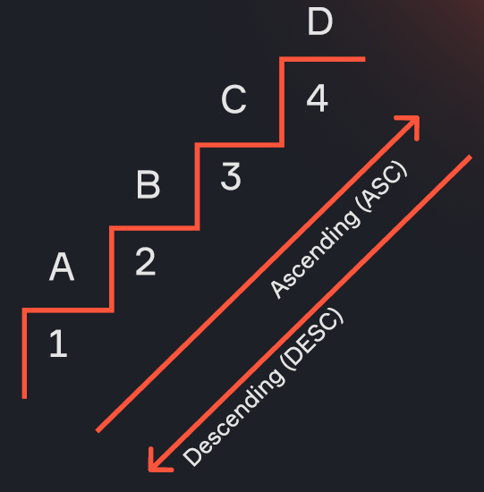

```sql
   SELECT *
     FROM table
    WHERE <condition>
 ORDER BY <field_1> DESC, <field_2>
```

The sort field can be given by name, by alias, or by its ordinal number among the output fields (starting from 1). Numbers sort numerically, character types lexicographically.

### Limiting the result set (LIMIT, OFFSET)

`LIMIT` restricts the number of rows returned; combined with `OFFSET` it gives pagination.

```sql
   SELECT *
     FROM table
    WHERE <condition>
 ORDER BY <field_1>, <field_2>
    LIMIT n1                       -- return n1 rows
   OFFSET n2                       -- skip the first n2 rows
```

`LIMIT 10 OFFSET 10` selects 10 rows starting from the 11th.

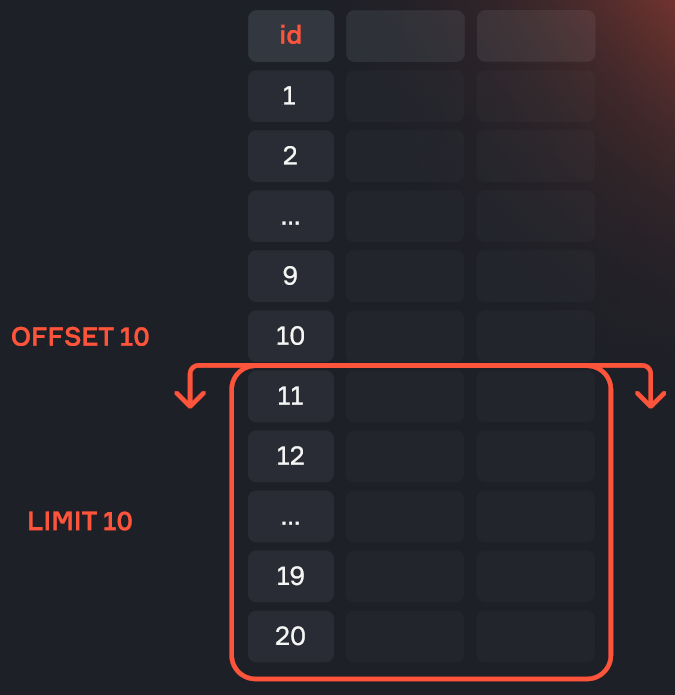

```sql
  SELECT *
    FROM locations
   WHERE type in ('TV', 'Fantasy town', 'Planet')
ORDER BY name LIMIT 10 OFFSET 10;
```

| id | name | type | dimension |
|---|---|---|---|
| 69 | Earth (C-35) | Planet | Dimension C-35 |
| 23 | Earth (C-500A) | Planet | Dimension C-500A |
| 74 | Earth (Chair Dimension) | Planet | Chair Dimension |

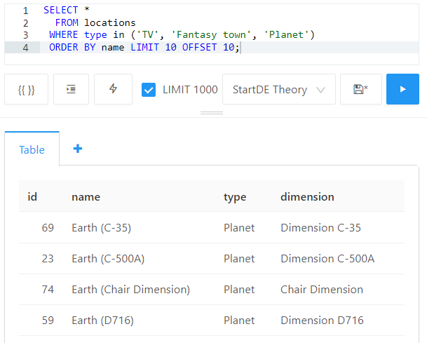

### Missing data (NULL)

`NULL` denotes the absence of data. It is not an empty string and not zero, and it needs a special approach.

**`NULL` does not take part in ordinary comparisons** — use `IS NULL` / `IS NOT NULL`:

```sql
SELECT * FROM employees WHERE email IS NULL;
SELECT * FROM employees WHERE email IS NOT NULL;
```

**Arithmetic with `NULL` yields `NULL`:**

```sql
SELECT sale_id, price, discount, price - discount AS final_price
  FROM sales;
-- for rows with NULL in discount, final_price will also be NULL
```

**`COALESCE`** returns the first non-`NULL` argument:

```sql
SELECT employee_id, first_name, COALESCE(last_name, '') AS last_name
  FROM employees;
```

**Sorting** — `NULL` may come first or last depending on the DBMS; state it with `NULLS FIRST` / `NULLS LAST`:

```sql
SELECT product_id, product_name, price
  FROM products
 ORDER BY price NULLS FIRST;
```

```sql
SELECT id, name, type,
       COALESCE(dimension, 'unknown')
  FROM locations
 WHERE type in ('TV', 'Fantasy town', 'Planet');
```

| id | name | type | coalesce |
|---|---|---|---|
| 1 | Earth (C-137) | Planet | Dimension C-137 |
| 4 | Worldender's lair | Planet | unknown |
| 6 | Interdimensional Cable | TV | unknown |
| 8 | Post-Apocalyptic Earth | Planet | Post-Apocalyptic Dimension |

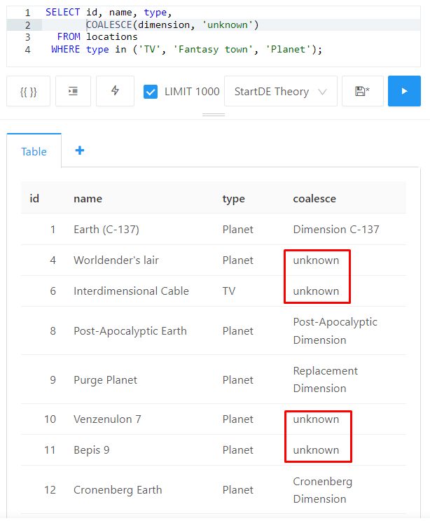

### Check yourself

**What will `NULL = NULL` return?** — `NULL`: a comparison with `NULL` is always undefined.

**What will `NULL OR TRUE` return?** — `TRUE`: `OR` is true if at least one operand is true.

**What will `NULL AND TRUE` return?** — `NULL`: the result depends on the unknown value.

**How is `NULL` handled during sorting?** — differently in different DBMSs; change it with `NULLS FIRST` / `NULLS LAST`.

---

## 1.2 Aggregate functions

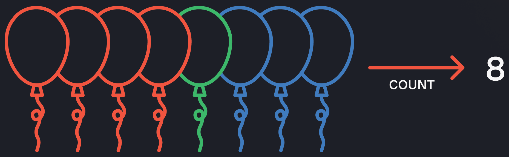

Aggregate functions perform a calculation over a set of values and return a single value — the aggregate. They are used to analyse and summarise data: the sum of today's purchases, the number of people in a department, the average height of a population.

| Purpose | Function | Example |
|---|---|---|
| Count | `COUNT(<field>)` | `SELECT COUNT(*) FROM products` |
| Sum | `SUM(<field>)` | `SELECT SUM(final_price) FROM sales` |
| Average | `AVG(<field>)` | `SELECT AVG(discount) FROM prices` |
| Minimum | `MIN(<field>)` | `SELECT MIN(weight) FROM students` |
| Maximum | `MAX(<field>)` | `SELECT MAX(weight) FROM students` |

```sql
SELECT SUM(id), AVG(id), MIN(id), MAX(id)
  FROM locations;
```

| sum | avg | min | max |
|---|---|---|---|
| 8 001 | 63.50 | 1 | 126 |

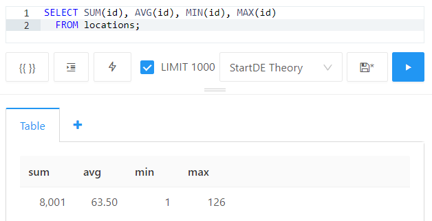

### Specifics of COUNT

- `COUNT(*)` — the number of rows in the table (or in the filtered table, if `WHERE` is used);
- `COUNT(1)` — the same as `COUNT(*)`, but the DBMS does not read the values of every field, using a constant instead;
- `COUNT(<field>)` — the number of non-empty values in the field;
- `COUNT(DISTINCT <field>)` — the number of unique non-empty values in the field.

```sql
SELECT COUNT(*)               AS count_,
       COUNT(1)               AS count_1,
       COUNT(dimension)       AS count_dimension,
       COUNT(distinct type)   AS count_dist_type
  FROM locations;
```

| count_ | count_1 | count_dimension | count_dist_type |
|---|---|---|---|
| 126 | 126 | 95 | 44 |

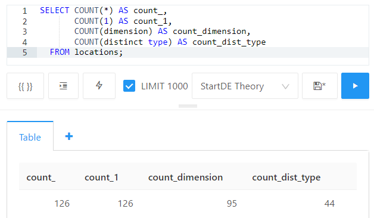

Counting values of different kinds in one pass, with `COUNT`, `SUM` and `CASE`:

```sql
SELECT COUNT(1) AS row_cnt,
       SUM(CASE WHEN gender = 'Male'   THEN 1 ELSE 0 END) AS male_cnt,
       SUM(CASE WHEN gender = 'Female' THEN 1 ELSE 0 END) AS female_cnt
  FROM characters
 WHERE status = 'Alive';
```

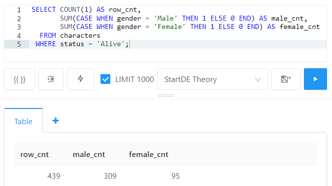

`COUNT(1)` gives the number of rows; the `CASE` expressions put a 1 where the gender matches and a 0 otherwise, so summing them counts each gender. One query, no `UNION`, no grouping.

### Grouping data (GROUP BY)

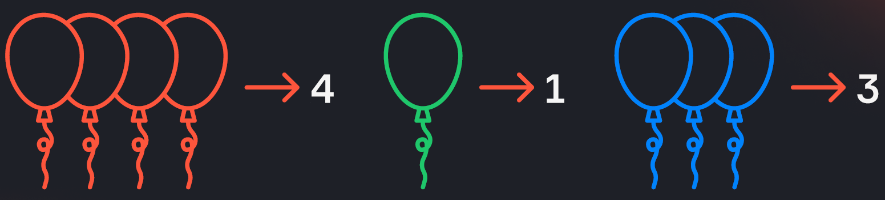

`GROUP BY` lets you specify the grouping field and execute aggregate functions within each group.

```sql
SELECT <grouping field>, <aggregate>
  FROM table
 GROUP BY <grouping field>;
```

```sql
SELECT substr(episode_id, 1, 3) AS season,
       COUNT(1)                 AS ep_cnt
  FROM episodes
 GROUP BY substr(episode_id, 1, 3)
 ORDER BY 1;
```

| season | ep_cnt |
|---|---|
| S01 | 11 |
| S02 | 10 |
| S03 | 10 |
| S04 | 10 |
| S05 | 10 |

### Filtering by aggregates (HAVING)


Sometimes you need to filter data *after* it has been aggregated. That is what `HAVING` is for.

```sql
SELECT <grouping field>, <aggregate>
  FROM table
 GROUP BY <grouping field>
HAVING <condition on the aggregate>
```

```sql
SELECT substr(episode_id, 1, 3) AS season,
       COUNT(1)                 AS ep_cnt
  FROM episodes
 GROUP BY substr(episode_id, 1, 3)
HAVING COUNT(1) > 10;
```

| season | ep_cnt |
|---|---|
| S01 | 11 |

Filtering by *non-aggregated* values can be written either in `WHERE` or in `HAVING` — these two queries return the same result:

```sql
SELECT sex, COUNT(user_id)
  FROM users
 WHERE sex != 'male'
 GROUP BY sex;

SELECT sex, COUNT(user_id)
  FROM users
 GROUP BY sex
HAVING sex != 'male';
```

But you should filter non-aggregated data in `WHERE`, that is, in advance: unnecessary rows are removed before grouping, and computing resources are not spent counting values you are going to throw away anyway.

### Check yourself

**How do you count the number of employees in a particular department?** — `COUNT(1)` with a `WHERE` on the department.

**How do you count the total number of rows, the number of men and the number of women in one query?** — `COUNT(1)` plus `SUM(CASE …)` per gender.

**How can you find duplicates using grouping?** — group by the fields that should be unique, count the rows per group, and keep the groups with `HAVING COUNT(1) > 1`.

**What is the difference between `WHERE` and `HAVING`?** — `WHERE` filters the source rows before grouping, `HAVING` filters aggregates after it. Order of execution: `WHERE` → `GROUP BY` → `HAVING`.

---

## 1.3 Window functions

An **analytic (window) function** performs calculations over a set of records forming a window (partition), and returns a single value per row.

> 💡 The main advantage of window functions: they return exactly as many records as they received. With `GROUP BY`, a group collapses into one row. A window function performs the same aggregation by group but preserves the structure of the source table — the aggregation result is simply added to every record in a separate column.

Data is divided into **partitions** by a field or fields; inside each partition it is sorted and then analysed.

### Example

**payments**

| user_id | payment_sum | payment_dttm |
|---|---|---|
| 1 | 5 | 2025-05-06 18:00:34 |
| 1 | 12 | 2025-05-06 16:17:43 |
| 1 | 50 | 2025-05-06 15:58:02 |
| 2 | 55 | 2025-05-06 09:15:22 |
| 3 | 2 | 2025-05-08 14:28:59 |
| 3 | 34 | 2025-05-05 11:39:05 |
| 4 | 6 | 2025-05-09 14:18:02 |

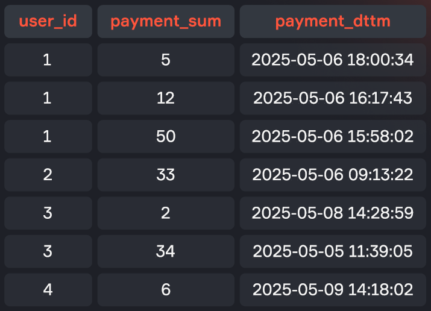

The purchase number for each user in chronological order, and the running total of their purchases:

```sql
SELECT user_id,
       payment_dttm,
       ROW_NUMBER() OVER (PARTITION BY user_id
                          ORDER BY payment_dttm) AS num,
       SUM(payment_sum) OVER (PARTITION BY user_id
                              ORDER BY payment_dttm) AS cume_sum
  FROM payments;
```

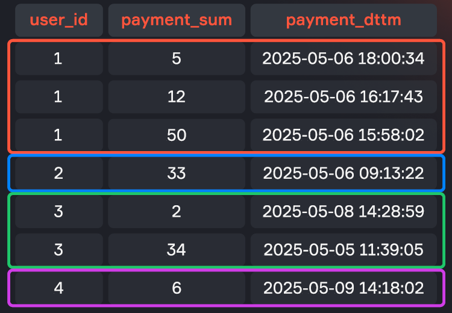

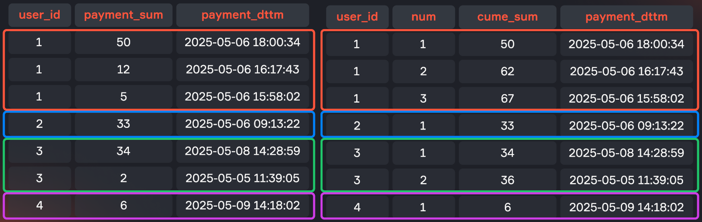

### Syntax

```sql
<function>(<field>) OVER (PARTITION BY <partition> ORDER BY <sorting> <frame>)
```

- **function** — the window function over the chosen field;
- **partition** — the field or set of fields defining the group (here, `user_id`);
- **sorting** — the field or fields by which rows are ordered inside the partition (here, the purchase date);
- **frame** — the set of rows inside the window we operate on (optional).

First the data is split into partitions, then sorted, and only then is the function applied to each record inside the partition.

> 💡 Why is the sum computed over the current row and all previous ones rather than over all of the user's purchases? Because when a window function is used with an aggregate, a **window frame** is determined for each row. If you specify `ORDER BY` inside `OVER`, the frame by default runs from the beginning of the partition to the current row — hence the running total. Without `ORDER BY`, the frame is the whole partition (the total of all of the user's purchases). Without `PARTITION BY`, the frame is the whole table.

### The three groups of analytic functions

| AGGREGATION | OFFSET | RANKING |
|---|---|---|
| `AVG()` | `FIRST_VALUE()` | `ROW_NUMBER()` |
| `COUNT()` | `LAST_VALUE()` | `RANK()` |
| `MAX()` | `LAG()` | `DENSE_RANK()` |
| `MIN()` | `LEAD()` | `NTILE()` |
| `SUM()` | `NTH_VALUE()` | `CUME_DIST()` |
| | | `PERCENT_RANK()` |

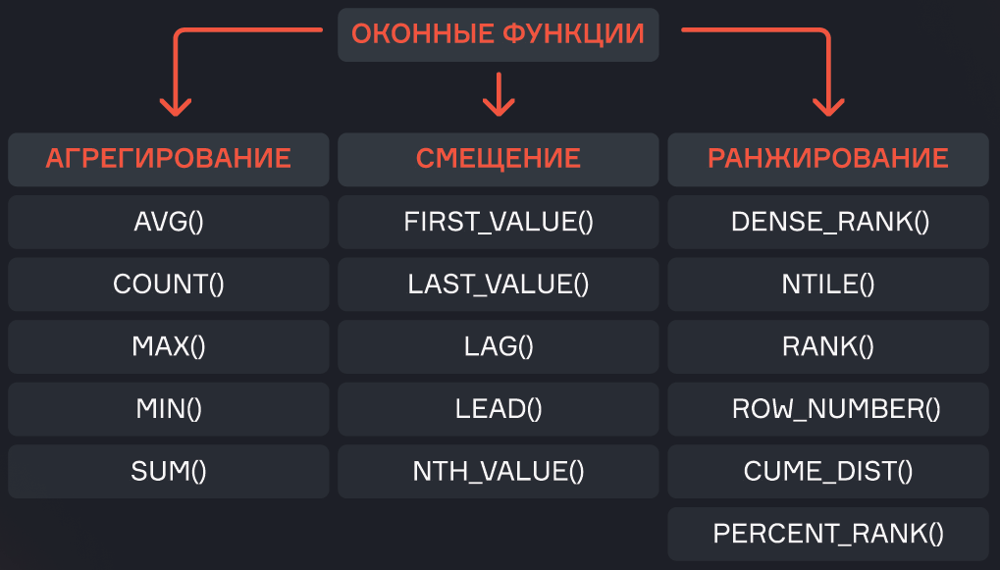

The examples below all build on the same base query, which joins characters with the episodes they appear in and counts the unique episodes per character per season, keeping characters who appear more than five times in a season:

```sql
SELECT c.name,
       substr(ep.episode_id, 1, 3) AS season,
       COUNT(DISTINCT ep.episode_id) AS ep_cnt
  FROM characters AS c
  LEFT JOIN char_ep AS ce
    ON c.id = ce.character_id
  LEFT JOIN episodes AS ep
    ON ce.episode_id = ep.id
 GROUP BY 1, 2
HAVING COUNT(ep.episode_id) > 5;
```

| name | season | ep_cnt |
|---|---|---|
| Beth Smith | S01 | 11 |
| Beth Smith | S02 | 8 |
| Beth Smith | S03 | 10 |
| Jerry Smith | S01 | 11 |
| Morty Smith | S01 | 11 |

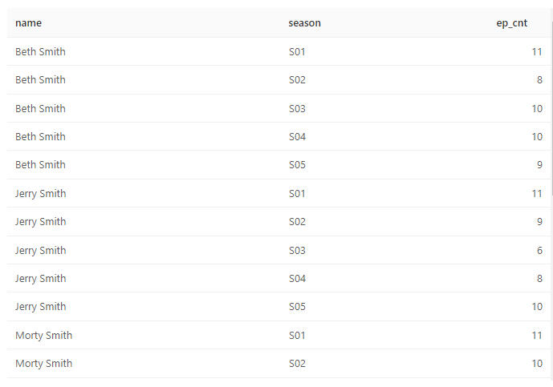

> The examples wrap it in a `WITH` block — a CTE, covered in [1.4](#14-subqueries-and-cte). Read it for now as "give this query a name".

### Aggregate window functions

`AVG`, `COUNT`, `MAX`, `MIN`, `SUM` — cumulative values inside a window:

```sql
WITH char_in_episodes AS (
    SELECT c.name,
           substr(ep.episode_id, 1, 3) AS season,
           COUNT(DISTINCT ep.episode_id) AS ep_cnt
      FROM characters AS c
      LEFT JOIN char_ep AS ce ON c.id = ce.character_id
      LEFT JOIN episodes AS ep ON ce.episode_id = ep.id
     GROUP BY 1, 2
    HAVING COUNT(ep.episode_id) > 5
)
SELECT name,
       season,
       ep_cnt,
       SUM(ep_cnt) OVER (PARTITION BY name ORDER BY season)::int AS ep_sum,
       AVG(ep_cnt) OVER (PARTITION BY name ORDER BY season)      AS ep_avg,
       MIN(ep_cnt) OVER (PARTITION BY name ORDER BY season)::int AS ep_min,
       MAX(ep_cnt) OVER (PARTITION BY name ORDER BY season)::int AS ep_max
  FROM char_in_episodes;
```

| name | season | ep_cnt | ep_sum | ep_avg | ep_min | ep_max |
|---|---|---|---|---|---|---|
| Beth Smith | S01 | 11 | 11 | 11.00 | 11 | 11 |
| Beth Smith | S02 | 8 | 19 | 9.50 | 8 | 11 |
| Beth Smith | S03 | 10 | 29 | 9.67 | 8 | 11 |
| Beth Smith | S04 | 10 | 39 | 9.75 | 8 | 11 |
| Beth Smith | S05 | 9 | 48 | 9.60 | 8 | 11 |
| Jerry Smith | S01 | 11 | 11 | 11.00 | 11 | 11 |
| Jerry Smith | S02 | 9 | 20 | 10.00 | 9 | 11 |
| Jerry Smith | S03 | 6 | 26 | 8.67 | 6 | 11 |

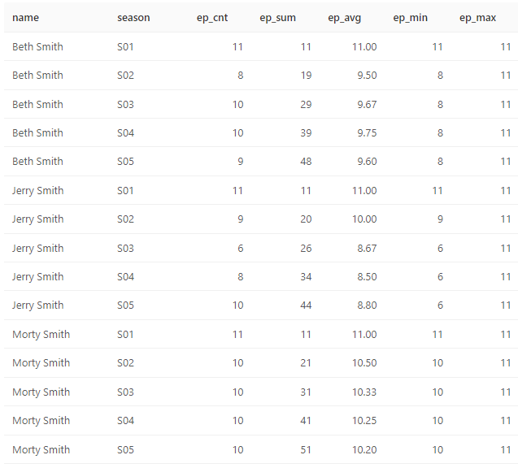

### Offset functions

Offset functions reach into neighbouring rows:

- `FIRST_VALUE` — the first row in the frame
- `LAST_VALUE` — the last row in the frame
- `LAG` — the value in the previous row of the partition
- `LEAD` — the value in the next row of the partition
- `NTH_VALUE` — the value in row number N (the second argument)

```sql
SELECT name,
       season,
       ep_cnt,
       FIRST_VALUE(ep_cnt)  OVER (PARTITION BY name ORDER BY season) AS first,
       LAST_VALUE(ep_cnt)   OVER (PARTITION BY name ORDER BY season) AS last,
       LAG(ep_cnt)          OVER (PARTITION BY name ORDER BY season) AS prev_season_cnt,
       LEAD(ep_cnt)         OVER (PARTITION BY name ORDER BY season) AS next_season_cnt,
       NTH_VALUE(ep_cnt, 2) OVER (PARTITION BY name ORDER BY season) AS second_season_cnt
  FROM char_in_episodes;
```

| name | season | ep_cnt | first | last | prev_season_cnt | next_season_cnt | second_season_cnt |
|---|---|---|---|---|---|---|---|
| Beth Smith | S01 | 11 | 11 | 11 | | 8 | |
| Beth Smith | S02 | 8 | 11 | 8 | 11 | 10 | 8 |
| Beth Smith | S03 | 10 | 11 | 10 | 8 | 10 | 8 |
| Beth Smith | S04 | 10 | 11 | 10 | 10 | 9 | 8 |
| Beth Smith | S05 | 9 | 11 | 9 | 10 | | 8 |

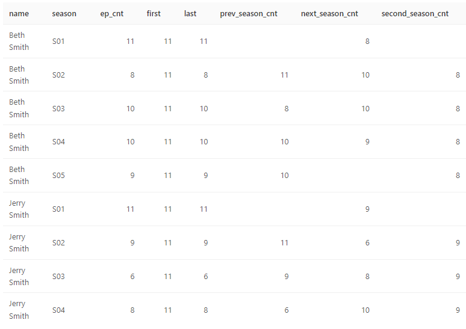

### Ranking functions

- `ROW_NUMBER` — the row number inside the partition
- `RANK` — the rank within the partition, skipping the next rank when values repeat
- `DENSE_RANK` — the rank without gaps when values repeat
- `NTILE` — splits the window into the given number of groups and returns the group number
- `CUME_DIST` — the cumulative distribution, RANK/COUNT
- `PERCENT_RANK` — the relative rank, (RANK-1)/(COUNT-1)

```sql
SELECT name,
       season,
       ep_cnt,
       ROW_NUMBER()   OVER (PARTITION BY name ORDER BY ep_cnt) AS rn,
       RANK()         OVER (PARTITION BY name ORDER BY ep_cnt) AS rank,
       DENSE_RANK()   OVER (PARTITION BY name ORDER BY ep_cnt) AS dense_rank,
       NTILE(2)       OVER (PARTITION BY name ORDER BY ep_cnt) AS group_num,
       CUME_DIST()    OVER (PARTITION BY name ORDER BY ep_cnt) AS cume_dist,
       PERCENT_RANK() OVER (PARTITION BY name ORDER BY ep_cnt) AS percent_rank
  FROM char_in_episodes;
```

| name | season | ep_cnt | rn | rank | dense_rank | group_num | cume_dist | percent_rank |
|---|---|---|---|---|---|---|---|---|
| Beth Smith | S02 | 8 | 1 | 1 | 1 | 1 | 0.20 | 0.00 |
| Beth Smith | S05 | 9 | 2 | 2 | 2 | 1 | 0.40 | 0.25 |
| Beth Smith | S03 | 10 | 3 | 3 | 3 | 1 | 0.80 | 0.50 |
| Beth Smith | S04 | 10 | 4 | 3 | 3 | 2 | 0.80 | 0.50 |
| Beth Smith | S01 | 11 | 5 | 5 | 4 | 2 | 1.00 | 1.00 |

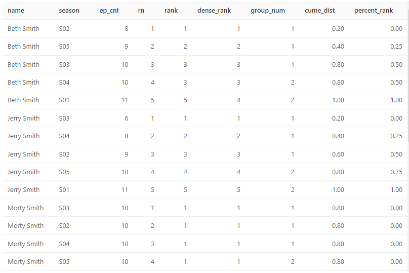

- `ROW_NUMBER` numbers the rows within each character; `NTILE(2)` splits each partition into two roughly equal parts (an odd row count skews this) and numbers every row by its group.
- Beth Smith appeared 10 times in both season 3 and season 4, so both rows get 3 in `RANK` and in `DENSE_RANK`. The next row, though, is 4 in `DENSE_RANK` and 5 in `RANK`.
- `CUME_DIST` shows the share of rows less than **or equal to** the current row; `PERCENT_RANK` the share of rows strictly less than it. Hence the last value of both is always 1, while the first value is 0 for `PERCENT_RANK` but non-zero for `CUME_DIST`.

### Frames

Frames specify the exact range of rows to aggregate over. Two ways of defining them:

1. `ROWS` — works with rows inside the partition.
2. `RANGE` — works with a range of values inside the partition.

**ROWS** — boundaries by row number:

```sql
ROWS BETWEEN <lower boundary> AND <upper boundary>
```

- `UNBOUNDED PRECEDING` — the window starts at the first row of the group
- `UNBOUNDED FOLLOWING` — the window ends at the last row of the group
- `CURRENT ROW` — the window starts or ends at the current row
- `<n> PRECEDING` / `<n> FOLLOWING` — n rows before / after the current row

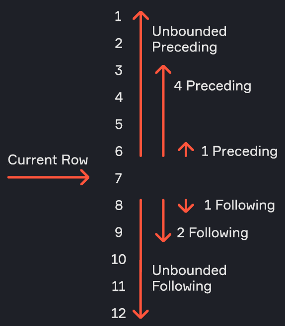

```sql
SELECT name,
       season,
       ep_cnt,
       SUM(ep_cnt) OVER (PARTITION BY name ORDER BY season
                         ROWS BETWEEN UNBOUNDED PRECEDING AND CURRENT ROW)::int AS v1,
       SUM(ep_cnt) OVER (PARTITION BY name ORDER BY season
                         ROWS BETWEEN CURRENT ROW AND UNBOUNDED FOLLOWING)      AS v2,
       SUM(ep_cnt) OVER (PARTITION BY name ORDER BY season
                         ROWS BETWEEN 3 PRECEDING AND CURRENT ROW)::int         AS v3,
       SUM(ep_cnt) OVER (PARTITION BY name ORDER BY season
                         ROWS BETWEEN CURRENT ROW AND 2 FOLLOWING)::int         AS v4
  FROM char_in_episodes;
```

| name | season | ep_cnt | v1 | v2 | v3 | v4 |
|---|---|---|---|---|---|---|
| Beth Smith | S01 | 11 | 11 | 48.00 | 11 | 29 |
| Beth Smith | S02 | 8 | 19 | 37.00 | 19 | 28 |
| Beth Smith | S03 | 10 | 29 | 29.00 | 29 | 29 |
| Beth Smith | S04 | 10 | 39 | 19.00 | 39 | 19 |
| Beth Smith | S05 | 9 | 48 | 9.00 | 37 | 9 |

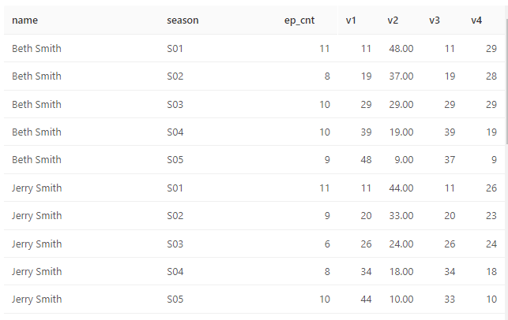

**RANGE** — boundaries by row *values* rather than row numbers:

```sql
RANGE BETWEEN <lower boundary> AND <upper boundary>
```

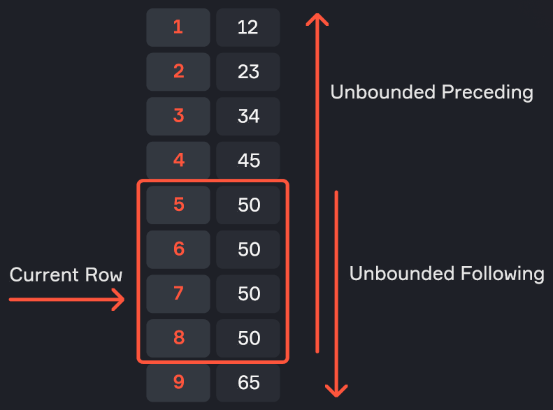

> 💡 If no frame is specified, `RANGE BETWEEN UNBOUNDED PRECEDING AND CURRENT ROW` applies: all records from the first row of the window up to the current one.

```sql
SELECT name,
       season,
       ep_cnt,
       SUM(ep_cnt) OVER (PARTITION BY name ORDER BY ep_cnt
                         RANGE BETWEEN UNBOUNDED PRECEDING AND CURRENT ROW)::int AS v1,
       SUM(ep_cnt) OVER (PARTITION BY name ORDER BY ep_cnt
                         RANGE BETWEEN CURRENT ROW AND UNBOUNDED FOLLOWING)      AS v2
  FROM char_in_episodes;
```

| name | season | ep_cnt | v1 | v2 |
|---|---|---|---|---|
| Beth Smith | S02 | 8 | 8 | 48.00 |
| Beth Smith | S05 | 9 | 17 | 40.00 |
| Beth Smith | S03 | 10 | 37 | 31.00 |
| Beth Smith | S04 | 10 | 37 | 31.00 |
| Beth Smith | S01 | 11 | 48 | 11.00 |

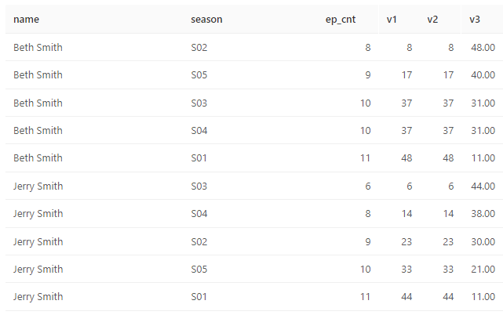

Note how the two rows with `ep_cnt = 10` share the same value — `RANGE` treats ties as one range, whereas `ROWS` would have given them different running totals.

### Window Frame — a named window

A named partition can be reused several times in one query. It improves readability, and in some DBMSs speeds the query up.

```sql
WINDOW <alias> AS (PARTITION BY <partition> ORDER BY <sorting> <frame>)
```

```sql
SELECT name,
       season,
       ep_cnt,
       SUM(ep_cnt) OVER w ::int AS an_sum,
       AVG(ep_cnt) OVER w       AS an_avg,
       MIN(ep_cnt) OVER w ::int AS an_min,
       MAX(ep_cnt) OVER w ::int AS an_max
  FROM char_in_episodes
WINDOW w AS (PARTITION BY name ORDER BY season);
```

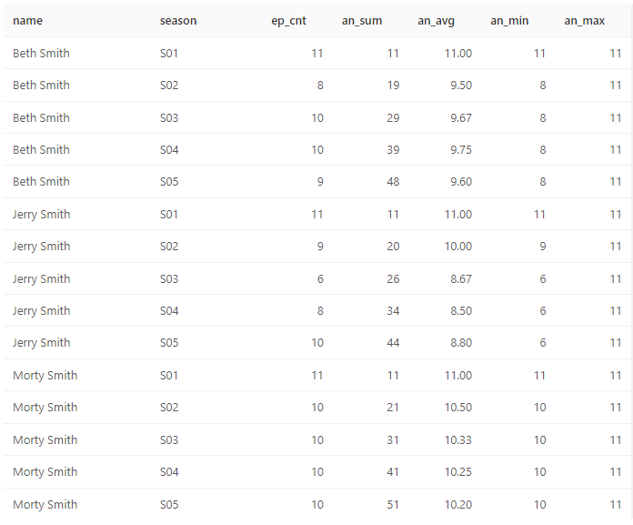

### Check yourself

**How do you compute a cumulative sum?** — with the analytic `SUM`: partition the data, sort it, apply the aggregate.

**What happens if you do not specify a frame?** — aggregation runs from the first row of the window up to and including the current one.

**What options are there for specifying a frame?** — by rows (`ROWS`) and by row values (`RANGE`).

**What is the difference between `RANK` and `DENSE_RANK`?** — `RANK` leaves gaps after ties; `DENSE_RANK` does not.

---

## 1.4 Subqueries and CTE

A **subquery** is a query inside another query. Subqueries can appear in `SELECT`, `FROM`, `JOIN`, `WHERE`, `HAVING` and `ORDER BY`.

### Types of subqueries

**Non-correlated subqueries** can be executed independently of the outer query. Such a subquery runs once, and its result is used by the outer query:

```sql
SELECT name
  FROM customers
 WHERE customer_id IN (
           SELECT customer_id
             FROM orders
            WHERE order_amount > 1000
       );
```

The inner query runs once and returns a list of customer IDs.

**Correlated subqueries** reference the outer table, so they depend on the outer query. For every row of the outer query the subquery is executed again — which affects performance:

```sql
SELECT e1.name, e1.salary
  FROM employees e1
 WHERE e1.salary > (
           SELECT AVG(e2.salary)
             FROM employees e2
            WHERE e2.department_id = e1.department_id
       );
```

**Scalar queries** are a separate group: queries returning a single value, e.g. `SELECT AVG(column) FROM table`.

### Subqueries in FROM

```sql
SELECT *
  FROM (SELECT * FROM table) AS t1;
```

> 💡 Some DBMSs require subqueries in `FROM` to have aliases. Using aliases is a useful habit.

```sql
SELECT substr(episode_id, 1, 3) AS season, COUNT(DISTINCT name) AS char_cnt
  FROM
   (SELECT e.episode_id, c.name
      FROM episodes AS e
      JOIN char_ep AS ce ON e.id = ce.episode_id
      JOIN characters AS c ON ce.character_id = c.id
   ) AS epis_char
 GROUP BY substr(episode_id, 1, 3)
 ORDER BY 1;
```

| season | char_cnt |
|---|---|
| S01 | 188 |
| S02 | 167 |
| S03 | 195 |
| S04 | 177 |
| S05 | 162 |

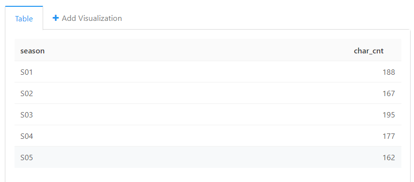

### Subqueries in JOIN

```sql
SELECT *
  FROM table1 AS t1
  JOIN (SELECT * FROM table2) AS t2
    ON t1.id = t2.id;
```

```sql
SELECT epis_char.season,
       COUNT(DISTINCT ep.episode_id)   AS ep_cnt,
       COUNT(DISTINCT epis_char.name)  AS char_cnt
  FROM
   (SELECT substr(e.episode_id, 1, 3) AS season, c.name
      FROM episodes AS e
      JOIN char_ep AS ce ON e.id = ce.episode_id
      JOIN characters AS c ON ce.character_id = c.id
   ) AS epis_char
  JOIN episodes AS ep ON substr(ep.episode_id, 1, 3) = epis_char.season
 GROUP BY epis_char.season
 ORDER BY 1;
```

| season | ep_cnt | char_cnt |
|---|---|---|
| S01 | 11 | 188 |
| S02 | 10 | 167 |
| S03 | 10 | 195 |

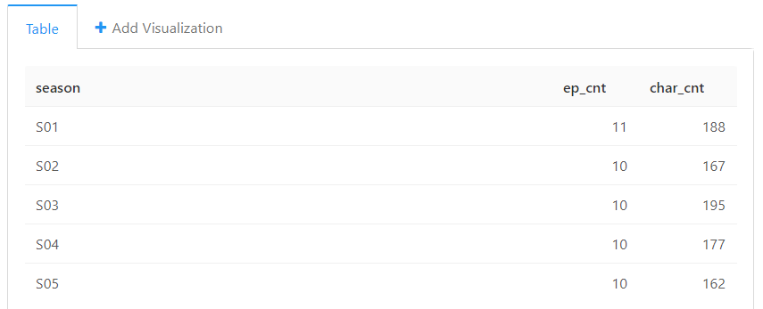

### Subqueries in SELECT

Non-correlated — **must be scalar**, otherwise the DBMS cannot tell which returned value to use in a given row:

```sql
SELECT id, name, (SELECT avg(price) FROM table2) AS new_column
  FROM table;
```

Correlated:

```sql
SELECT name,
       (SELECT COUNT(1)
          FROM orders
         WHERE orders.employee_id = employees.employee_id) AS order_cnt
  FROM employees;
```

```sql
SELECT epis_char.season,
       (SELECT COUNT(ep.episode_id)
          FROM episodes AS ep
         WHERE substr(ep.episode_id, 1, 3) = epis_char.season) AS ep_cnt,
       (SELECT COUNT(1) FROM episodes) AS all_ep_cnt,
       COUNT(DISTINCT epis_char.name)  AS char_cnt
  FROM
   (SELECT substr(e.episode_id, 1, 3) AS season, c.name
      FROM episodes AS e
      JOIN char_ep AS ce ON e.id = ce.episode_id
      JOIN characters AS c ON ce.character_id = c.id
   ) AS epis_char
 GROUP BY epis_char.season;
```

| season | ep_cnt | all_ep_cnt | char_cnt |
|---|---|---|---|
| S01 | 11 | 51 | 188 |
| S02 | 10 | 51 | 167 |
| S03 | 10 | 51 | 195 |

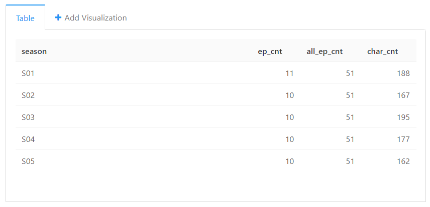

### Subqueries in WHERE

Non-correlated — filtering by a constant returned by a scalar subquery:

```sql
SELECT *
  FROM table1
 WHERE price > (SELECT AVG(price) FROM table2);
```

Correlated — only the records with the minimum price for each product:

```sql
SELECT *
  FROM product_price AS pp
 WHERE pp.price = (
           SELECT min(ppm.price)
             FROM product_price AS ppm
            WHERE ppm.product_id = pp.product_id
       )
 ORDER BY pp.product_id, pp.price, pp.store_id;
```

Multi-column — comparing two or more fields against a subquery:

```sql
SELECT employee_id, name, department_id
  FROM employees
 WHERE (department_id, location) =
       (SELECT department_id, location
          FROM departments
         WHERE department_id = 101);
```

**Clauses for subqueries returning one field and several records:**

`IN` — checks whether a value is contained in the subquery result:

```sql
SELECT * FROM table1 WHERE id IN (SELECT id FROM table2);
```

`EXISTS` — `TRUE` if the subquery returns at least one row. It makes sense when the subquery is correlated:

```sql
SELECT *
  FROM table1
 WHERE EXISTS (SELECT id
                 FROM table2
                WHERE table2.name = table1.name);
```

`ANY`/`SOME` — `TRUE` if the condition holds for at least one value in the set:

```sql
SELECT employee_id, name, salary
  FROM employees
 WHERE salary > ANY (SELECT salary FROM employees WHERE department_id = 10);
```

`ANY` and `SOME` are completely identical; some DBMSs support only one of the two.

`ALL` — `TRUE` if the condition holds for every value in the set:

```sql
SELECT employee_id, name, salary
  FROM employees
 WHERE salary > ALL (SELECT salary FROM employees WHERE department_id = 10);
```

```sql
SELECT *
  FROM characters
 WHERE EXISTS (SELECT 1
                 FROM char_loc
                WHERE location_id = (SELECT id FROM locations WHERE name = 'Earth (C-137)')
                  AND char_loc.character_id = characters.id);
```

| id | name | status | species | gender |
|---|---|---|---|---|
| 38 | Beth Smith | Alive | Human | Female |
| 45 | Bill | Alive | Human | Male |
| 71 | Conroy | Dead | Robot | |
| 92 | Davin | Dead | Human | Male |

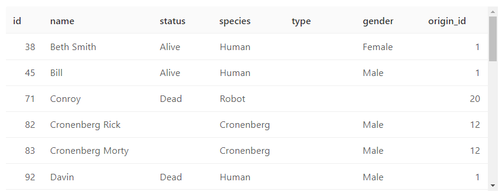

### Subqueries in HAVING

Only the records whose aggregates satisfy the comparison with the subquery are kept (the subquery must then return a single value):

```sql
SELECT id, SUM(price) AS sm
  FROM table1
 GROUP BY id
HAVING SUM(price) > (SELECT AVG(price) FROM table1);
```

```sql
SELECT substr(episode_id, 1, 3) AS season,
       COUNT(1) AS cnt
  FROM episodes
 GROUP BY substr(episode_id, 1, 3)
HAVING COUNT(1) < (SELECT COUNT(1) FROM episodes WHERE episode_id like 'S01%');
```

| season | cnt |
|---|---|
| S02 | 10 |
| S03 | 10 |
| S04 | 10 |
| S05 | 10 |

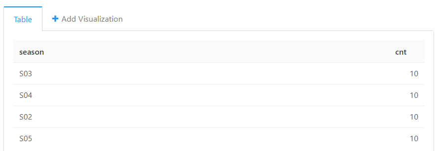

### Subqueries in ORDER BY

A correlated subquery in `ORDER BY` computes a sorting value for every row:

```sql
SELECT employee_id, name, salary, department_id
  FROM employees
 ORDER BY (SELECT AVG(salary)
             FROM employees AS e2
            WHERE e2.department_id = employees.department_id);
```

> 💡 A non-correlated subquery in `ORDER BY` has no practical meaning — sorting by a constant does not change the order of rows.

```sql
SELECT *
  FROM characters
 ORDER BY (
       SELECT COUNT(1)
         FROM char_ep
        WHERE char_ep.character_id = characters.id
       ) DESC;
```

| id | name | status | species | gender |
|---|---|---|---|---|
| 1 | Rick Sanchez | Alive | Human | Male |
| 2 | Morty Smith | Alive | Human | Male |
| 4 | Beth Smith | Alive | Human | Female |
| 3 | Summer Smith | Alive | Human | Female |

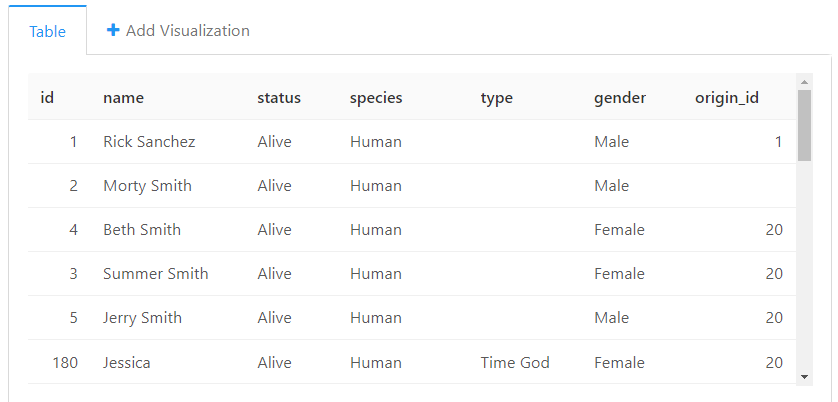

### Common Table Expression (CTE)

A CTE lets you move a subquery outside the main query. It is declared with `WITH` and can be used several times — but only within one overall query.

```sql
WITH cte_name AS (
      SELECT id, name, count FROM table
)
SELECT *
  FROM table1
  JOIN cte_name ON table1.id = cte_name.id;
```

**Advantages:**

1. **Improved readability** — a complex query is split into understandable parts.
2. **Optimization** — the CTE's result can be used several times without re-executing the subquery.

```sql
WITH cte AS (
       SELECT city, country, date, weather FROM table
)
SELECT weather FROM cte WHERE country = 'Russia'
UNION
SELECT weather FROM cte WHERE country = 'Peru';
```

Here the subquery is executed once but used twice.

There can be several CTEs in one query: `WITH` is written once and the CTEs are listed separated by commas. A later CTE may reference an earlier one:

```sql
WITH cte AS (
       SELECT id, name, count FROM table
),
cte2 AS (
       SELECT id, name, SUM(count) FROM cte GROUP BY id, name
)
SELECT *
  FROM table1
  JOIN cte2 ON table1.id = cte2.id;
```

**CTE vs temporary table:**

- A **temporary table** is created by the user and exists until the session ends (until the connection is closed).
- A **CTE** exists only within the execution of the query; once the query has returned data, the CTE is gone.

```sql
WITH epis_char AS (
     SELECT substr(e.episode_id, 1, 3) AS season, c.name
       FROM episodes AS e
       JOIN char_ep AS ce ON e.id = ce.episode_id
       JOIN characters AS c ON ce.character_id = c.id
)
SELECT epis_char.season,
       (SELECT COUNT(ep.episode_id)
          FROM episodes AS ep
         WHERE substr(ep.episode_id, 1, 3) = epis_char.season) AS ep_cnt,
       (SELECT COUNT(1) FROM episodes) AS all_ep_cnt,
       COUNT(DISTINCT epis_char.name)  AS char_cnt
  FROM epis_char
 GROUP BY epis_char.season
 ORDER BY 1;
```

| season | ep_cnt | all_ep_cnt | char_cnt |
|---|---|---|---|
| S01 | 11 | 51 | 188 |
| S02 | 10 | 51 | 167 |
| S03 | 10 | 51 | 195 |
| S04 | 10 | 51 | 177 |
| S05 | 10 | 51 | 162 |

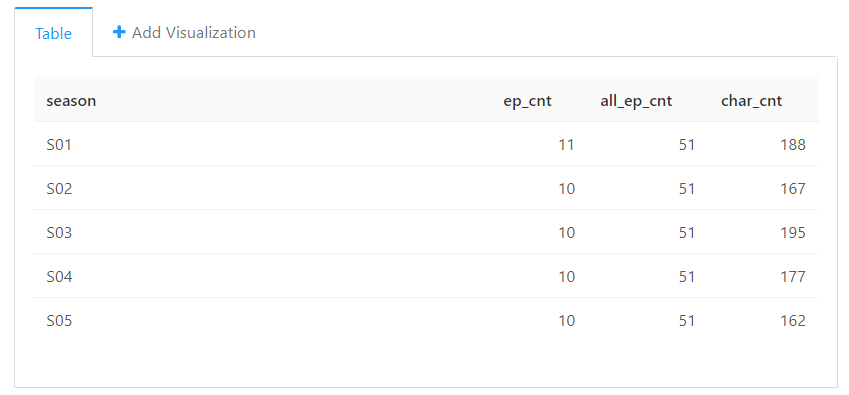

### Check yourself

**What is the difference between correlated and non-correlated subqueries?** — non-correlated ones can run independently of the outer query; correlated ones depend on data from it.

**How do `EXISTS`, `SOME`, `ALL` and `ANY` work?** — `EXISTS` checks for at least one row; `SOME`/`ANY` compare against any value from the subquery; `ALL` against all of them.

**What is a scalar subquery?** — one that returns a single value.

**What happens if a subquery in `WHERE` returns `NULL`?** — the condition is not satisfied, since `NULL` is neither true nor false, so the outer query returns no rows.

**What is a CTE used for?** — readability and optimization.

**How does a CTE differ from a temporary table?** — a temporary table lives until the end of the session, a CTE only within the query.

---

## 1.5 Joins and unions

### DISTINCT

`DISTINCT` removes duplicate rows from the query result:

```sql
SELECT DISTINCT column1 FROM table_name;
SELECT DISTINCT column1, column2 FROM table_name;   -- unique combinations
```

`DISTINCT` is written once, right after `SELECT`. The DBMS has to remember every unique value and compare it with the following ones, which can slow the query down.

```sql
SELECT DISTINCT type
  FROM locations;
```

| type |
|---|
| Non-Diegetic Alternative Reality |
| Death Star |
| Arcade |


### UNION and UNION ALL

`UNION` and `UNION ALL` combine the results of two or more queries **vertically**:

- `UNION` combines the results, excluding duplicate rows;
- `UNION ALL` does the same but keeps duplicates.


Deduplication costs extra resources and time, so `UNION ALL` works faster.

```sql
SELECT <field_1>, <field_2>, <field_3>
  FROM table_1
 UNION [ALL]
SELECT <field_1>, <field_2>, <field_3>
  FROM table_2;
```

The restriction: the number of fields in the combined results must be the same. Field names may differ — the final names come from the first query. Data types may differ too, but combining only compatible types is recommended.

```sql
SELECT name
  FROM locations

 UNION ALL

SELECT name
  FROM characters
 ORDER BY 1;
```

| name |
|---|
| 26 Years Old Morty |
| 40 Years Old Morty |
| 7+7 Years Old Morty |
| 80's snake |


### JOIN


`JOIN` enriches data from one table with data from another — a **horizontal** combination. Every row in one table is matched against the second by some condition, and matching rows are combined.

```sql
SELECT a.column1, b.column2
  FROM table1 a
  JOIN table2 b ON a.id = b.table2_id;
```

Tables can be given aliases so that you do not have to write their names out in full; `AS` may be omitted here.


`INNER` may be omitted — an inner join is performed by default. `OUTER` may be omitted in `LEFT JOIN` and `RIGHT JOIN`.

Take an `employees` table and a `departments` table:

**employees**

| employee_id | name | department_id |
|---|---|---|
| 1 | John | 1 |
| 2 | Jane | 2 |
| 3 | Mike | 4 |
| 4 | Anna | 3 |
| 5 | Steve | NULL |
| 6 | Bob | 2 |

**departments**

| department_id | department_name |
|---|---|
| 1 | HR |
| 2 | Engineering |
| 3 | Sales |

**`INNER JOIN`** returns the rows that have a match in both tables:

```sql
SELECT e.employee_id, e.name, d.department_name
  FROM employees e
 INNER JOIN departments d ON e.department_id = d.department_id;
```

| employee_id | name | department_name |
|---|---|---|
| 1 | John | HR |
| 2 | Jane | Engineering |
| 4 | Anna | Sales |
| 6 | Bob | Engineering |

Mike (department 4, which does not exist) and Steve (`NULL`) are excluded.

**`LEFT JOIN`** returns all rows from the left table and the matching rows from the right one; where there is no match, `NULL`:

```sql
SELECT e.employee_id, e.name, d.department_name
  FROM employees e
  LEFT JOIN departments d ON e.department_id = d.department_id;
```

| employee_id | name | department_name |
|---|---|---|
| 1 | John | HR |
| 2 | Jane | Engineering |
| 3 | Mike | NULL |
| 4 | Anna | Sales |
| 5 | Steve | NULL |
| 6 | Bob | Engineering |

**`RIGHT JOIN`** is the mirror image — all rows from the right table plus matches from the left:

```sql
SELECT e.employee_id, e.name, d.department_name
  FROM employees e
 RIGHT JOIN departments d ON e.department_id = d.department_id;
```

It shows which departments exist even if they have no employees.

**`FULL JOIN`** returns all rows from both tables, filling the missing values with `NULL`:

```sql
SELECT e.employee_id, e.name, d.department_name
  FROM employees e
  FULL JOIN departments d ON e.department_id = d.department_id;
```

Here the result coincides with the `LEFT JOIN`, because every row of `departments` has a match in `employees`, so no extra `NULL` rows are added.

A clearer `FULL JOIN` example — courses and flows:

**courses**

| id | name | description |
|---|---|---|
| 1 | Data Engineer | Training for data engineers |
| 2 | Data Analyst | Training for data analysts |
| 3 | Start ML | Introductory ML course |

**flows**

| id | course_id | number | start_date |
|---|---|---|---|
| 1 | 1 | 31 | 2024-03-07 |
| 2 | 1 | 32 | 2024-04-01 |
| 3 | 1 | 33 | 2024-04-21 |

```sql
SELECT c.id         AS course_id,
       c.name       AS course_name,
       f.number     AS flow_num,
       f.start_date AS flow_start
  FROM courses AS c
  FULL JOIN flows AS f
    ON c.id = f.course_id;
```

| course_id | course_name | flow_num | flow_start |
|---|---|---|---|
| 1 | Data Engineer | 31 | 2024-03-07 |
| 1 | Data Engineer | 32 | 2024-04-01 |
| 1 | Data Engineer | 33 | 2024-04-21 |
| 2 | Data Analyst | NULL | NULL |
| 3 | Start ML | NULL | NULL |


### Special types of JOIN

**`CROSS JOIN`** — a join without a condition, producing the Cartesian product of two tables. Useful when every row of one table must be matched with every row of another, but dangerous: the row count grows multiplicatively.


```sql
SELECT c1.name AS name_1, c2.name AS name_2
  FROM characters AS c1
 CROSS JOIN characters AS c2
 WHERE c1.name != c2.name;
```

| name_1 | name_2 |
|---|---|
| Rick Sanchez | Morty Smith |
| Rick Sanchez | Summer Smith |
| Rick Sanchez | Beth Smith |


**`SELF JOIN`** — joining a table with itself. Useful for comparing rows of the same table or working with hierarchical data, such as employees and their managers:

```sql
SELECT e1.name AS employee, e2.name AS manager
  FROM employees e1
  JOIN employees e2 ON e1.manager_id = e2.id;
```

**Anti-join** — not an official join type, but a common pattern: rows in one table with no match in another (customers who have never made a purchase):

```sql
SELECT a.*
  FROM table_a AS a
  LEFT JOIN table_b AS b
    ON a.id = b.id
 WHERE b.id IS NULL;
```

The same logic can be expressed with `NOT EXISTS`.

### Venn diagrams


Venn diagrams are often used to explain joins because they show intersections and unions clearly. They do not, however, convey all the nuances of joins in relational databases — in particular what happens when values in a table repeat.

### Joining and aggregating together

Joins and aggregation are usually used in the same query. Counting the number of flows for each course:

```sql
SELECT c.id        AS course_id,
       c.name      AS course_name,
       COUNT(f.id) AS flow_cnt
  FROM courses AS c
  LEFT JOIN flows AS f
    ON c.id = f.course_id
 GROUP BY course_id, course_name;
```

| course_id | course_name | flow_cnt |
|---|---|---|
| 1 | Data Engineer | 3 |
| 2 | Data Analyst | 0 |
| 3 | Start ML | 0 |

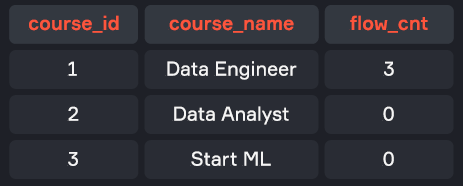

Note that `COUNT(f.id)` returns 0 rather than 1 for courses with no flows, because `COUNT(<field>)` ignores `NULL`s. Adding `HAVING` keeps only the courses that do have flows:

```sql
SELECT c.id        AS course_id,
       c.name      AS course_name,
       COUNT(f.id) AS flow_cnt
  FROM courses AS c
  LEFT JOIN flows AS f
    ON c.id = f.course_id
 GROUP BY course_id, course_name
HAVING COUNT(f.id) > 0;
```

| course_id | course_name | flow_cnt |
|---|---|---|
| 1 | Data Engineer | 3 |

And the same shape of query on the demo data — characters appearing in more than 10 episodes:

```sql
SELECT char.name, COUNT(ep.name) AS ep_cnt
  FROM characters AS char
  LEFT JOIN char_ep AS c_e ON char.id = c_e.character_id
  LEFT JOIN episodes AS ep ON ep.id = c_e.episode_id
 GROUP BY char.name
HAVING COUNT(ep.name) > 10
 ORDER BY ep_cnt DESC;
```

| name | ep_cnt |
|---|---|
| Morty Smith | 54 |
| Rick Sanchez | 54 |
| Beth Smith | 52 |
| Summer Smith | 51 |

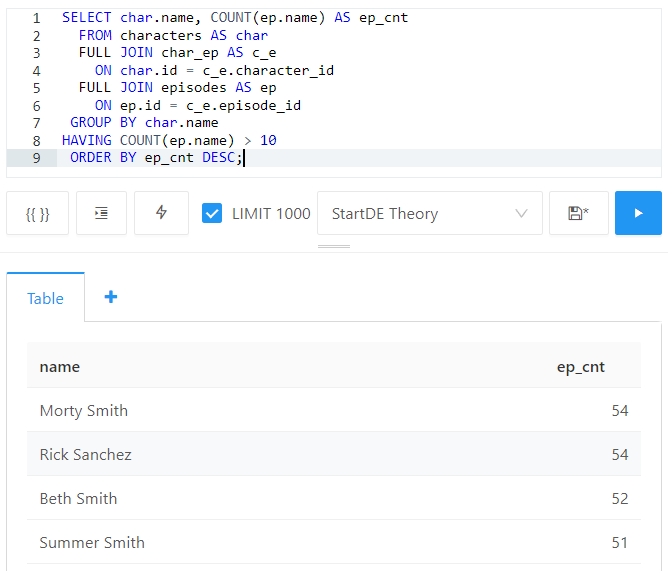

### Check yourself

**How does `DISTINCT` affect performance?** — it increases execution time: the DBMS has to compare and remember every unique value.

**What is the difference between `UNION` and `UNION ALL`?** — `UNION` removes duplicates, `UNION ALL` does not and is therefore faster.

**How do you combine or join fields of different types?** — cast one of them with `CAST` or `::`.

**Table t1 has N rows, t2 has M rows. What is the maximum number of rows a join can produce?** — N × M, with a `CROSS JOIN`.

**How does `JOIN` differ from `UNION`?** — `JOIN` combines data horizontally, enriching rows; `UNION` combines vertically, stacking rows.

**What happens if you use a `WHERE` condition with a `CROSS JOIN`?** — the Cartesian product is built first and only then filtered, which may cost a lot of resources.

---

## 1.6 ACID and the execution plan

### ACID

Anything that changes data in a database happens inside a **transaction** — a unit of work that either takes effect completely or not at all. A transaction is opened with `BEGIN` and closed with `COMMIT` (apply) or `ROLLBACK` (undo):

```sql
BEGIN;
UPDATE accounts SET balance = balance - 100 WHERE id = 1;
UPDATE accounts SET balance = balance + 100 WHERE id = 2;
COMMIT;
```

If the second `UPDATE` fails, `ROLLBACK` returns the database to the state it was in before `BEGIN` — money never disappears halfway through the transfer.

ACID is the set of four guarantees a transactional DBMS gives:

- **Atomicity** — a transaction is all-or-nothing. There is no state in which half of its statements have been applied.
- **Consistency** — a transaction moves the database from one valid state to another; all constraints (primary and foreign keys, `CHECK`, `NOT NULL`) hold before and after it.
- **Isolation** — concurrent transactions do not see each other's intermediate results. How strictly is governed by the **isolation level**: `READ UNCOMMITTED`, `READ COMMITTED` (the PostgreSQL default), `REPEATABLE READ`, `SERIALIZABLE`. The stricter the level, the fewer the anomalies (dirty reads, non-repeatable reads, phantom reads) and the higher the cost in concurrency.
- **Durability** — once `COMMIT` returns, the data survives a crash or a power failure, because it has been written to the transaction log on disk.

```sql
BEGIN ISOLATION LEVEL REPEATABLE READ;
-- ... the statements of the transaction ...
COMMIT;
```

> 💡 Analytical (OLAP) databases often relax these guarantees deliberately in exchange for read throughput. ACID in full is the domain of transactional (OLTP) systems such as PostgreSQL.

### Order of execution of clauses

We write an SQL query in one order and the DBMS executes it in another. The logical order of execution is:

1. **FROM** — the engine determines which tables the data will be taken from.
2. **ON** — the join conditions are processed; filtering happens before the join itself.
3. **JOIN** — the tables are joined on the specified conditions.
4. **WHERE** — the rows satisfying the query's conditions are filtered.
5. **GROUP BY** — the rows are grouped by the specified columns.
6. **HAVING** — the aggregated data is filtered; groups that fail the condition are cut off.
7. **SELECT** — the columns given in the query are computed and extracted.
8. **DISTINCT** — duplicates are removed from the result, if required.
9. **ORDER BY** — the data is sorted.
10. **LIMIT / OFFSET** — the rows for output are finally determined.

This explains several things we have already met: why `WHERE` cannot see an alias defined in `SELECT` (step 4 runs before step 7), why `ORDER BY` *can* see one (step 9 runs after step 7), and why filtering in `WHERE` is cheaper than the same filter in `HAVING`.

To simplify the picture: imagine working with two large stacks of documents. First we filter out the unnecessary pages, then combine the stacks, group them by certain features, mark the important elements, and finally order and shorten them as needed.

### The execution plan

The logical order above says *what* the DBMS computes. **The execution plan** says *how* — which physical operations it will perform, in what order, and at what cost. The plan is produced by the optimizer, which analyses table statistics and chooses access methods and join algorithms.

`EXPLAIN` shows the plan without running the query:

```sql
EXPLAIN
SELECT c.name, COUNT(ce.episode_id)
  FROM characters AS c
  LEFT JOIN char_ep AS ce ON c.id = ce.character_id
 GROUP BY c.name;
```

Reading a plan, `EXPLAIN ANALYZE`, indexes and query optimization are the subject of Lecture 3.

---

## Summary

**Filtering and sorting.** `WHERE` selects rows by a condition; `AND` and `OR` combine conditions, with `AND` binding tighter — set precedence explicitly with parentheses. Text is filtered with `=`, `LIKE`, `ILIKE`, `IN` and string functions. `ORDER BY` sorts (`ASC`/`DESC`), `LIMIT` and `OFFSET` paginate. `NULL` means the absence of data: compare it with `IS NULL` / `IS NOT NULL`, replace it with `COALESCE`, and place it explicitly in sorts with `NULLS FIRST` / `NULLS LAST`.

**Aggregate functions.** `SUM`, `MIN`, `MAX`, `AVG`, `COUNT` compute a single value over a set of rows. `GROUP BY` applies them per group, `HAVING` filters the groups afterwards. Filter non-aggregated data in `WHERE`, before grouping.

**Window functions.** `<function>(<field>) OVER (PARTITION BY … ORDER BY … <frame>)` computes over a window while returning every input row. Three groups: aggregate (`SUM`, `AVG`, `MIN`, `MAX`, `COUNT`), offset (`LAG`, `LEAD`, `FIRST_VALUE`, `LAST_VALUE`, `NTH_VALUE`) and ranking (`ROW_NUMBER`, `RANK`, `DENSE_RANK`, `NTILE`, `CUME_DIST`, `PERCENT_RANK`). Frames (`ROWS`, `RANGE`) fix the exact set of rows; `WINDOW` names a window for reuse.

**Subqueries and CTE.** A subquery is a query inside another query — non-correlated, correlated or scalar — usable in `SELECT`, `FROM`, `JOIN`, `WHERE`, `HAVING` and `ORDER BY`, with `IN`, `EXISTS`, `ANY`/`SOME` and `ALL`. A CTE (`WITH`) lifts a subquery out of the main query, improving readability and letting one result be reused. A CTE lives only for the duration of the query; a temporary table lives until the end of the session.

**Joins and unions.** `DISTINCT` removes duplicate rows. `UNION`/`UNION ALL` combine results vertically (`UNION` deduplicates, `UNION ALL` is faster). `JOIN` combines them horizontally: `INNER`, `LEFT`, `RIGHT`, `FULL`, `CROSS`, plus the `SELF JOIN` and anti-join patterns.

**ACID and execution.** Transactions guarantee Atomicity, Consistency, Isolation and Durability. Clauses execute in the order `FROM → ON → JOIN → WHERE → GROUP BY → HAVING → SELECT → DISTINCT → ORDER BY → LIMIT/OFFSET`; `EXPLAIN` shows the physical plan the optimizer chose.

By the end of this lecture you can write an SQL query using the following clauses:

| Clause | Description |
|---|---|
| `SELECT` | Queries data from one or several tables; selects specific columns and expressions |
| `DISTINCT` | Removes duplicate rows from the query result |
| `FROM` | Points to the table (or tables) the query addresses |
| `JOIN` | Joins rows from two or more tables on a related column: `INNER`, `LEFT`, `RIGHT`, `FULL`, `CROSS` |
| `WHERE` | Specifies the conditions by which rows are selected |
| `GROUP BY` | Groups rows with the same values in the specified columns for aggregation |
| `HAVING` | Filters the groups created by `GROUP BY` |
| `OVER` / `WINDOW` | Defines the window a window function is computed over |
| `WITH` | Declares a CTE — a named subquery used within the query |
| `ORDER BY` | Orders the rows of the result (`ASC` / `DESC`) |
| `LIMIT` and `OFFSET` | `LIMIT` restricts the number of rows returned; `OFFSET` skips rows before returning the rest |
| `UNION` and `UNION ALL` | Combine the results of several `SELECT` queries; `UNION` removes duplicates |
