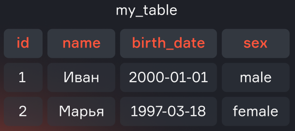
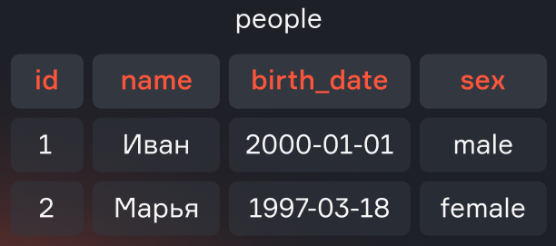
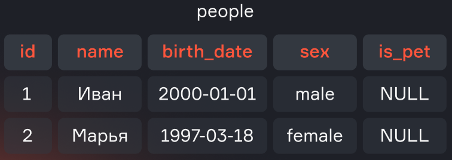
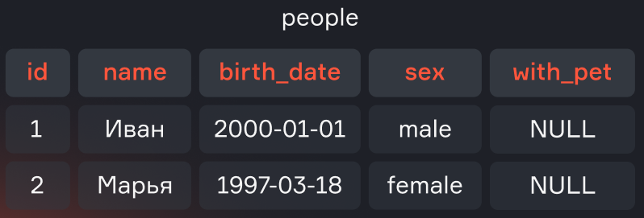
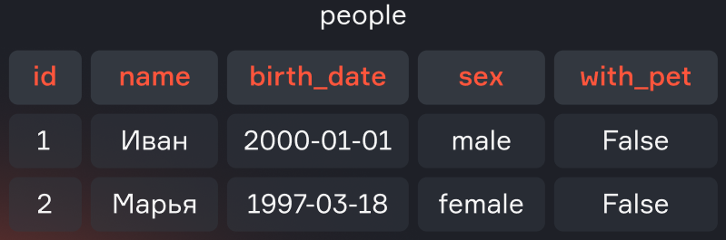
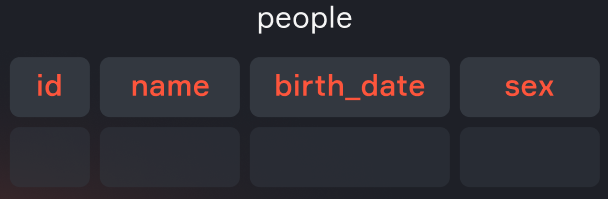
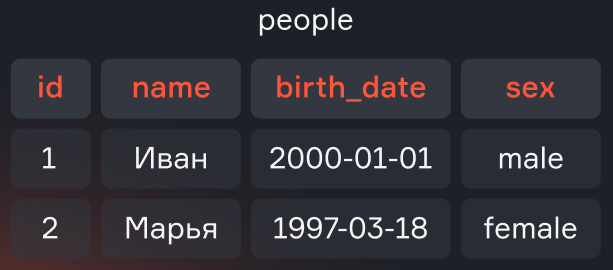
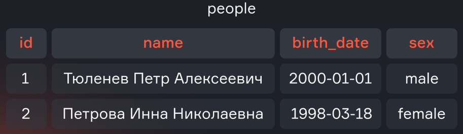

# Lecture 2. DDL & DML, Procedures, Variables

*Assembled from `md_base/` (lessons 8 and 9) according to `course_curriculum.md`, section 2, and extended with the procedures and variables material. PostgreSQL syntax.*

## Contents

- [2.1 Creating and updating tables](#21-creating-and-updating-tables)
  - [DDL — Data Definition Language](#ddl--data-definition-language)
  - [DML — Data Manipulation Language](#dml--data-manipulation-language)
- [2.2 Materializations: views and materialized views](#22-materializations-views-and-materialized-views)
- [2.3 Procedures](#23-procedures)
- [2.4 Variables](#24-variables)
- [Summary](#summary)

Lecture 1 was about *reading* data. This lecture is about *changing* it — the structure of the database, its contents, and the code that lives inside the database itself.

---

## 2.1 Creating and updating tables

SQL statements are traditionally split into groups by what they act on:

| Group | Statements | Acts on |
|---|---|---|
| **DDL** — Data Definition Language | `CREATE`, `ALTER`, `DROP`, `TRUNCATE` | the structure: tables, indexes, constraints, sequences |
| **DML** — Data Manipulation Language | `INSERT`, `UPDATE`, `DELETE` | the data inside the tables |
| **TCL** — Transaction Control Language | `BEGIN`, `COMMIT`, `ROLLBACK` | transactions (see ACID, Lecture 1 §1.6) |
| **DCL** — Data Control Language | `GRANT`, `REVOKE` | access rights |

This section covers the first two.

### DDL — Data Definition Language

#### CREATE

Creating a table in its simplest form:

```sql
CREATE TABLE my_table (
    id               int,
    name             text,
    birth_date       date,
    sex              text
);
```

**my_table**

| id | name | birth_date | sex |
|---|---|---|---|
| 1 | Иван | 2000-01-01 | male |
| 2 | Марья | 1997-03-18 | female |



In practice you also declare keys, length limits and constraints. The same table, written the way you would actually write it in PostgreSQL:

```sql
CREATE TABLE my_table (
    id                   SERIAL PRIMARY KEY,
    name                 VARCHAR(255),
    birth_date           DATE,
    sex                  VARCHAR(6) NOT NULL,
    CONSTRAINT sex_check CHECK (sex IN ('male', 'female'))
);
```

- `id` is not a plain `INT` but a `SERIAL PRIMARY KEY` — an auto-incrementing surrogate key;
- `name` is a `VARCHAR` limited to 255 characters instead of an unbounded `TEXT`;
- `sex` carries a `NOT NULL` constraint;
- the `CHECK` constraint at the end restricts `sex` to `'male'` or `'female'`.

> 💡 DDL syntax differs considerably between DBMSs — ClickHouse, for example, additionally requires a table engine, a sort key and `ON CLUSTER` for a distributed rollout. Always consult the documentation of the system you are working with. Everything in this course is PostgreSQL.

Two more constraint types worth knowing at this point:

```sql
CREATE TABLE orders (
    id          SERIAL PRIMARY KEY,
    person_id   INT REFERENCES my_table(id),      -- foreign key
    order_num   VARCHAR(20) UNIQUE,               -- uniqueness
    created_at  TIMESTAMP DEFAULT now()           -- default value
);
```

- **`PRIMARY KEY`** uniquely identifies a row; there is exactly one per table, and it is `NOT NULL` by definition.
- **`REFERENCES`** (a foreign key) guarantees that the value exists in the referenced table — this is the "Consistency" of ACID being enforced for you.
- **`UNIQUE`** forbids repeated values.
- **`DEFAULT`** supplies a value when the `INSERT` does not.

#### ALTER

`ALTER TABLE` renames tables and adds, modifies and removes fields.

Renaming a table:

```sql
ALTER TABLE my_table
RENAME TO people;
```

**people**

| id | name | birth_date | sex |
|---|---|---|---|
| 1 | Иван | 2000-01-01 | male |
| 2 | Марья | 1997-03-18 | female |



Renaming is usually fast: no new table is created and no data is copied — one name is simply replaced by another in the DBMS's catalogue.

Adding a new field:

```sql
ALTER TABLE people
ADD COLUMN is_pet boolean;
```

**people**

| id | name | birth_date | sex | is_pet |
|---|---|---|---|---|
| 1 | Иван | 2000-01-01 | male | NULL |
| 2 | Марья | 1997-03-18 | female | NULL |



In all existing rows the new field takes the value `NULL`.

Renaming a field:

```sql
ALTER TABLE people
RENAME COLUMN is_pet TO with_pet;
```

**people**

| id | name | birth_date | sex | with_pet |
|---|---|---|---|---|
| 1 | Иван | 2000-01-01 | male | NULL |
| 2 | Марья | 1997-03-18 | female | NULL |



Setting a default value for a field:

```sql
ALTER TABLE people
ALTER COLUMN with_pet
SET DEFAULT false;
```



> 💡 The default value applies only to new rows. Rows added earlier keep their `NULL`.

Changing a column's type:

```sql
ALTER TABLE people
ALTER COLUMN with_pet TYPE text
USING with_pet::text;
```

#### TRUNCATE

Clearing a table of records:

```sql
TRUNCATE TABLE people;
```

**people**

| id | name | birth_date | sex |
|---|---|---|---|
| *(empty)* | | | |



`TRUNCATE TABLE` removes all rows very quickly — much faster than `DELETE FROM table`, because it does not delete rows one by one. The table structure stays in place.

#### DROP

Dropping a column:

```sql
ALTER TABLE people
DROP COLUMN with_pet;
```

**people**

| id | name | birth_date | sex |
|---|---|---|---|
| 1 | Иван | 2000-01-01 | male |
| 2 | Марья | 1997-03-18 | female |



Dropping a table:

```sql
DROP TABLE people;
```

> 💡 Be careful with dropping a table — restoring it from a backup will be very hard.

### DML — Data Manipulation Language

#### INSERT

Adding records from literal values:

```sql
INSERT INTO people (id, name, birth_date, sex)
VALUES (1, 'Иванов Иван Иванович', date '2000-01-01', 'male'),
       (2, 'Петрова Инна Николаевна', date '1998-03-18', 'female');
```

**people**

| id | name | birth_date | sex |
|---|---|---|---|
| 1 | Иванов Иван Иванович | 2000-01-01 | male |
| 2 | Петрова Инна Николаевна | 1998-03-18 | female |


Adding rows from a query:

```sql
INSERT INTO people
SELECT id, name, date, NULL
  FROM employees
 WHERE species = 'Human';
```

The fields selected in `SELECT` must match, in order and in type, the fields of the target table. If a field has no source, put something explicit — `NULL` — in its place.

#### UPDATE

Changing data in all records of a column:

```sql
UPDATE people
   SET salary = salary * 1.1;
```

Changing data in filtered records:

```sql
UPDATE people
   SET name = 'Тюленев Петр Алексеевич'
 WHERE id = 1;
```

**people**

| id | name | birth_date | sex |
|---|---|---|---|
| 1 | Тюленев Петр Алексеевич | 2000-01-01 | male |
| 2 | Петрова Инна Николаевна | 1998-03-18 | female |



#### DELETE

```sql
DELETE FROM people
 WHERE id > 200;
```


> 💡 `DELETE` should always have a condition. If you mean to delete everything, `TRUNCATE` is the right statement.

#### DELETE vs TRUNCATE

- **`DELETE`** removes rows one by one and is normally used with a filter condition. It can clear a whole table, but slowly, since every row is processed separately.
- **`TRUNCATE`** clears the whole table at once. It is much faster, because no row-by-row deletion happens — at the cost of not being able to delete selectively.

#### A note on safety

Every DML statement in this section changes production data. Two habits worth forming now:

1. Write the `SELECT` first, check what it returns, and only then convert it into a `DELETE` or an `UPDATE` with the same `WHERE`.
2. Wrap risky changes in a transaction, so a mistake can be undone:

```sql
BEGIN;
UPDATE people SET sex = 'female' WHERE id = 1;
SELECT * FROM people WHERE id = 1;   -- check the result
COMMIT;                              -- or ROLLBACK if it looks wrong
```

---

## 2.2 Materializations: views and materialized views

When several source tables are joined, filtered and aggregated, and the result is needed again and again, writing the query out repeatedly becomes laborious. Instead, give the query a name.

### Views

A **view** (`VIEW`) is a named query. You address it as if it were a table — but it is not a table: the data stays in the source tables, and every time the view is addressed the same query is executed anew.

```sql
CREATE VIEW only_human AS
SELECT id, name, status, type, gender, origin_id
  FROM characters
 WHERE species = 'Human';
```

Now the view can be used like any table:

```sql
SELECT * FROM only_human;
```

Replacing and dropping a view:

```sql
CREATE OR REPLACE VIEW only_human AS
SELECT id, name, status, gender FROM characters WHERE species = 'Human';

DROP VIEW only_human;
```

**Advantages:**

- simplifies work with frequently used queries — a view can be reused in different queries;
- improves readability and is convenient when providing data to stakeholders;
- restricts access — users can be granted access to particular views that expose only the data they are allowed to see, without exposing the whole database.

> 💡 Data is not stored in a view. Every time it is addressed, the source tables are joined, filtered and aggregated again. Using a view does not save computing resources.

**View vs CTE:**

- A view can be used in other queries without being defined again, because it is a physical object in the database, stored on disk — remember that only the query is stored, not the data it returns. A CTE lives within a single query.
- A CTE can be part of a view. That matters, for example, for recursive queries, which are impossible without a CTE.

### Materialized views

A **materialized view** looks like an ordinary one, but the result of the query is saved into a physical table stored on disk. That is the trade-off: reads become cheap, but the data is a snapshot and can go stale.

```sql
CREATE MATERIALIZED VIEW char_per_season AS
SELECT substr(ep.episode_id, 1, 3) AS season,
       COUNT(DISTINCT ce.character_id) AS char_cnt
  FROM episodes AS ep
  JOIN char_ep AS ce ON ep.id = ce.episode_id
 GROUP BY 1;

REFRESH MATERIALIZED VIEW char_per_season;

DROP MATERIALIZED VIEW char_per_season;
```

In PostgreSQL the refresh is explicit — `REFRESH MATERIALIZED VIEW`, run manually or on a schedule. Other DBMSs differ substantially: some refresh in real time, some by a trigger, and some have no such functionality at all. Always consult the documentation.

| | View | Materialized view | Table |
|---|---|---|---|
| Stores data | no | yes | yes |
| Cost of reading | the full query, every time | a read of stored rows | a read of stored rows |
| Freshness | always current | as of the last refresh | always current |
| Occupies disk | no (only the definition) | yes | yes |

### Check yourself

**What are views used for?** — to simplify collecting data from the same source tables and reduce duplicated code.

**How does a materialized view differ from an ordinary one?** — a materialized view is a physical table refreshed on some event; an ordinary view is simply a named query.

**What happens if the schema of the table a view is built on changes?** — the view breaks and has to be re-created with `DROP VIEW` and `CREATE OR REPLACE VIEW`.

---

## 2.3 Procedures

Views name a *query*. Procedures and functions name a *sequence of statements* — logic that lives inside the database and can contain variables, conditions and loops. In PostgreSQL this code is written in **PL/pgSQL**.

### Function or procedure?

PostgreSQL has both, and the difference matters:

| | `FUNCTION` | `PROCEDURE` |
|---|---|---|
| Called with | `SELECT my_func(…)` | `CALL my_proc(…)` |
| Returns | a value or a set of rows | nothing (only `INOUT` parameters) |
| Usable inside a query | yes | no |
| Can manage transactions | no | yes (`COMMIT` / `ROLLBACK` inside) |

Rule of thumb: if you need a **value**, write a function; if you need an **action**, write a procedure.

### A function

```sql
CREATE OR REPLACE FUNCTION episode_count(char_name text)
RETURNS integer
LANGUAGE plpgsql
AS $$
DECLARE
    result integer;
BEGIN
    SELECT COUNT(ce.episode_id)
      INTO result
      FROM characters AS c
      JOIN char_ep   AS ce ON c.id = ce.character_id
     WHERE c.name = char_name;

    RETURN result;
END;
$$;
```

Calling it:

```sql
SELECT episode_count('Rick Sanchez');   -- 54
```

And, because a function returns a value, it can be used anywhere a value is expected — including inside another query:

```sql
SELECT name, episode_count(name) AS ep_cnt
  FROM characters
 WHERE species = 'Human'
 LIMIT 10;
```

Note the structure, which is the same for every PL/pgSQL routine:

- `$$ … $$` — **dollar quoting**. The body is a string; dollar quoting saves you from escaping every quote inside it.
- `DECLARE` — the block where local variables are declared.
- `BEGIN … END;` — the executable block. (This `BEGIN` is a block delimiter, not the transaction `BEGIN` from §2.1.)

### A procedure

A procedure performs an action. Archiving characters who are no longer alive:

```sql
CREATE OR REPLACE PROCEDURE archive_dead_characters()
LANGUAGE plpgsql
AS $$
DECLARE
    moved_cnt integer;
BEGIN
    INSERT INTO characters_archive
    SELECT * FROM characters WHERE status = 'Dead';

    GET DIAGNOSTICS moved_cnt = ROW_COUNT;

    DELETE FROM characters WHERE status = 'Dead';

    RAISE NOTICE 'Archived % characters', moved_cnt;
END;
$$;
```

```sql
CALL archive_dead_characters();
```

`GET DIAGNOSTICS … = ROW_COUNT` reads how many rows the previous statement touched; `RAISE NOTICE` prints a message to the client — the closest thing PL/pgSQL has to `print`.

### Parameters

Parameters have three modes:

```sql
CREATE OR REPLACE PROCEDURE raise_salary(
    IN    dept_id   integer,
    IN    pct       numeric DEFAULT 10,
    INOUT affected  integer DEFAULT 0
)
LANGUAGE plpgsql
AS $$
BEGIN
    UPDATE employees
       SET salary = salary * (1 + pct / 100)
     WHERE department_id = dept_id;

    GET DIAGNOSTICS affected = ROW_COUNT;
END;
$$;

CALL raise_salary(2, 15, NULL);
```

- `IN` (the default) — an input parameter;
- `OUT` — an output parameter;
- `INOUT` — both; this is how a procedure returns anything at all.

### Control flow

Conditions:

```sql
IF ep_cnt > 50 THEN
    RAISE NOTICE 'main character';
ELSIF ep_cnt > 10 THEN
    RAISE NOTICE 'recurring character';
ELSE
    RAISE NOTICE 'guest';
END IF;
```

Loops:

```sql
-- a counted loop
FOR i IN 1..5 LOOP
    RAISE NOTICE 'season %', i;
END LOOP;

-- a loop over the rows of a query
FOR rec IN SELECT name, status FROM characters LIMIT 10 LOOP
    RAISE NOTICE '% is %', rec.name, rec.status;
END LOOP;

-- a conditional loop
WHILE cnt < 10 LOOP
    cnt := cnt + 1;
END LOOP;
```

> 💡 Row-by-row loops are the slowest way to work with a relational database. If the same result can be expressed as a single set-based `UPDATE` or `INSERT … SELECT`, write that instead — the loop is for the cases where it genuinely cannot.

### Error handling

```sql
BEGIN
    INSERT INTO people (id, name) VALUES (1, 'Иван');
EXCEPTION
    WHEN unique_violation THEN
        RAISE NOTICE 'id 1 already exists, skipping';
    WHEN others THEN
        RAISE NOTICE 'unexpected error: %', SQLERRM;
END;
```

An `EXCEPTION` block catches errors so that a routine can continue instead of aborting the whole transaction. `SQLERRM` holds the error message, `SQLSTATE` the error code.

### Dropping a routine

```sql
DROP FUNCTION  episode_count(text);
DROP PROCEDURE archive_dead_characters();
```

The argument types are part of the identity of a routine — PostgreSQL allows overloading, so `DROP` needs the signature, not just the name.

---

## 2.4 Variables

There are two quite different things called "variables" in PostgreSQL. Do not mix them up.

### 1. Variables inside PL/pgSQL

Declared in the `DECLARE` block of a function, procedure or anonymous block, and living only for the duration of the call.

```sql
DECLARE
    ep_cnt      integer;                      -- no initial value → NULL
    threshold   integer := 10;                -- with an initial value
    label       text    := 'main character';
    season      constant text := 'S01';       -- cannot be reassigned
    rec         record;                       -- a row of any shape
    ch          characters%ROWTYPE;           -- a row of the characters table
    nm          characters.name%TYPE;         -- the type of one column
BEGIN
    ...
END;
```

Assignment uses `:=`, and a query result is assigned with `SELECT … INTO`:

```sql
threshold := threshold * 2;

SELECT COUNT(1) INTO ep_cnt FROM episodes;
```

`%TYPE` and `%ROWTYPE` are worth the habit: they tie the variable to the column or table definition, so the code keeps working if the column type changes.

### An anonymous block: DO

You do not have to create a routine to run PL/pgSQL. A `DO` block executes it once, immediately — ideal for one-off maintenance scripts:

```sql
DO $$
DECLARE
    total_ep  integer;
    total_chr integer;
BEGIN
    SELECT COUNT(1) INTO total_ep  FROM episodes;
    SELECT COUNT(1) INTO total_chr FROM characters;

    RAISE NOTICE 'Episodes: %, characters: %, average % characters per episode',
                 total_ep, total_chr, round(total_chr::numeric / total_ep, 2);
END;
$$;
```

A `DO` block takes no parameters and returns nothing — it acts.

### 2. Session variables

These live in the connection, not in a block, and are visible to every statement until the session ends.

```sql
SET my.season = 'S01';                       -- set for the session
SELECT current_setting('my.season');         -- read it back

SELECT *
  FROM episodes
 WHERE substr(episode_id, 1, 3) = current_setting('my.season');
```

`SET LOCAL` limits the setting to the current transaction:

```sql
BEGIN;
SET LOCAL my.season = 'S02';
-- ... visible only inside this transaction ...
COMMIT;
```

The same mechanism configures the server's own behaviour:

```sql
SET work_mem = '256MB';
SET search_path TO public, staging;
SHOW work_mem;
```

> 💡 A custom session variable must contain a dot (`my.season`, not `season`) — that is how PostgreSQL distinguishes user settings from its own configuration parameters.

### 3. psql client variables

Strictly speaking these belong to the `psql` client rather than to the server, but they are what people usually reach for in scripts:

```sql
\set season 'S01'
SELECT * FROM episodes WHERE episode_id LIKE :'season' || '%';
```

`:name` substitutes the value, `:'name'` substitutes it quoted as a string literal, and `:"name"` as an identifier.

### Which one to use

| Need | Use |
|---|---|
| A temporary value inside a routine or block | a PL/pgSQL variable in `DECLARE` |
| A value shared by several statements in one connection | `SET` / `current_setting()` |
| A parameter for a script run through the `psql` client | `\set` and `:name` |
| A value passed from an application | a **query parameter** (`$1`, `$2`), never string concatenation |

The last row is a security point, not a style point: building SQL by concatenating user input is how SQL injection happens. Pass parameters.

---

## Summary

**DDL** describes the structure of the data — tables, indexes, constraints, sequences:

- `CREATE TABLE` — creates a table; declare `PRIMARY KEY`, `NOT NULL`, `UNIQUE`, `CHECK`, `REFERENCES` and `DEFAULT` while you are there;
- `ALTER TABLE` — renames a table, and adds, renames, retypes and drops fields;
- `DROP COLUMN` / `DROP TABLE` — removes a field or the whole table;
- `TRUNCATE TABLE` — removes all records fast, keeping the structure.

**DML** manipulates the data in the tables:

- `INSERT INTO` — adds records, from `VALUES` or from a `SELECT`;
- `UPDATE` — changes data, with or without a filter;
- `DELETE` — deletes data; always give it a condition, and use `TRUNCATE` when you mean "everything".

**Materializations** name a query:

- a **view** stores only the query — it is always current, occupies no space, and costs a full re-execution on every read;
- a **materialized view** stores the result — reads are cheap, but the data is only as fresh as the last `REFRESH MATERIALIZED VIEW`;
- unlike a CTE, both persist in the database and can be used by other queries.

**Procedures and functions** put logic in the database, written in PL/pgSQL:

- a `FUNCTION` returns a value and can be called inside a query (`SELECT f(x)`);
- a `PROCEDURE` performs an action, is called with `CALL`, and can manage transactions;
- both support `IN`/`OUT`/`INOUT` parameters, `IF`, `FOR`/`WHILE` loops, and `EXCEPTION` blocks;
- prefer set-based statements to row-by-row loops.

**Variables** come in three kinds, at three different scopes:

- PL/pgSQL variables — declared in `DECLARE`, assigned with `:=` or `SELECT … INTO`, alive for one call; `%TYPE` and `%ROWTYPE` tie them to the schema;
- session variables — `SET` / `SET LOCAL`, read with `current_setting()`, alive for the connection or the transaction;
- psql client variables — `\set` and `:name`, for scripts.

Values coming from an application belong in query parameters, never in concatenated SQL.
