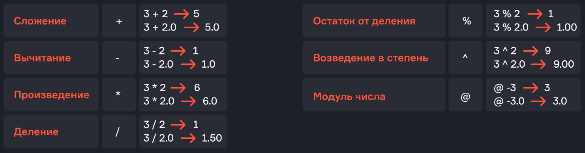
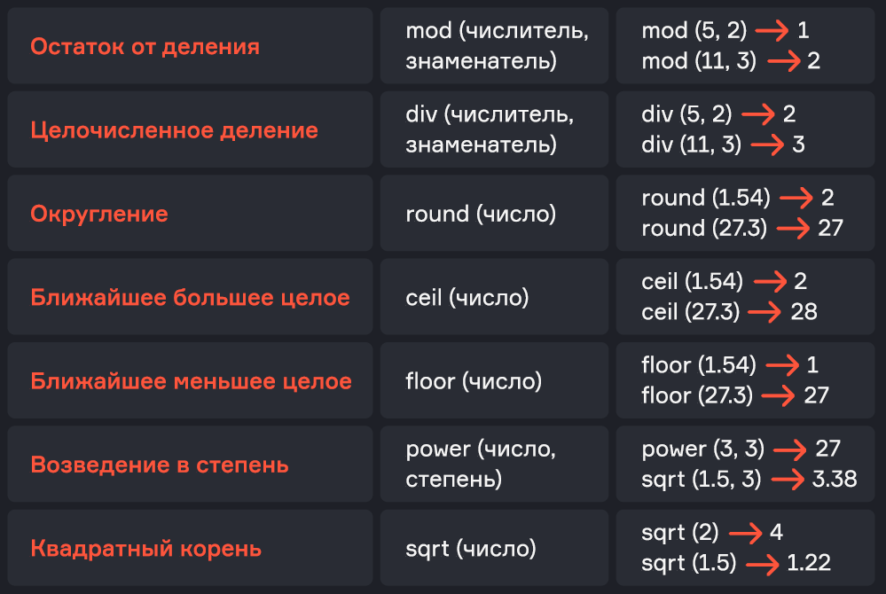
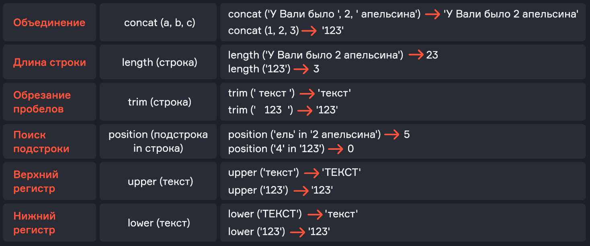
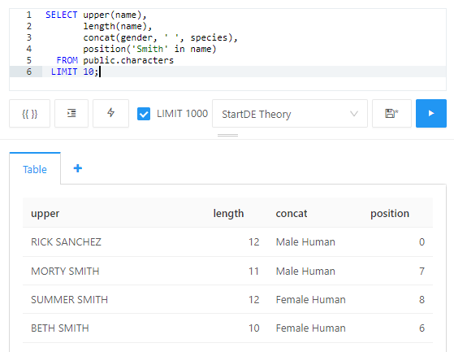
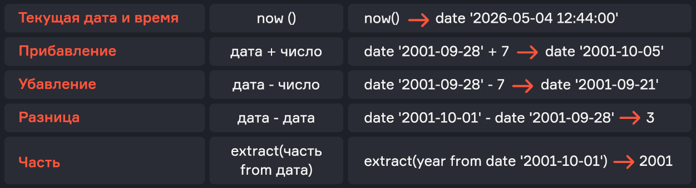
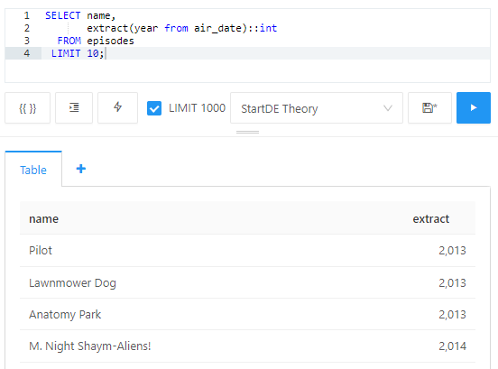
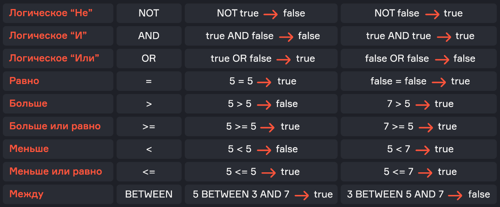
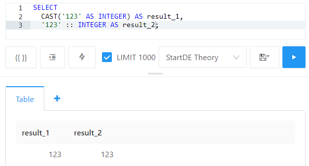

# Lesson 2. SQL Basics

*Source: «Урок 2. Основы SQL.pdf» — translated from Russian.*

## Contents

- About data types and functions
- Numbers
  - Operators
  - Functions
- Character types
  - Functions
- Date and time
  - Functions
- Flag (Boolean)
  - Functions
- The CASE operator
- Type conversion
- Additional types
- Alias
- Summary

---

## About data types and functions

Most databases have the following basic data types:

- numeric;
- character;
- date-time;
- flags.

There are also additional data types, such as arrays, JSON, UUID, binary types and geodata.

Data types play an important role in a database for several reasons:

- **They help ensure data integrity**, guaranteeing that only valid values are stored in columns (for example, a column with a numeric data type will not accept string values).
- **They optimize storage**, allowing memory to be used efficiently. For example, storing an integer requires less memory than storing the same information as a string (a set of characters). In addition, both numeric and character types have subtypes that limit the amount of memory a column value may occupy. This can be a limit on the maximum number of characters for the string type `VARCHAR(255)`, or a limit on the maximum value for an integer data type (the `int` type has a limit of 2 147 483 647).
- **They optimize performance**, allowing the operations we need to run faster. For example, comparison and sorting operations run faster for numeric data types than for character ones.
- **They simplify working with data**, by validating the data being entered into the database and by making the database more readable and understandable for developers and administrators.

Data types may differ depending on the DBMS, so you must always check the documentation of the database you are working with.

A **function** is a subroutine that takes arguments as input, performs certain operations (for example, calculations or data manipulations) and returns a result. For instance, a summation function with two input parameters takes the values of the first and the second argument, computes their sum and returns it.

If you wish, the result of any function can be used further, inside the next function. To do this you have to nest one function inside another. As an example of such nesting, imagine a function that computes the square of a sum: first the sum is computed by the first function, and the result is then squared by the second one.

---

## Numbers

As in mathematics, numbers can be integer or fractional. Unlike integers, fractional numbers have some number of digits after the decimal point, which may also be zeros (in that case the fractional number equals an integer). Different DBMSs denote numeric types differently, and they also have different ranges of valid values and different memory footprints:

- **Integers** (`TINYINT`, `SMALLINT`, `MEDIUMINT`, `INT` (or `INTEGER`), `BIGINT`)
- **Decimal fractions** (`FLOAT`, `DOUBLE`, `DECIMAL`, `NUMERIC`)

### Operators

Numeric types have both operators and functions. Operators perform mathematical operations such as addition, subtraction, multiplication and division. In addition, SQL has extra operators — modulo (remainder of division), exponentiation and absolute value.

| Operation | Operator | Examples |
|---|---|---|
| Addition | `+` | `3 + 2 → 5`  ·  `3 + 2.0 → 5.0` |
| Subtraction | `-` | `3 - 2 → 1`  ·  `3 - 2.0 → 1.0` |
| Multiplication | `*` | `3 * 2 → 6`  ·  `3 * 2.0 → 6.0` |
| Division | `/` | `3 / 2 → 1`  ·  `3 / 2.0 → 1.50` |
| Remainder of division | `%` | `3 % 2 → 1`  ·  `3 % 2.0 → 1.00` |
| Exponentiation | `^` | `3 ^ 2 → 9`  ·  `3 ^ 2.0 → 9.00` |
| Absolute value | `@` | `@ -3 → 3`  ·  `@ -3.0 → 3.0` |



Note that when you use only integer values in operators, the result will be an integer. If one of the arguments is fractional, the result will be fractional too.

### Functions

Most DBMSs implement the following functions for performing various calculations and conversions on numeric types:

| Purpose | Function | Examples |
|---|---|---|
| Remainder of division | `mod(numerator, denominator)` | `mod(5, 2) → 1`  ·  `mod(11, 3) → 2` |
| Integer division | `div(numerator, denominator)` | `div(5, 2) → 2`  ·  `div(11, 3) → 3` |
| Rounding | `round(number)` | `round(1.54) → 2`  ·  `round(27.3) → 27` |
| Nearest larger integer | `ceil(number)` | `ceil(1.54) → 2`  ·  `ceil(27.3) → 28` |
| Nearest smaller integer | `floor(number)` | `floor(1.54) → 1`  ·  `floor(27.3) → 27` |
| Exponentiation | `power(number, power)` | `power(3, 3) → 27`  ·  `power(1.5, 3) → 3.38` |
| Square root | `sqrt(number)` | `sqrt(2) → 4`* · `sqrt(1.5) → 1.22` |



> \* Reproduced as printed in the original slide; mathematically `sqrt(2) ≈ 1.41`.

> 💡 If you were attentive, you may have noticed that the remainder of division can be obtained both with the `%` operator and with the `DIV` function — this does not affect the computed result. Likewise, exponentiation can be done in several ways.

If we want to use our DBMS as a calculator, we need to use the `SELECT` statement and then list, separated by commas, the expressions and functions we need. There is no need to specify a `FROM` clause, because we are not requesting data from any table.

Example of using numeric operators and functions:

```sql
SELECT 1 + 2       AS simple_sum,    -- result 3
       1 + 2.0     AS second_sum,    -- result 3.00
       4 - 8       AS negative_diff, -- result -4
       5 * 6       AS abs,           -- result 30
       round(2.5)  AS our_round,     -- result 3.00
       ceil(2.5)   AS ceil,          -- result 3.00
       floor(2.5)  AS floor,         -- result 2.00
       power(3, 5) AS power,         -- result 243
       sqrt(25)    AS square_root    -- result 5.00
```

---

## Character types

Character types include any characters, strings, letters or even sentences. Just like numeric types, character types are described differently in different DBMSs (`TEXT`, `STRING`, `CHAR`, `VARCHAR`), and they have different length ranges and memory footprints. Therefore you must check the documentation of the database you are working with.

### Functions

| Purpose | Function | Examples |
|---|---|---|
| Concatenation | `concat(a, b, c)` | `concat('Valya had ', 2, ' oranges') → 'Valya had 2 oranges'`  ·  `concat(1, 2, 3) → '123'` |
| String length | `length(string)` | `length('У Вали было 2 апельсина') → 23`  ·  `length('123') → 3` |
| Trimming spaces | `trim(string)` | `trim(' text ') → 'text'`  ·  `trim(' 123 ') → '123'` |
| Substring search | `position(substring in string)` | `position('ель' in '2 апельсина') → 5`  ·  `position('4' in '123') → 0` |
| Upper case | `upper(text)` | `upper('текст') → 'ТЕКСТ'`  ·  `upper('123') → '123'` |
| Lower case | `lower(text)` | `lower('ТЕКСТ') → 'текст'`  ·  `lower('123') → '123'` |



> The Russian sample strings above are kept as they appear in the original slide, because the returned lengths and positions depend on them.

Note that strings must be enclosed in quotes, which may be either single or double. Also remember that spaces are counted when computing the length of a string.

Example of using character functions:

```sql
SELECT upper(name),                    -- name in upper case
       length(name),                   -- number of characters
       concat(gender, ' ', species),   -- gender and species joined
       position('Smith' in name)       -- position of the substring
  FROM public.characters
 LIMIT 10;
```

| upper | length | concat | position |
|---|---|---|---|
| RICK SANCHEZ | 12 | Male Human | 0 |
| MORTY SMITH | 11 | Male Human | 7 |
| SUMMER SMITH | 12 | Female Human | 8 |
| BETH SMITH | 10 | Female Human | 6 |



---

## Date and time

SQL has four date and time types:

- **Date** — just a date
- **DateTime** — date and time
- **Time** — time only
- **Timestamp**

**Timestamp** is a number containing the count of seconds elapsed since 1 January 1970. This format is standard in Unix systems and is often more useful than a date or a time. As a rule, users do not think about which time zone a particular server is in. A timestamp always counts seconds in UTC; on every request we get an absolute time, which the server converts into our current time zone. Under the hood, however, it does not differ depending on where the server is located.

### Functions

| Purpose | Function | Examples |
|---|---|---|
| Current date and time | `now()` | `now() → date '2026-05-04 12:44:00'` |
| Addition | `date + number` | `date '2001-09-28' + 7 → date '2001-10-05'` |
| Subtraction | `date - number` | `date '2001-09-28' - 7 → date '2001-09-21'` |
| Difference | `date - date` | `date '2001-10-01' - date '2001-09-28' → 3` |
| Part of a date | `extract(part from date)` | `extract(year from date '2001-10-01') → 2001` |



In the examples above, note that `DATE` is a date constructor which explicitly states that the string `'2001-09-28'` should be interpreted as a date.

Example of using date and time functions:

```sql
SELECT name,                              -- name
       extract(year from air_date)::int   -- year
  FROM episodes;
```

| name | extract |
|---|---|
| Pilot | 2013 |
| Lawnmower Dog | 2013 |
| Anatomy Park | 2013 |
| M. Night Shaym-Aliens! | 2014 |



---

## Flag (Boolean)

This type is most often described as `Boolean` or `Bool`. Inside the database it is stored as 1 or 0, and in the interface it is usually shown as `True` or `False`. It is a flag that answers a specific question, for example:

- has the student passed the test;
- has the purchase been paid for;
- is the user 18 years old;
- has onboarding been completed.

### Functions

| Purpose | Operator | Examples |
|---|---|---|
| Logical "NOT" | `NOT` | `NOT true → false`  ·  `NOT false → true` |
| Logical "AND" | `AND` | `true AND false → false`  ·  `true AND true → true` |
| Logical "OR" | `OR` | `true OR false → true`  ·  `false OR false → false` |
| Equal | `=` | `5 = 5 → true`  ·  `false = false → true` |
| Greater than | `>` | `5 > 5 → false`  ·  `7 > 5 → true` |
| Greater than or equal | `>=` | `5 >= 5 → true`  ·  `7 >= 5 → true` |
| Less than | `<` | `5 < 5 → false`  ·  `5 < 7 → true` |
| Less than or equal | `<=` | `5 <= 5 → true`  ·  `5 <= 7 → true` |
| Between | `BETWEEN` | `5 BETWEEN 3 AND 7 → true`  ·  `3 BETWEEN 5 AND 7 → false` |



In SQL, **operator precedence** for logical operations determines the order in which these operations are executed. Knowing operator precedence helps you build queries correctly and avoid logic errors.

Operator precedence in SQL:

- Comparison operators `=`, `!=`, `<`, `>`, `<=`, `>=`, `<>`, `BETWEEN`, `LIKE`, `IN`, `IS NULL`, `IS NOT NULL` have the highest precedence among logical operations and are evaluated first when expressions are evaluated.
- The logical operator `NOT` has higher precedence than `AND` and `OR`, and is used to invert a logical value.
- The logical operator `AND` has medium precedence and is used to combine two logical expressions, both of which must be true for the operator to return `True`; otherwise it returns `False`.
- The logical operator `OR` has the lowest precedence and is used to combine two logical expressions, one of which must be true for the operator to return `True`; otherwise it returns `False`.

---

## The CASE operator

The `CASE` operator in SQL is a powerful tool for building conditional logical expressions that let you perform different actions depending on given conditions. It can be applied in `SELECT`, `UPDATE` and other statements to select data, aggregate it, update it and create computed fields. The syntax of the operator resembles `if-else` constructs in programming languages and can be applied in a variety of scenarios.

```sql
CASE                                  -- operator
     WHEN condition_1 THEN result_1   -- condition 1
     WHEN condition_2 THEN result_2   -- condition 2
     ...
     ELSE result_N                    -- condition N
END                                   -- end of the logical expression
```

Example of using logical functions and the `CASE` operator:

```sql
SELECT name,
       CASE WHEN dimension = 'Dimension C-137' THEN 'Earth'
            ELSE 'not Earth' END AS Earth,
       type = 'Planet' AS is_planet,
       id > 10 AS not_top10,
       (type = 'Planet')::int AS is_planet_int
  FROM locations
 LIMIT 100;
```

| name | earth | is_planet | not_top10 | is_planet_int |
|---|---|---|---|---|
| Earth (C-137) | Earth | true | false | 1 |
| Abadango | not Earth | false | false | 0 |
| Citadel of Ricks | not Earth | false | false | 0 |
| Worldender's lair | not Earth | true | false | 1 |


---

## Type conversion

We have already seen that the result of adding an integer and a fractional number is a fractional number, and that a number is converted to text when text and a number are concatenated. These are examples of **implicit conversion**, where the DBMS understands that the data type of one column can be converted into the data type of another without being told explicitly.

We can also state explicitly that a data type must be converted into another type — for example, converting text into a number and then working with it as a number. For this, **explicit conversion** is used, performed with the double colon `::` or with the `CAST` function.

A rule of a good developer is "explicit is better than implicit". So even if the DBMS converts everything internally, it is better to make the conversion explicit. It is important to remember this rule, because not all DBMSs support the same implicit type-conversion rules, which can cause problems when porting code between different DBMSs. Implicit conversions can also be less performant, since the DBMS has to determine the type additionally before converting.

> 💡 Explicit conversion makes the behaviour of the code more predictable.

Conversion example:

```sql
SELECT
  CAST('123' AS INTEGER) AS result_1,
  '123' :: INTEGER       AS result_2;
```

| result_1 | result_2 |
|---|---|
| 123 | 123 |



---

## Additional types

- **Arrays** — a set of values of the same type. For example, we do not want to add 255 columns, so we put everything into a single array in one column.
- **JSON** — a text format for working with structured data. Some DBMSs let you work with this type not as a string but as a full-fledged structure, quickly finding the values you need (as in Python).
- **UUID** — an identification standard. It is usually generated programmatically, and the collision rate for such UIDs is very low. It is an alternative to an ID that we fill with increasing values.
- **Binary types** let you store pictures, videos and other files. There is no point in working with these types using SQL, so in practice files are stored in a separate file storage and the table stores a link to the file.
- **Geodata** let you specify, for example, a point or an area on a map. Some DBMSs provide such functionality.

Different DBMSs offer different types, and these are only the most common additional types.

---

## Alias

To give a name to whatever a function or an expression returns, we can use a pseudonym, or **alias**. To do this we use the `AS` keyword after our function or our expression. Technically you can omit it and this will not be an error. However, in that case the readability of large queries suffers, so using aliases is still recommended.

Let us look at one of the examples given in this lesson:

```sql
SELECT name,
       CASE WHEN dimension = 'Dimension C-137' THEN 'Earth'
            ELSE 'not Earth' END AS Earth,
       type = 'Planet' AS is_planet,
       id > 10 AS not_top10,
       (type = 'Planet')::int AS is_planet_int
  FROM locations
 LIMIT 100;
```

In the resulting table we explicitly wrote the names — that is, the aliases — for four of the five columns: `Earth`, `is_planet`, `not_top10`, `is_planet_int`. And what will be printed if you do not write them, we suggest you check for yourself 🙂

---

## Summary

- Most databases have several basic data types:
  - **Numeric.** Among them are integers (`TINYINT`, `SMALLINT`, `MEDIUMINT`, `INTEGER`, `BIGINT`) and decimal fractions (`FLOAT`, `DOUBLE`, `DECIMAL`, `NUMERIC`)
  - **Character** (`TEXT`, `STRING`, `CHAR`, `VARCHAR`)
  - **Date-time** (`DATE`, `DATETIME`, `TIME`, `TIMESTAMP`)
  - **Flags** (`BOOLEAN` or `BOOL`)
- Different types are intended for different ranges of values (or numbers of characters) and different memory footprints
- Type conversion in a DBMS can be explicit or implicit. Explicit conversion (using the `CAST` operator or `::`) makes the behaviour of the code more predictable
- A function is a subroutine that takes arguments as input, performs certain operations (for example, calculations or data manipulations) and returns a result. If you wish, the result of any function can be used further, in the next function. In addition to functions, numeric types have operators that perform mathematical operations
- The `CASE` operator is a powerful tool in SQL that lets you build conditions for performing different operations depending on the value of a column or an expression
- It is considered good practice to assign an alias to the result of evaluating an expression or of a function
