# Lesson 4. Complex Queries

*Source: «Урок 4. Сложные запросы.pdf» — translated from Russian.*

## Contents

- The DISTINCT clause
- Combining queries (UNION and UNION ALL)
- Joining tables (JOIN)
  - Main types of JOIN
  - Special types of JOIN
  - Venn diagrams
- Interview questions
- Summary

---

## The DISTINCT clause

The `DISTINCT` clause is used to remove duplicate rows from the result of a query. By applying `DISTINCT` we can get only the unique rows from a table. For example, the query below will output the unique values in the field `column1`:

```sql
SELECT DISTINCT column1 FROM table_name;
```

When we need unique combinations of values across two or more fields, we list the fields separated by commas and write the `DISTINCT` clause once, also right after `SELECT`:

```sql
SELECT DISTINCT column1, column2 FROM table_name;
```

When we use `DISTINCT`, the DBMS remembers every unique value and compares it with the following ones, which can slow the query down. This can be useful, for example, in the case of network errors, when the data source may send the same message to the DBMS twice.

Example of using the `DISTINCT` clause:

```sql
SELECT DISTINCT type
  FROM locations;
```

| type |
|---|
| Non-Diegetic Alternative Reality |
| Death Star |
| Arcade |

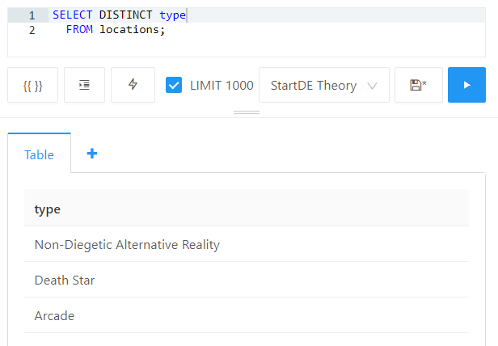

---

## Combining queries (UNION and UNION ALL)

The `UNION` and `UNION ALL` operations are used to combine the results of two or more queries:

- `UNION` combines the results, excluding duplicate rows;
- `UNION ALL` works in the same way as `UNION`, but does not exclude duplicates.

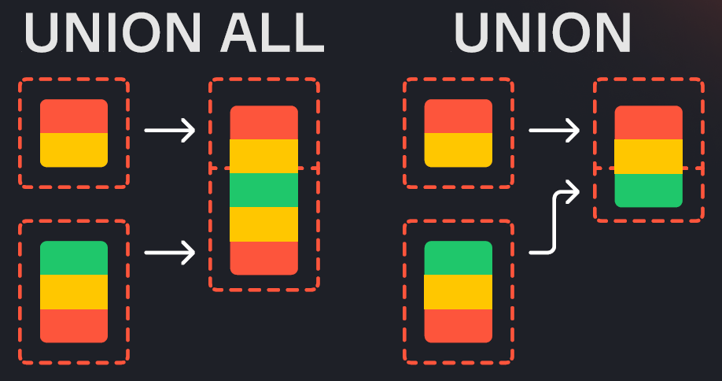

Thus `UNION` (unlike `UNION ALL`) performs deduplication.

> 💡 Deduplication — the elimination of repeated data.

Deduplication requires additional resources and time to execute, so `UNION ALL` works faster because it simply combines the results without removing duplicates.

General form of an SQL query using UNION:

```sql
SELECT <field_1>, <field_2>, <field_3>   -- query selecting from the first table
  FROM table_1
 UNION [ALL]                             -- the clause that combines the results
SELECT <field_1>, <field_2>, <field_3>   -- query selecting from the second table
  FROM table_2;
```

The `UNION` and `UNION ALL` operations have a restriction: the number of fields in the combined query results must be the same. The field names may differ, since the final field names are taken from the first query. The data types in the corresponding fields may also differ, but it is recommended to combine only fields with compatible data types.

Example of a query using UNION:

```sql
SELECT name
  FROM locations

 UNION ALL

SELECT name
  FROM characters
 ORDER BY 1;
```

| name |
|---|
| 26 Years Old Morty |
| 40 Years Old Morty |
| 7+7 Years Old Morty |
| 80's snake |

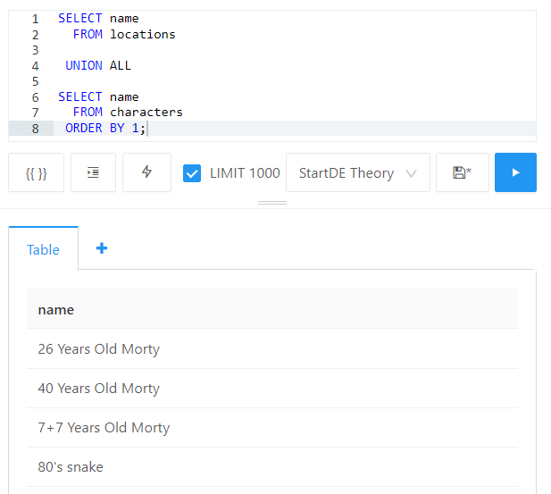

---

## Joining tables (JOIN)


The `JOIN` operation is used to enrich data from one table with data from another. Every row in one table is matched against the second table by some condition, and then the rows are combined. Such a condition is, for example, the equality of values in a certain field (or fields): records matching the value of the field from the first table are looked up in the second table, after which they are combined into the result table.

General form of an SQL query using JOIN:

```sql
SELECT a.column1, b.column2
  FROM table1 a
  JOIN table2 b ON a.id = b.table2_id;
```

This query joins the tables `table1` and `table2` on the field `id` from `table1` and the field `table2_id` from `table2`. Note that when joining, tables can be given aliases so that you do not have to write the table names out in full. The `AS` keyword may be omitted here.

### Main types of JOIN

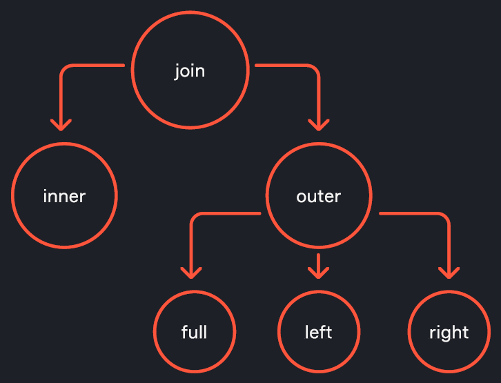

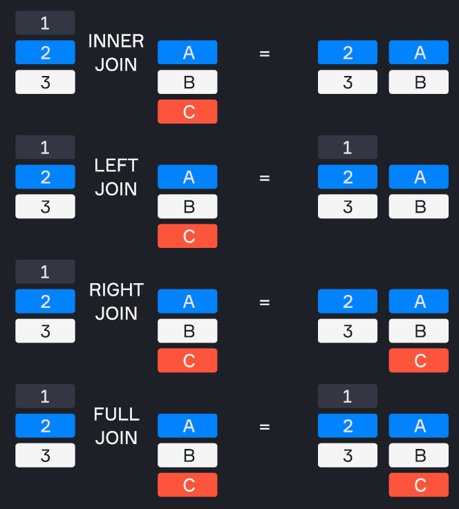

There are several types of `JOIN` operations, each with its own specifics and applied depending on the task. In SQL, when using the `JOIN` operator the word `INNER` can be omitted, because an inner join (`INNER JOIN`) is performed by default. When using the `LEFT JOIN` and `RIGHT JOIN` operators the word `OUTER` can also be omitted. This simplifies the syntax and makes queries more readable without changing their meaning.

As an example, let us take the employees table `employees` with the fields `employee_id`, `name` and `department_id`, and the departments table `departments` with the fields `department_id` and `department_name`.

**employees**

| employee_id | name | department_id |
|---|---|---|
| 1 | John | 1 |
| 2 | Jane | 2 |
| 3 | Mike | 4 |
| 4 | Anna | 3 |
| 5 | Steve | NULL |
| 6 | Bob | 2 |

**departments**

| department_id | department_name |
|---|---|
| 1 | HR |
| 2 | Engineering |
| 3 | Sales |

**INNER JOIN (inner join):** returns the rows that have a match in both tables.

To find only those employees for whom the database has information about their departments, we use `INNER JOIN`:

```sql
SELECT e.employee_id, e.name, d.department_name
  FROM employees e
 INNER JOIN departments d ON e.department_id = d.department_id;
```

Only those employees who have a corresponding `department_id` in the `departments` table will be included in the result. Employees whose `department_id` is `NULL`, or who have no match in the `departments` table, will be excluded from the result.

| employee_id | name | department_name |
|---|---|---|
| 1 | John | HR |
| 2 | Jane | Engineering |
| 4 | Anna | Sales |
| 6 | Bob | Engineering |

**OUTER JOIN (outer join):**

**`LEFT JOIN` (`LEFT OUTER JOIN`):** returns all rows from the left table and the matching rows from the right table. If there are no matches, `NULL`s are used in place of the right table's values.

To enrich the employees table with information about department names, we use `LEFT JOIN`:

```sql
SELECT e.employee_id, e.name, d.department_name
  FROM employees e
  LEFT JOIN departments d ON e.department_id = d.department_id;
```

All employees from the `employees` table will be included in the result. For employees who have a match in the `departments` table, the corresponding department name will be filled in. If there is no such match, then `NULL`.

| employee_id | name | department_name |
|---|---|---|
| 1 | John | HR |
| 2 | Jane | Engineering |
| 3 | Mike | NULL |
| 4 | Anna | Sales |
| 5 | Steve | NULL |
| 6 | Bob | Engineering |

**`RIGHT JOIN` (`RIGHT OUTER JOIN`):** returns all rows from the right table and the matching rows from the left table. If there are no matches, `NULL`s are used in place of the left table's values.

To enrich the departments table with information about employees, we use `RIGHT JOIN`:

```sql
SELECT e.employee_id, e.name, d.department_name
  FROM employees e
 RIGHT JOIN departments d ON e.department_id = d.department_id;
```

The query lets us see the employees who have a department specified and whose department exists in the departments table. It also shows which departments exist, even if they have no employees.

| employee_id | name | department_name |
|---|---|---|
| 1 | John | HR |
| 2 | Jane | Engineering |
| 4 | Anna | Sales |
| 6 | Bob | Engineering |

**`FULL JOIN` (`FULL OUTER JOIN`):** returns all rows from both tables, filling in the missing values with `NULL`.

```sql
SELECT e.employee_id, e.name, d.department_name
  FROM employees e
  FULL JOIN departments d ON e.department_id = d.department_id;
```

The query lets us fully combine the information about employees and departments. In this case the query result will coincide with the result of the `LEFT JOIN`, because all rows from the left table (`employees`) are present in the join and all rows from the right table (`departments`) have matches in the left table, so no extra rows with `NULL` are added to the result.

| employee_id | name | department_name |
|---|---|---|
| 1 | John | HR |
| 2 | Jane | Engineering |
| 3 | Mike | NULL |
| 4 | Anna | Sales |
| 5 | Steve | NULL |
| 6 | Bob | Engineering |

Another example of how FULL JOIN works — joining the courses table with the flows table:

**courses**

| id | name | description |
|---|---|---|
| 1 | Data Engineer | Training for data engineers |
| 2 | Data Analyst | Training for data analysts |
| 3 | Start ML | Introductory ML course |

**flows**

| id | course_id | number | start_date |
|---|---|---|---|
| 1 | 1 | 31 | 2024-03-07 |
| 2 | 1 | 32 | 2024-04-01 |
| 3 | 1 | 33 | 2024-04-21 |

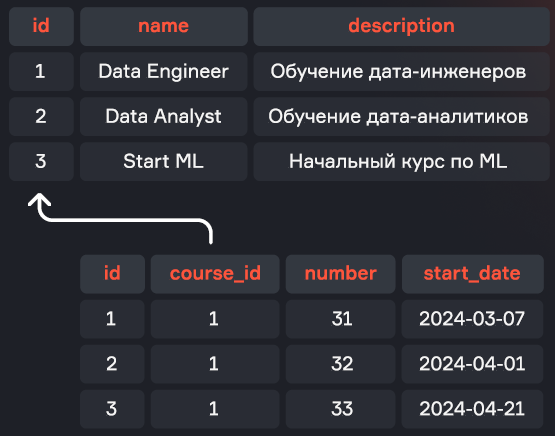

```sql
SELECT c.id         AS course_id,
       c.name       AS course_name,
       f.number     AS flow_num,
       f.start_date AS flow_start
  FROM courses AS c
  FULL JOIN flows AS f
    ON c.id = f.course_id;
```

| course_id | course_name | flow_num | flow_start |
|---|---|---|---|
| 1 | Data Engineer | 31 | 2024-03-07 |
| 1 | Data Engineer | 32 | 2024-04-01 |
| 1 | Data Engineer | 33 | 2024-04-21 |
| 2 | Data Analyst | NULL | NULL |
| 3 | Start ML | NULL | NULL |

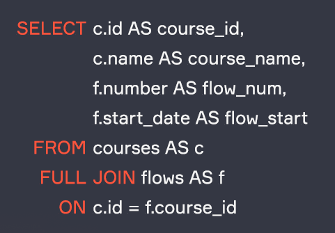

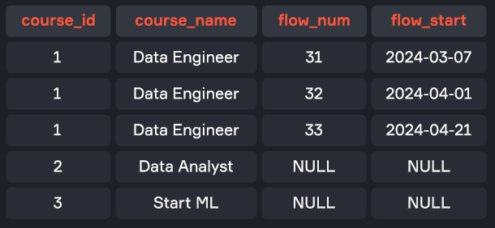

The `courses` table is joined with the `flows` table using `FULL JOIN`; values from the `courses` table where there are no matches are automatically filled with `NULL`.

### Special types of JOIN

- **CROSS JOIN:** a join without a condition, producing the Cartesian product of two tables. It is useful in situations where you need to match every row of one table with every row of another table. However, it should be used with caution because of the possible exponential growth in the number of rows in the result, which can lead to a significant drop in performance.

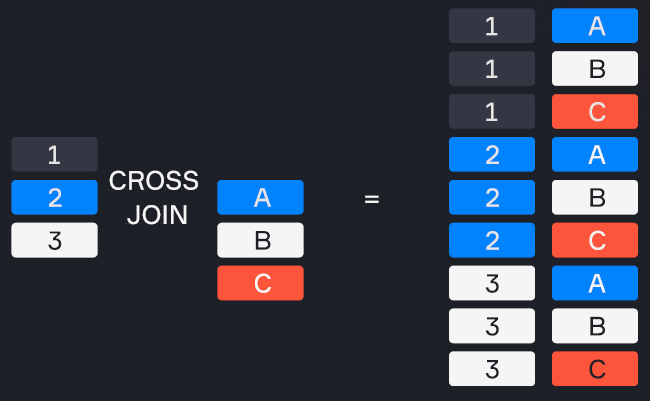

- **SELF JOIN:** joining a table with itself. This is useful when you need to compare rows of the same table or obtain data that is in different rows but related to each other. A self join is often used for working with hierarchical data — for example, to analyse the relationships between employees and their managers within a single table.

Example of how CROSS JOIN works:

```sql
SELECT c1.name AS name_1, c2.name AS name_2
  FROM characters AS c1
 CROSS JOIN characters AS c2
 WHERE c1.name != c2.name;
```

| name_1 | name_2 |
|---|---|
| Rick Sanchez | Morty Smith |
| Rick Sanchez | Summer Smith |
| Rick Sanchez | Beth Smith |
| Rick Sanchez | Jerry Smith |

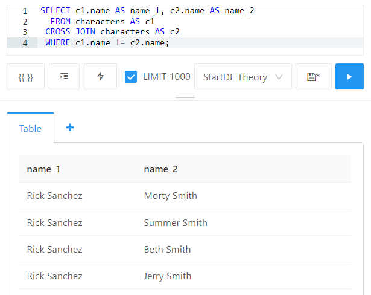

In the query above we output all possible pairwise variations of names.

### Venn diagrams

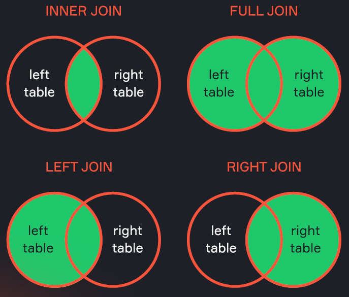

Venn diagrams are often used to explain the different types of JOINs in SQL, because they clearly demonstrate the intersections and unions of sets.

However, Venn diagrams do not always accurately convey all the aspects and nuances of JOIN operations in the context of relational databases (for example, when values in a table are repeated). You can read more about this in the articles *«Понимание джойнов сломано»* ("Understanding of joins is broken", habr.com) and *«Понимание джойнов сломано. Продолжение»* ("Understanding of joins is broken. Continued", habr.com).

---

## Interview questions

**1. How does DISTINCT affect query performance?**

`DISTINCT` increases the query execution time, because the DBMS has to compare and remember every unique value.

**2. What happens if you select `DISTINCT *` from a table?**

We get full deduplication of the data.

**3. What is the difference between UNION and UNION ALL?**

`UNION` removes duplicates, `UNION ALL` does not. `UNION ALL` works faster, since it does not require deduplication.

**4. How can you combine fields of different types?**

You have to convert one type into the other, for example using the `CAST` clause.

**5. What types of JOIN do you know?**

`INNER JOIN`, `LEFT JOIN`, `RIGHT JOIN`, `FULL JOIN`, `CROSS JOIN`, `SELF JOIN`.

**6. Table t1 has N rows, table t2 has M rows. What is the maximum number of rows we can get from a join?**

With a CROSS JOIN we can get N * M rows.

**7. How can we select all possible pairs of employees who work in the same department?**

You need to join the two tables and filter out the rows in which an employee was joined to themselves.

**8. How do you join tables on fields with different data types?**

Cast one of the fields to the required type with `CAST` or `::`.

**9. What happens if you use a WHERE condition with a CROSS JOIN?**

First the CROSS JOIN will be performed, then the rows will be filtered by the WHERE condition, which may take more resources.

---

## Summary

- The `DISTINCT` clause is used to remove duplicate rows from the query result
- The `UNION` and `UNION ALL` operations are used to combine the results of two queries:
  - `UNION` combines the results, excluding duplicate rows
  - `UNION ALL` works in the same way as `UNION`, but does not exclude duplicates
- The `JOIN` operation is used to enrich data from one table with data from another. Every row in one table is matched against the second table, either by some condition or without one. Types of joins: `INNER JOIN`, `LEFT JOIN`, `RIGHT JOIN`, `FULL JOIN`, `CROSS JOIN`
- `SELF JOIN` — joining a table with itself. This is useful when you need to compare rows of the same table or obtain data that is in different rows but related to each other

By the end of this lesson you can write an SQL query using the following clauses:

| Clause | Description |
|---|---|
| `SELECT` | The main operator for querying data from one or several tables. Lets you select specific columns and rows based on given conditions. |
| `DISTINCT` | Used together with `SELECT` to remove duplicate rows from the query result |
| `FROM` | Points to the table in the database that the query addresses |
| `JOIN` | Joins rows from two or more tables based on a related column between them. The different join types include: INNER JOIN, LEFT JOIN (or LEFT OUTER JOIN), RIGHT JOIN (or RIGHT OUTER JOIN), FULL JOIN (or FULL OUTER JOIN), CROSS JOIN |
| `WHERE` | Specifies the conditions by which rows will be selected |
| `ORDER BY` | Orders the rows in the query result by one or several columns. Can be used for sorting in ascending (`ASC`) or descending (`DESC`) order |
| `LIMIT` and `OFFSET` | `LIMIT` restricts the number of rows returned. `OFFSET` skips the specified number of rows before returning the remaining rows |
| `UNION` and `UNION ALL` | Combine the results of two or more `SELECT` queries. `UNION` removes duplicates, while `UNION ALL` keeps all rows, including duplicates |
