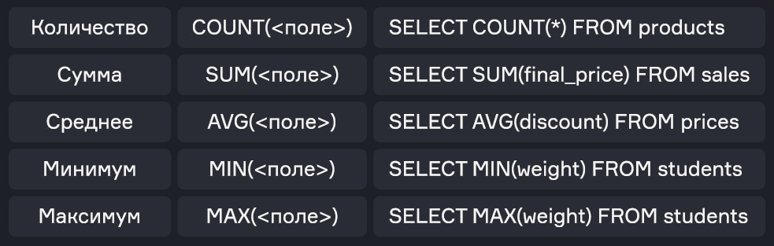
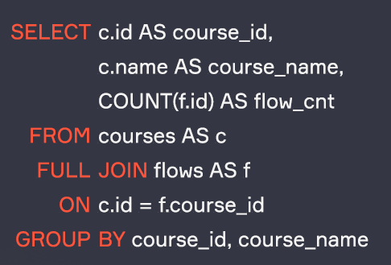
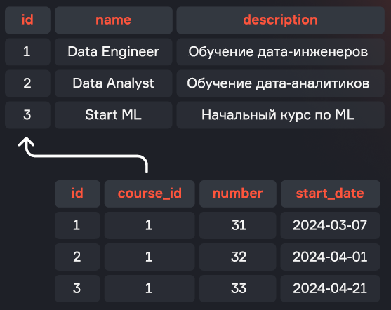
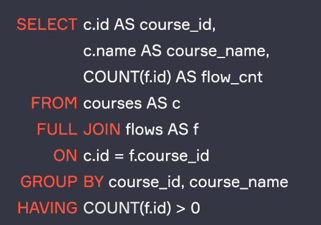

# Lesson 5. Aggregation

*Source: «Урок 5. Агрегация.pdf» — translated from Russian.*

## Contents

- Aggregate functions
  - Specifics of the COUNT function
- Grouping data
- Filtering by aggregates
- Interview questions
- Summary

---

## Aggregate functions


Aggregate functions perform a calculation over a set of values and return a single value, which is called an aggregate. They are used to analyse and summarise data, grouping it by certain criteria and returning statistical values. For example, we can calculate the sum of all purchases made today, the number of people in a department, or the average height of a population.

The main aggregate functions include:

| Purpose | Function | Example |
|---|---|---|
| Count | `COUNT(<field>)` | `SELECT COUNT(*) FROM products` |
| Sum | `SUM(<field>)` | `SELECT SUM(final_price) FROM sales` |
| Average | `AVG(<field>)` | `SELECT AVG(discount) FROM prices` |
| Minimum | `MIN(<field>)` | `SELECT MIN(weight) FROM students` |
| Maximum | `MAX(<field>)` | `SELECT MAX(weight) FROM students` |



Example of how aggregate functions work:

```sql
SELECT SUM(id), AVG(id), MIN(id), MAX(id)
  FROM locations;
```

| sum | avg | min | max |
|---|---|---|---|
| 8 001 | 63.50 | 1 | 126 |


---

## Specifics of the COUNT function

The `COUNT` function has several variations:

- `COUNT(*)` returns the number of rows in the table (or in the filtered table, if a `WHERE` clause is used);
- `COUNT(1)` is the same as `COUNT(*)`, but the DBMS does not read the values of every field, using a constant instead;
- `COUNT(<field>)` counts the number of non-empty values in the specified field;
- `COUNT(DISTINCT <field>)` returns the number of unique non-empty values in the specified field.

Example of how the `COUNT` function works:

```sql
SELECT COUNT(*) AS count_,
       COUNT(1) AS count_1,
       COUNT(dimension) AS count_dimension,
       COUNT(distinct type) AS count_dist_type
  FROM locations;
```

| count_ | count_1 | count_dimension | count_dist_type |
|---|---|---|---|
| 126 | 126 | 95 | 44 |


Example of counting the number of values in a column using `COUNT`, `SUM` and `CASE`:

```sql
SELECT COUNT(1) AS row_cnt,
       SUM(CASE WHEN gender = 'Male'   THEN 1 ELSE 0 END) AS male_cnt,
       SUM(CASE WHEN gender = 'Female' THEN 1 ELSE 0 END) AS female_cnt
  FROM characters
 WHERE status = 'Alive';
```


In the query above we obtain the field with the number of rows using `COUNT(1)`, and we count by gender by summing the result of the `CASE` expressions. When the gender matches the one we need we put 1, and in the opposite case 0. If we sum up these ones, we get the number of male and female characters.

---

## Grouping data


To compute aggregates over sets of data, the `GROUP BY` clause is used. It lets you specify the grouping field and execute aggregate functions within each group.

General form of a query with grouping:

```sql
SELECT <grouping field>, <aggregate>
  FROM table
 GROUP BY <grouping field>;
```

### Example of using grouping and aggregation

We need to count the number of flows for each course:

**courses**

| id | name | description |
|---|---|---|
| 1 | Data Engineer | Training for data engineers |
| 2 | Data Analyst | Training for data analysts |
| 3 | Start ML | Introductory ML course |

**flows**

| id | course_id | number | start_date |
|---|---|---|---|
| 1 | 1 | 31 | 2024-03-07 |
| 2 | 1 | 32 | 2024-04-01 |
| 3 | 1 | 33 | 2024-04-21 |


To do this we need to write an SQL query that joins the courses and flows tables and aggregates the "flows" field for each of the courses:

```sql
SELECT c.id        AS course_id,
       c.name      AS course_name,
       COUNT(f.id) AS flow_cnt
  FROM courses AS c
  FULL JOIN flows AS f
    ON c.id = f.course_id
 GROUP BY course_id, course_name;
```



In the query we combine two tables, group the data by `course_id` and `course_name`, and count the number of flows for each course. As a result we get the table we need:

| course_id | course_name | flow_cnt |
|---|---|---|
| 1 | Data Engineer | 3 |
| 2 | Data Analyst | 0 |
| 3 | Start ML | 0 |


---

## Filtering by aggregates


Sometimes you need to filter data after it has been aggregated. The `HAVING` clause is used for this. It lets you set conditions on aggregated data.

General form of a query with grouping and filtering by an aggregate:

```sql
SELECT <grouping field>, <aggregate>
  FROM table
 GROUP BY <grouping field>
HAVING <condition on the aggregate>
```

### Example of a query with filtering by an aggregate

We need to find the courses that have at least one flow.



To do this we need to write an SQL query that joins the courses and flows tables, aggregates the "flows" field for each of the courses, and applies a filter condition on the aggregated value:

```sql
SELECT c.id        AS course_id,
       c.name      AS course_name,
       COUNT(f.id) AS flow_cnt
  FROM courses AS c
  FULL JOIN flows AS f
    ON c.id = f.course_id
 GROUP BY course_id, course_name
HAVING COUNT(f.id) > 0;
```



In the query we combine two tables, group the data by `course_id` and `course_name`, count the number of flows for each course and then filter that count. As a result we get the table we need:

| course_id | course_name | flow_cnt |
|---|---|---|
| 1 | Data Engineer | 3 |


This query returns only those courses that have at least one flow.

Example of a query with filtering by an aggregate:

```sql
SELECT char.name, COUNT(ep.name) AS ep_cnt
  FROM characters AS char
  FULL JOIN char_ep AS c_e
    ON char.id = c_e.character_id
  FULL JOIN episodes AS ep
    ON ep.id = c_e.episode_id
 GROUP BY char.name
HAVING COUNT(ep.name) > 10
 ORDER BY ep_cnt DESC;
```

| name | ep_cnt |
|---|---|
| Morty Smith | 54 |
| Rick Sanchez | 54 |
| Beth Smith | 52 |
| Summer Smith | 51 |


Filtering data by non-aggregated values can be done either in the `WHERE` block or in the `HAVING` block. For example, the result of the following queries will be the same:

```sql
SELECT sex, COUNT(user_id)
FROM users
WHERE sex != 'male'
GROUP BY sex
```

```sql
SELECT sex, COUNT(user_id)
FROM users
GROUP BY sex
HAVING sex != 'male'
```

However, it is recommended to filter by non-aggregated data specifically in the `WHERE` block, that is, in advance. In that case the unnecessary data is removed from the calculations before grouping, and computing resources are not spent on counting values that you are going to filter out later anyway.

---

## Interview questions

**How do you count the number of employees working in a particular department?**

We count `COUNT(1)` from the table, filtering the department by name or ID with `WHERE`.

**How do you count, in a single query, the total number of rows, the number of men and the number of women in a table?**

Using `COUNT(1)`, and also substituting a one for the male gender flag in one field and a one for the female gender flag in another field, and then summing those rows.

**How can you find duplicates using grouping?**

We can group the data by the fields we need, counting the number of rows per group, and then filter in `HAVING` the groups containing more than one row — that is, the duplicates.

**What is the difference between `WHERE` and `HAVING`?**

- `WHERE` filters the original rows before they are grouped
- `HAVING` filters aggregated data after the grouping has been performed

Order of execution: first `WHERE`, then `GROUP BY`, and finally `HAVING`.

---

## Summary

- For calculations over a set of values, aggregate functions are used (`SUM`, `MIN`, `MAX`, `AVG`, `COUNT`). With the `COUNT` function you can count the number of rows in a table, the number of non-empty values in a field, and also the number of unique non-empty values of a field.
- To apply aggregate functions to groups of rows rather than to the whole field, the `GROUP BY` clause is used. It lets you specify the grouping fields, combining rows that have the same values into groups, and execute aggregate functions within each group.
- To filter the result of aggregate function calculations after grouping, the `HAVING` clause is used. First filtering in `WHERE` is performed, then `GROUP BY`, and finally filtering in `HAVING`.

By the end of this lesson you can write an SQL query using the following clauses:

| Clause | Description |
|---|---|
| `SELECT` | The main operator for querying data from one or several tables. Lets you select specific columns and rows based on given conditions. |
| `DISTINCT` | Used together with `SELECT` to remove duplicate rows from the query result |
| `FROM` | Points to the table (or tables) in the database that the query addresses |
| `JOIN` | Joins rows from two or more tables based on a related column between them. The different join types include: INNER JOIN, LEFT JOIN (or LEFT OUTER JOIN), RIGHT JOIN (or RIGHT OUTER JOIN), FULL JOIN (or FULL OUTER JOIN), CROSS JOIN |
| `WHERE` | Specifies the conditions by which rows will be selected |
| `GROUP BY` | Groups rows with the same values in the specified columns and lets you execute aggregate functions on each group |
| `HAVING` | Used to filter the groups created by `GROUP BY`, based on given conditions |
| `ORDER BY` | Orders the rows in the query result by one or several columns. Can be used for sorting in ascending (`ASC`) or descending (`DESC`) order |
| `LIMIT` and `OFFSET` | `LIMIT` restricts the number of rows returned. `OFFSET` skips the specified number of rows before returning the remaining rows |
| `UNION` and `UNION ALL` | Combine the results of two or more `SELECT` queries. `UNION` removes duplicates, while `UNION ALL` keeps all rows, including duplicates |
