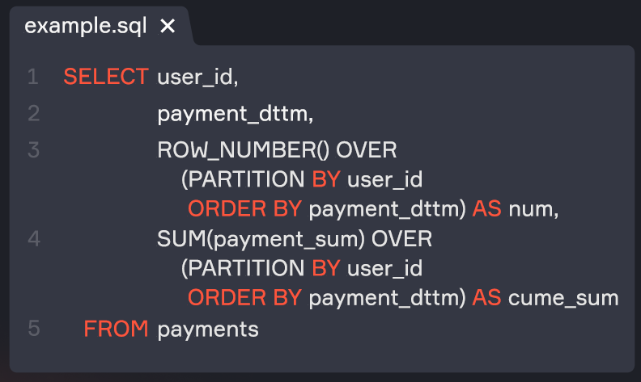
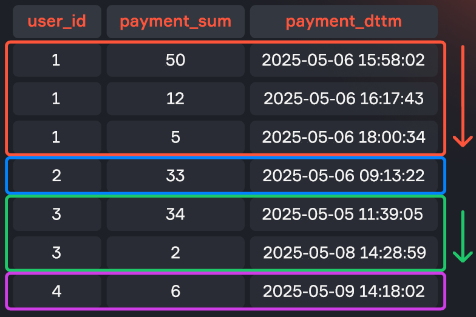
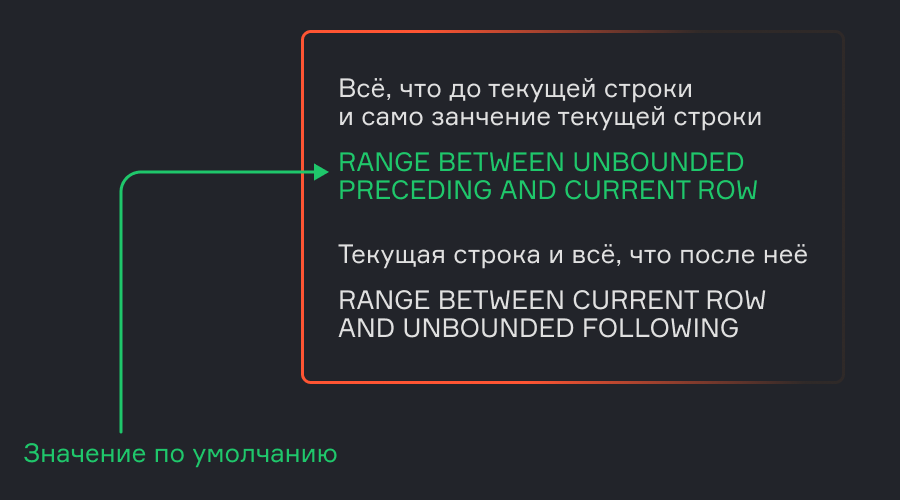

# Lesson 7. Analytic (Window) Functions

*Source: «Урок 7. Аналитические функции.pdf» — translated from Russian.*

## Contents

1. Analytic functions
2. The three groups of analytic functions
3. Aggregate functions
4. Offset functions
5. Ranking functions
6. Frames
7. Window Frame
8. Interview questions
9. Summary

---

## Analytic functions

SQL analytic functions, also known as window functions, play a key role in modern data analysis. They let you perform complex calculations over a set of rows while keeping every row in the resulting data set. These functions extend the capabilities of traditional aggregate functions such as `SUM`, `AVG` and `COUNT`, allowing operations over subsets of data. Thanks to their power and flexibility, analytic functions have become an indispensable tool for analysts and developers who aim for a deeper understanding of data and for optimizing query performance.

An **analytic (window) function** is a function that performs calculations based on a certain set of records, which form a window (partition). The window function is applied to the data inside the window and returns a single value as the result of the calculation.

> 💡 One of the main advantages of window functions is that they return exactly the same number of records that they received as input. Imagine you want to compute some value for a group of rows united by a common attribute (for example, a user id). If you used the `GROUP BY` operator, then instead of the original number of rows in the group you would get one row with the result. With grouping this is always the case — the number of rows in the resulting table always equals the number of groups in the source table. A window function, meanwhile, lets you carry out the same calculations with aggregation by groups, but preserves the structure of the source table: for every record belonging to a particular group, the aggregation result is simply given in a separate column.

Analytic (window) functions let you implement complex logic, such as computing a running total, determining the dates of a customer's first and last visits, and much more.

The data is divided into **partitions** (windows) by a certain field or fields. Inside each partition the data is sorted, after which it is analysed.

### Example

Let us look at an example. We have users making purchases. For each user the table records the date and time of the purchase, as well as the purchase amount.

**payments**

| user_id | payment_sum | payment_dttm |
|---|---|---|
| 1 | 5 | 2025-05-06 18:00:34 |
| 1 | 12 | 2025-05-06 16:17:43 |
| 1 | 50 | 2025-05-06 15:58:02 |
| 2 | 55 | 2025-05-06 09:15:22 |
| 3 | 2 | 2025-05-08 14:28:59 |
| 3 | 34 | 2025-05-05 11:39:05 |
| 4 | 6 | 2025-05-09 14:18:02 |


Example of a query with a window function that computes the purchase number for each user in chronological order, and the running total of all purchases for each user:

```sql
SELECT user_id,
       payment_dttm,
       ROW_NUMBER() OVER (PARTITION BY user_id
                          ORDER BY payment_dttm) AS num,
       SUM(payment_sum) OVER (PARTITION BY user_id
                              ORDER BY payment_dttm) AS cume_sum
  FROM payments
```







Let us look at the syntax of a window function in more detail. A window function is used with the keyword `OVER`. After `OVER`, the description of the window is given in parentheses. `PARTITION BY` defines the fields for splitting the data into groups. `ORDER BY` sets the sorting order of the data inside each partition.

```sql
<function>(<field>) OVER (PARTITION BY <partition> ORDER BY <sorting> <frame>)
```

- **function** — the window function over the chosen field;
- **partition** — the field or set of fields by which the group is determined;
  - in our case we split into groups by `user_id`
- **sorting** — the field or set of fields by which the rows are sorted inside the partition;
  - in our example we sort by the date of the purchase
- **frame** — the set of rows inside the window that we operate on.
  - an optional part of the query

First the data is split into the partitions defined in the `OVER` clause, then, if necessary, the records are sorted, and only then is the function applied to each record inside the partition. `ROW_NUMBER()` returns the row number inside the partition in the field `num`, and `SUM()` computes the cumulative sum of values inside the partition in the field `cume_sum` (with every new row our sum grows, so we get a running total).

> 💡 Why is the sum computed over the current row and all previous ones, rather than over all of the user's purchases in general? The point is that when window functions are used together with aggregate ones, a so-called **window frame** — a set of rows within its partition — is determined for each row. If you specify `ORDER BY` inside `OVER`, then by default the frame will consist of all rows from the beginning of the partition to the current row (the frame will also include rows that are equal to the current row by the value given in `ORDER BY`). That is exactly why in our example the sum is computed as a running total for each user. If `ORDER BY` is not specified, then the default frame will consist of all rows of the partition, i.e. the sum of all purchases of each user will be computed. You can also omit `PARTITION BY`, and then the window frame becomes the whole table, and we will simply compute the sum of the purchases of all users.

---

## The three groups of analytic functions

Analytic functions are divided into three main groups:

1. **Aggregate functions** (SUM, AVG, MAX, MIN).
2. **Offset functions** (LAG, LEAD, FIRST_VALUE, LAST_VALUE, NTH_VALUE).
3. **Ranking functions** (ROW_NUMBER, RANK, DENSE_RANK, NTILE, CUME_DIST, PERCENT_RANK).

| WINDOW FUNCTIONS | | |
|---|---|---|
| **AGGREGATION** | **OFFSET** | **RANKING** |
| `AVG()` | `FIRST_VALUE()` | `DENSE_RANK()` |
| `COUNT()` | `LAST_VALUE()` | `NTILE()` |
| `MAX()` | `LAG()` | `RANK()` |
| `MIN()` | `LEAD()` | `ROW_NUMBER()` |
| `SUM()` | `NTH_VALUE()` | `CUME_DIST()` |
| | | `PERCENT_RANK()` |


---

## Aggregate functions

Aggregate functions let you compute cumulative values inside a window:

- average (`AVG`)
- count (`COUNT`)
- maximum (`MAX`)
- minimum (`MIN`)
- sum (`SUM`)

To examine window functions, let us look at the following query:

```sql
SELECT c.name,
           substr(ep.episode_id, 1, 3) AS season,
           COUNT(DISTINCT ep.episode_id) AS ep_cnt
    FROM characters AS c
    LEFT JOIN char_ep AS ce
      ON c.id = ce.character_id
    LEFT JOIN episodes AS ep
     ON ce.episode_id = ep.id
  GROUP BY 1, 2
  HAVING COUNT(ep.episode_id) > 5
```

In this query we joined the characters table with the episodes table, obtaining as output all characters and the episodes they appear in. We then grouped the selection by character name and by season, counting the number of unique episodes our characters took part in, and restricting the selection to those characters who took part in a season more than five times.

Query result:

| name | season | ep_cnt |
|---|---|---|
| Beth Smith | S01 | 11 |
| Beth Smith | S02 | 8 |
| Beth Smith | S03 | 10 |
| Beth Smith | S04 | 10 |
| Beth Smith | S05 | 9 |
| Jerry Smith | S01 | 11 |
| Jerry Smith | S02 | 9 |
| Jerry Smith | S03 | 6 |
| Jerry Smith | S04 | 8 |
| Jerry Smith | S05 | 10 |
| Morty Smith | S01 | 11 |
| Morty Smith | S02 | 10 |


By wrapping this query in a CTE, we can demonstrate how analytic aggregate functions work:

```sql
WITH char_in_episodes AS (
    SELECT c.name,
          substr(ep.episode_id, 1, 3) AS season,
          COUNT(DISTINCT ep.episode_id) AS ep_cnt
     FROM characters AS c
     LEFT JOIN char_ep AS ce
       ON c.id = ce.character_id
     LEFT JOIN episodes AS ep
       ON ce.episode_id = ep.id
    GROUP BY 1, 2
    HAVING COUNT(ep.episode_id) > 5
)
SELECT name,
       season,
      ep_cnt,
      SUM(ep_cnt) OVER (PARTITION BY name ORDER BY season)::int AS ep_sum,
      AVG(ep_cnt) OVER (PARTITION BY name ORDER BY season)      AS ep_avg,
      MIN(ep_cnt) OVER (PARTITION BY name ORDER BY season)::int AS ep_min,
      MAX(ep_cnt) OVER (PARTITION BY name ORDER BY season)::int AS ep_max
FROM char_in_episodes;
```

| name | season | ep_cnt | ep_sum | ep_avg | ep_min | ep_max |
|---|---|---|---|---|---|---|
| Beth Smith | S01 | 11 | 11 | 11.00 | 11 | 11 |
| Beth Smith | S02 | 8 | 19 | 9.50 | 8 | 11 |
| Beth Smith | S03 | 10 | 29 | 9.67 | 8 | 11 |
| Beth Smith | S04 | 10 | 39 | 9.75 | 8 | 11 |
| Beth Smith | S05 | 9 | 48 | 9.60 | 8 | 11 |
| Jerry Smith | S01 | 11 | 11 | 11.00 | 11 | 11 |
| Jerry Smith | S02 | 9 | 20 | 10.00 | 9 | 11 |
| Jerry Smith | S03 | 6 | 26 | 8.67 | 6 | 11 |
| Jerry Smith | S04 | 8 | 34 | 8.50 | 6 | 11 |
| Jerry Smith | S05 | 10 | 44 | 8.80 | 6 | 11 |
| Morty Smith | S01 | 11 | 11 | 11.00 | 11 | 11 |
| Morty Smith | S02 | 10 | 21 | 10.50 | 10 | 11 |
| Morty Smith | S03 | 10 | 31 | 10.33 | 10 | 11 |
| Morty Smith | S04 | 10 | 41 | 10.25 | 10 | 11 |
| Morty Smith | S05 | 10 | 51 | 10.20 | 10 | 11 |


This query shows the cumulative sum (`ep_sum`), average (`ep_avg`), minimum (`ep_min`) and maximum (`ep_max`) over episodes for each character by season.

---

## Offset functions

Offset functions let you access the values of neighbouring rows:

- `FIRST_VALUE` — the first row in the partition
- `LAST_VALUE` — the last row in the partition
- `LAG` — the value in the previous row of the partition
- `LEAD` — the value in the next row of the partition
- `NTH_VALUE` — the value in the row of the partition with number N (passed as the function's second argument)

Example of how offset functions work:

```sql
WITH char_in_episodes AS (
      SELECT c.name,
             substr(ep.episode_id, 1, 3) AS season,
             COUNT(DISTINCT ep.episode_id) AS ep_cnt
      FROM characters AS c
      LEFT JOIN char_ep AS ce
      ON c.id = ce.character_id
      LEFT JOIN episodes AS ep
      ON ce.episode_id = ep.id
      GROUP BY 1, 2
      HAVING COUNT(ep.episode_id) > 5
)
SELECT name,
        season,
        ep_cnt,
        FIRST_VALUE(ep_cnt) OVER (PARTITION BY name ORDER BY season) AS first,
        LAST_VALUE(ep_cnt)  OVER (PARTITION BY name ORDER BY season) AS last,
        LAG(ep_cnt)         OVER (PARTITION BY name ORDER BY season) AS prev_season_cnt,
        LEAD(ep_cnt)        OVER (PARTITION BY name ORDER BY season) AS next_season_cnt,
        NTH_VALUE(ep_cnt, 2) OVER (PARTITION BY name ORDER BY season) AS second_season_cnt
FROM char_in_episodes;
```

| name | season | ep_cnt | first | last | prev_season_cnt | next_season_cnt | second_season_cnt |
|---|---|---|---|---|---|---|---|
| Beth Smith | S01 | 11 | 11 | 11 | | 8 | |
| Beth Smith | S02 | 8 | 11 | 8 | 11 | 10 | 8 |
| Beth Smith | S03 | 10 | 11 | 10 | 8 | 10 | 8 |
| Beth Smith | S04 | 10 | 11 | 10 | 10 | 9 | 8 |
| Beth Smith | S05 | 9 | 11 | 9 | 10 | | 8 |
| Jerry Smith | S01 | 11 | 11 | 11 | | 9 | |
| Jerry Smith | S02 | 9 | 11 | 9 | 11 | 6 | 9 |
| Jerry Smith | S03 | 6 | 11 | 6 | 9 | 8 | 9 |
| Jerry Smith | S04 | 8 | 11 | 8 | 6 | 10 | 9 |


This example uses the functions `FIRST_VALUE`, `LAST_VALUE`, `LAG`, `LEAD` and `NTH_VALUE` to obtain the first (`first`), last (`last`), previous (`prev_season_cnt`), next (`next_season_cnt`) and second (`second_season_cnt`) values within each window's frame.

---

## Ranking functions

Ranking functions assign ordinal numbers to rows or rank them within partitions:

- `ROW_NUMBER` — returns the row number inside the partition
- `RANK` — computes the rank of a record within the partition, skipping the next rank when values repeat
- `DENSE_RANK` — computes the rank of a record within the partition without gaps when values repeat
- `NTILE` — splits the window into a given number of groups, which is passed to the function as an argument, and returns the group number
- `CUME_DIST` — returns the relative row number (the cumulative distribution RANK/COUNT)
- `PERCENT_RANK` — returns the relative rank (RANK-1)/(COUNT-1)

Example of how ranking functions work:

```sql
WITH char_in_episodes AS (
     SELECT c.name,
            substr(ep.episode_id, 1, 3) AS season,
            COUNT(DISTINCT ep.episode_id) AS ep_cnt
     FROM characters AS c
     LEFT JOIN char_ep AS ce
     ON c.id = ce.character_id
     LEFT JOIN episodes AS ep
     ON ce.episode_id = ep.id
     GROUP BY 1, 2
     HAVING COUNT(ep.episode_id) > 5
)
SELECT name,
        season,
        ep_cnt,
        ROW_NUMBER()   OVER (PARTITION BY name ORDER BY ep_cnt) AS rn,
        RANK()         OVER (PARTITION BY name ORDER BY ep_cnt) AS rank,
        DENSE_RANK()   OVER (PARTITION BY name ORDER BY ep_cnt) AS dense_rank,
        NTILE(2)       OVER (PARTITION BY name ORDER BY ep_cnt) AS group_num,
        CUME_DIST()    OVER (PARTITION BY name ORDER BY ep_cnt) AS cume_dist,
        PERCENT_RANK() OVER (PARTITION BY name ORDER BY ep_cnt) AS percent_rank
FROM char_in_episodes;
```

| name | season | ep_cnt | rn | rank | dense_rank | group_num | cume_dist | percent_rank |
|---|---|---|---|---|---|---|---|---|
| Beth Smith | S02 | 8 | 1 | 1 | 1 | 1 | 0.20 | 0.00 |
| Beth Smith | S05 | 9 | 2 | 2 | 2 | 1 | 0.40 | 0.25 |
| Beth Smith | S03 | 10 | 3 | 3 | 3 | 1 | 0.80 | 0.50 |
| Beth Smith | S04 | 10 | 4 | 3 | 3 | 2 | 0.80 | 0.50 |
| Beth Smith | S01 | 11 | 5 | 5 | 4 | 2 | 1.00 | 1.00 |
| Jerry Smith | S03 | 6 | 1 | 1 | 1 | 1 | 0.20 | 0.00 |
| Jerry Smith | S04 | 8 | 2 | 2 | 2 | 1 | 0.40 | 0.25 |
| Jerry Smith | S02 | 9 | 3 | 3 | 3 | 1 | 0.60 | 0.50 |
| Jerry Smith | S05 | 10 | 4 | 4 | 4 | 2 | 0.80 | 0.75 |
| Jerry Smith | S01 | 11 | 5 | 5 | 5 | 2 | 1.00 | 1.00 |
| Morty Smith | S03 | 10 | 1 | 1 | 1 | 1 | 0.80 | 0.00 |
| Morty Smith | S02 | 10 | 2 | 1 | 1 | 1 | 0.80 | 0.00 |
| Morty Smith | S04 | 10 | 3 | 1 | 1 | 1 | 0.80 | 0.00 |
| Morty Smith | S05 | 10 | 4 | 1 | 1 | 2 | 0.80 | 0.00 |


This query shows the differences between `ROW_NUMBER` (column `rn`), `RANK`, `DENSE_RANK`, `NTILE` (column `group_num`), `CUME_DIST` and `PERCENT_RANK`:

- The `ROW_NUMBER` function numbered the rows within each character. And the number 2 passed as an argument to the `NTILE` function made it possible to split the rows inside each partition into two roughly equal parts (an odd number of rows inside a partition affects this) and to number every row according to its group.
- We can see that in the third and the fourth season Beth Smith appeared 10 times each, and both rows are numbered 3 in both `RANK` and `DENSE_RANK`. But the next row in `DENSE_RANK` will have number 4, while in `RANK` it will have number 5.
- The `CUME_DIST` function shows the share of rows that are less than or equal to the current row. The `PERCENT_RANK` function shows the share of rows that are less than the current row. Accordingly, for the last value of both functions this is always one. For the first value in `PERCENT_RANK` there is not a single row whose value is smaller than it, whereas for the cumulative distribution `CUME_DIST` the first value is non-zero.

---

## Frames

Frames let you specify in detail the range of rows to aggregate over. There are two ways of defining frames:

1. `ROWS` — works with rows inside the partition.
2. `RANGE` — works with a range of values inside the partition.

### ROWS

Specifies the lower and upper boundary of the window by row numbers.

Syntax:

```sql
ROWS BETWEEN <lower boundary> AND <upper boundary>
```

- `UNBOUNDED PRECEDING` — the window starts at the first row of the group
- `UNBOUNDED FOLLOWING` — the window ends at the last row of the group
- `CURRENT ROW` — the window starts or ends at the current row

You can also specify row counts:

- `<number of rows> PRECEDING` — defines the number of rows before the current row
- `<number of rows> FOLLOWING` — defines the number of rows after the current row


For example, we have a partition of 12 rows. `ROWS` lets us choose the rows whose values we need to aggregate. For example, the current row is number 7; by default we aggregate for it all rows from the first one up to and including it. But you can also choose other rows to aggregate. For example, starting from the third row up to the current one. Starting from one row back up to the current one. Starting from the current one up to the last row in the window. Starting from the current one plus two more rows. Starting from the current one plus one more row. For this we use the `ROWS BETWEEN` notation, then specify the lower boundary, `AND` and the upper boundary.

Example of a query using the ROWS frame:

```sql
WITH char_in_episodes AS (
     SELECT c.name,
          substr(ep.episode_id, 1, 3) AS season,
          COUNT(DISTINCT ep.episode_id) AS ep_cnt
     FROM characters AS c
     LEFT JOIN char_ep AS ce
         ON c.id = ce.character_id
     LEFT JOIN episodes AS ep
          ON ce.episode_id = ep.id
      GROUP BY 1, 2
      HAVING COUNT(ep.episode_id) > 5
      )
SELECT name,
      season,
      ep_cnt,
      SUM(ep_cnt) OVER (PARTITION BY name ORDER BY season
                        ROWS BETWEEN UNBOUNDED PRECEDING AND CURRENT ROW)::int AS v1,
      SUM(ep_cnt) OVER (PARTITION BY name ORDER BY season
                        ROWS BETWEEN CURRENT ROW AND UNBOUNDED FOLLOWING)      AS v2,
      SUM(ep_cnt) OVER (PARTITION BY name ORDER BY season
                        ROWS BETWEEN 3 PRECEDING AND CURRENT ROW)::int         AS v3,
      SUM(ep_cnt) OVER (PARTITION BY name ORDER BY season
                        ROWS BETWEEN CURRENT ROW AND 2 FOLLOWING)::int         AS v4
FROM char_in_episodes
```

| name | season | ep_cnt | v1 | v2 | v3 | v4 |
|---|---|---|---|---|---|---|
| Beth Smith | S01 | 11 | 11 | 48.00 | 11 | 29 |
| Beth Smith | S02 | 8 | 19 | 37.00 | 19 | 28 |
| Beth Smith | S03 | 10 | 29 | 29.00 | 29 | 29 |
| Beth Smith | S04 | 10 | 39 | 19.00 | 39 | 19 |
| Beth Smith | S05 | 9 | 48 | 9.00 | 37 | 9 |
| Jerry Smith | S01 | 11 | 11 | 44.00 | 11 | 26 |
| Jerry Smith | S02 | 9 | 20 | 33.00 | 20 | 23 |
| Jerry Smith | S03 | 6 | 26 | 24.00 | 26 | 24 |
| Jerry Smith | S04 | 8 | 34 | 18.00 | 34 | 18 |
| Jerry Smith | S05 | 10 | 44 | 10.00 | 33 | 10 |


### RANGE

Specifies the lower and upper boundary of the window by row values.

```sql
RANGE BETWEEN <lower boundary> AND <upper boundary>
```

- `UNBOUNDED PRECEDING` — the window starts at the first value of the group
- `UNBOUNDED FOLLOWING` — the window ends at the last value of the group
- `CURRENT ROW` — the window starts or ends at the current value


> 💡 By default, if we have not specified a frame, `RANGE BETWEEN UNBOUNDED PRECEDING AND CURRENT ROW` is applied: all records from the first row of the window up to the current row.

#### Example

Everything up to the current range and the current value itself:

```sql
RANGE BETWEEN UNBOUNDED PRECEDING AND CURRENT ROW
```

The current range and everything after it:

```sql
RANGE BETWEEN CURRENT ROW AND UNBOUNDED FOLLOWING
```



Example of a query using the RANGE frame:

```sql
WITH char_in_episodes AS (
    SELECT c.name,
        substr(ep.episode_id, 1, 3) AS season,
        COUNT(DISTINCT ep.episode_id) AS ep_cnt
    FROM characters AS c
    LEFT JOIN char_ep AS ce
        ON c.id = ce.character_id
    LEFT JOIN episodes AS ep
        ON ce.episode_id = ep.id
    GROUP BY 1, 2
    HAVING COUNT(ep.episode_id) > 5
    )
SELECT name,
    season,
      ep_cnt,
      SUM(ep_cnt) OVER (PARTITION BY name ORDER BY ep_cnt
                        RANGE BETWEEN UNBOUNDED PRECEDING AND CURRENT ROW)::int AS v1,
      SUM(ep_cnt) OVER (PARTITION BY name ORDER BY ep_cnt
                        RANGE BETWEEN UNBOUNDED PRECEDING AND CURRENT ROW)::int AS v2,
      SUM(ep_cnt) OVER (PARTITION BY name ORDER BY ep_cnt
                        RANGE BETWEEN CURRENT ROW AND UNBOUNDED FOLLOWING)      AS v3
FROM char_in_episodes
```

| name | season | ep_cnt | v1 | v2 | v3 |
|---|---|---|---|---|---|
| Beth Smith | S02 | 8 | 8 | 8 | 48.00 |
| Beth Smith | S05 | 9 | 17 | 17 | 40.00 |
| Beth Smith | S03 | 10 | 37 | 37 | 31.00 |
| Beth Smith | S04 | 10 | 37 | 37 | 31.00 |
| Beth Smith | S01 | 11 | 48 | 48 | 11.00 |
| Jerry Smith | S03 | 6 | 6 | 6 | 44.00 |
| Jerry Smith | S04 | 8 | 14 | 14 | 38.00 |
| Jerry Smith | S02 | 9 | 23 | 23 | 30.00 |
| Jerry Smith | S05 | 10 | 33 | 33 | 21.00 |
| Jerry Smith | S01 | 11 | 44 | 44 | 11.00 |


---

## Window Frame

**Window Frame** is a named partition that can be used more than once in a query. A Window Frame improves the readability of a query and in some DBMSs increases query speed.

Window Frame syntax:

```sql
WINDOW <alias> AS (PARTITION BY <partition> ORDER BY <sorting> <frame>)
```

The named partition is defined after the query.

Example:

```sql
WITH char_in_episodes AS (
   SELECT c.name,
       substr(ep.episode_id, 1, 3) AS season,
       COUNT(DISTINCT ep.episode_id) AS ep_cnt
   FROM characters AS c
   LEFT JOIN char_ep AS ce
       ON c.id = ce.character_id
   LEFT JOIN episodes AS ep
       ON ce.episode_id = ep.id
   GROUP BY 1, 2
   HAVING COUNT(ep.episode_id) > 5
   )
SELECT name,
   season,
   ep_cnt,
   SUM(ep_cnt) OVER w::int AS an_sum,
   AVG(ep_cnt) OVER w      AS an_avg,
   MIN(ep_cnt) OVER w::int AS an_min,
   MAX(ep_cnt) OVER w::int AS an_max
  FROM char_in_episodes
WINDOW w AS (PARTITION BY name ORDER BY season)
```

| name | season | ep_cnt | an_sum | an_avg | an_min | an_max |
|---|---|---|---|---|---|---|
| Beth Smith | S01 | 11 | 11 | 11.00 | 11 | 11 |
| Beth Smith | S02 | 8 | 19 | 9.50 | 8 | 11 |
| Beth Smith | S03 | 10 | 29 | 9.67 | 8 | 11 |
| Beth Smith | S04 | 10 | 39 | 9.75 | 8 | 11 |
| Beth Smith | S05 | 9 | 48 | 9.60 | 8 | 11 |
| Jerry Smith | S01 | 11 | 11 | 11.00 | 11 | 11 |
| Jerry Smith | S02 | 9 | 20 | 10.00 | 9 | 11 |
| Jerry Smith | S03 | 6 | 26 | 8.67 | 6 | 11 |
| Jerry Smith | S04 | 8 | 34 | 8.50 | 6 | 11 |
| Jerry Smith | S05 | 10 | 44 | 8.80 | 6 | 11 |
| Morty Smith | S01 | 11 | 11 | 11.00 | 11 | 11 |
| Morty Smith | S02 | 10 | 21 | 10.50 | 10 | 11 |
| Morty Smith | S03 | 10 | 31 | 10.33 | 10 | 11 |
| Morty Smith | S04 | 10 | 41 | 10.25 | 10 | 11 |
| Morty Smith | S05 | 10 | 51 | 10.20 | 10 | 11 |


---

## Interview questions

**How do you compute a cumulative sum?**

With the analytic function `SUM`. We split our data into partitions, sort it and apply the aggregate function to it.

**What happens if you do not specify a frame in window functions?**

We aggregate the data starting from the very first row of the window up to and including the current one.

**What options for specifying a frame do you know?**

- by rows (`ROWS`)
- by row values (`RANGE`)

**What is the difference between RANK and DENSE_RANK?**

`RANK` leaves gaps when ranking if the values of several rows are the same. `DENSE_RANK`, after identical rows, assigns the next value without gaps.

---

## Summary

- An analytic (window) function is a function that performs calculations based on a certain set of records, which form a window (partition). A window function is applied to sorted data and returns a single value as the result of the calculation.
- One of the main advantages of window functions is that they return exactly the number of records they received as input.
- Window function syntax: `<function>(<field>) OVER (PARTITION BY <partition> ORDER BY <sorting> <frame>)`, where:
  - **function** — the window function over the chosen field;
  - **partition** — the field or set of fields by which the group is determined;
  - **sorting** — the field or set of fields by which the rows are sorted inside the partition;
  - **frame** — the set of rows inside the window that we operate on.
- Analytic functions are divided into three main groups:
  - **Aggregate functions** (SUM, AVG, MAX, MIN) let you compute cumulative values inside a window.
  - **Offset functions** (LAG, LEAD, FIRST_VALUE, LAST_VALUE, NTH_VALUE) let you access the values of neighbouring rows.
  - **Ranking functions** (ROW_NUMBER, RANK, DENSE_RANK, NTILE, CUME_DIST, PERCENT_RANK) assign ordinal numbers to rows or rank them within partitions.
- Frames let you specify in detail the range of rows to aggregate over. There are two ways of defining frames:
  - `ROWS` — works with rows inside the partition;
  - `RANGE` — works with a range of values inside the partition.
- Frame syntax: `ROWS BETWEEN <lower boundary> AND <upper boundary>`
  - `UNBOUNDED PRECEDING` — the window starts at the first row of the group
  - `UNBOUNDED FOLLOWING` — the window ends at the last row of the group
  - `CURRENT ROW` — the window starts or ends at the current row
  - `<number of rows> PRECEDING` — defines the number of rows before the current row
  - `<number of rows> FOLLOWING` — defines the number of rows after the current row

  For `RANGE`, specifying a number of rows is not applicable.
- **Window Frame** is a named partition that can be used more than once in a query. A Window Frame improves the readability of a query and in some DBMSs increases query speed.

  Window Frame syntax:

  `WINDOW <alias> AS (PARTITION BY <partition> ORDER BY <sorting> <frame>)`
