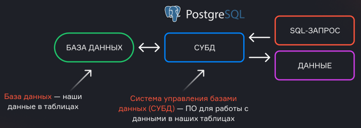
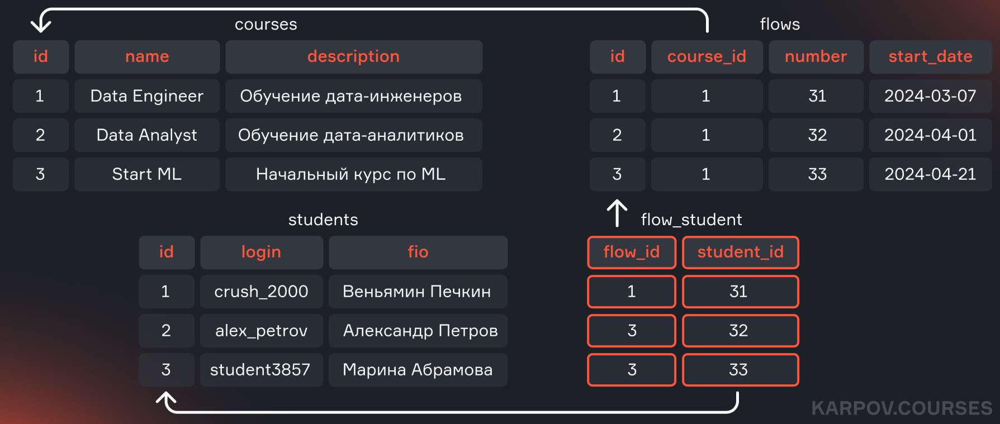
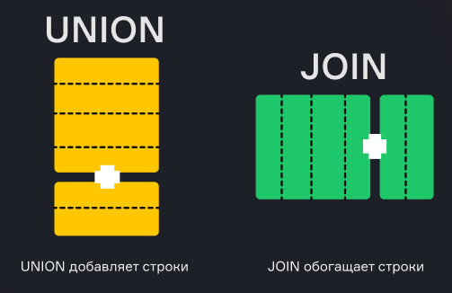

# Lesson 9. Additional SQL Features

*Source: «Урок 9. Дополнительные возможности SQL.pdf» — translated from Russian.*

## Contents

- Views
- Materialized views
- Query optimization
  - Main optimization techniques
  - Optimization examples
- Regular expressions
- Recursive queries
- Interview questions (views)
- Preparing for an interview: problem-solving patterns
- Interview questions
- Summary

---

## Views

When we have several source tables that we join, filter and aggregate, the result of such a query can be used many times, and writing the query out repeatedly can become labour-intensive. In this case we can create a **view** (`VIEW`) based on this query — in effect, give the query its own name. We can then address the view as if it were a table. But in reality a view is not a table: the data is stored in the original source tables. Every time the view is addressed, the same query is executed: joining, filtering, aggregating the data. So no resources are saved, but it is a convenient way to make a query more readable or to provide stakeholders with a convenient view of the result.

Although views, like CTEs, are used for similar purposes, there are differences between them:

- A view can be used in other queries without being defined again (unlike a CTE, which lives within a single query). This is because a view is a physical object in the database and is stored on disk (remember that only the query is stored, not the data that query returns).
- A CTE can be part of a view. This helps, for example, when we need to run a recursive query, which is impossible without using a CTE.

Example of creating a view:

```sql
CREATE VIEW only_human AS
SELECT id, name, status, type, gender, origin_id
FROM characters
WHERE species = 'Human';
```

We create the view with the `CREATE VIEW` statement, specify the name of the view, and then add the `SELECT` query that we want to name. Now we can address this view like a table according to SQL syntax:

```sql
SELECT * FROM only_human;
```

**Advantages:**

- Simplifying work with frequently used queries, since a view can be used in different queries
- Improved readability and convenience when providing data to stakeholders
- A view can be used to restrict certain users' access to the database (we can give users access to particular views that query the data they are allowed to see, without exposing the whole database)

> 💡 Data is not stored in a view. Every time the view is addressed, the source tables are joined, filtered and aggregated anew. So using a view does not save computing resources.

---

## Materialized views

Materialized views look like ordinary ones, but the query results are saved into a physical table (which is stored on disk). They are not supported in all DBMSs, and working with them can differ significantly. For example, in some systems the data is refreshed in real time, in others on a schedule or by a trigger, and some have no such functionality at all. So when working with materialized views you always need to consult the documentation to understand how they are implemented in a specific DBMS.

---

## Query optimization

When we write a query, inside the DBMS engine it goes to the optimizer. The optimizer aims to make the query run faster and with minimal resource consumption. It analyses table statistics, chooses the most suitable indexes and sometimes rewrites the query to improve how it works. How "smart" the optimizer is depends on the specific DBMS: in some cases it is more advanced, in others less so, and in some we can hint to the optimizer which index to use.

Optimal queries are important for several reasons:

1. **Performance:** in production systems every millisecond matters, so that data is returned to the user quickly.
2. **Shared use of resources:** in analytical databases where many users work, resource usage must be minimized so as not to interfere with other users.
3. **Cost saving:** in cloud databases you also pay for the computing resources used, so optimizing queries lets you save money.

There are many ways to optimize queries, but they differ across DBMSs. However, there are several universal approaches, which we will touch on.

### Main optimization techniques

#### Indexes

For a better understanding we can draw an analogy. Imagine a library where you need to find a particular book. Going through the shelves would take a long time, so we turn to the librarian, who uses a card catalogue. In one catalogue the books are sorted by the author's surname, in another by title, in a third by year of publication. Next to each title the shelf where the required book can be found is given. Indexes work in the same way as a card catalogue: they speed up the search for data, but they require storing information and updating it when changes occur.

Creating indexes on all fields of a table is not sensible. First, this increases the disk space used. Second, adding, changing or deleting records makes it necessary to update the indexes. It is better to create indexes on the fields that are frequently used in filtering or in joining tables. The optimizer uses indexes to return the data faster. In different DBMSs indexes work differently, and their use depends on statistics, on the user's hints in queries and on other factors.

#### Analysing the query plan

Analysing the query plan lets you understand exactly how the data is collected, the cost of the query, and which indexes and joins are used. For this, the keyword `EXPLAIN` is added to the query:

```sql
EXPLAIN
SELECT …         -- the query
```

### Optimization examples

Example — filtering by date:

```sql
SELECT *
FROM big_table
WHERE year(date) = '2021';
```

Here the `year()` function is used, and because of it the index on the `date` field does not work. Indexes depend on the specific field, and functions can block them. It is better to use the `BETWEEN` construct:

```sql
SELECT *
FROM big_table
WHERE date BETWEEN DATE '2021-01-01' AND DATE '2021-12-31';
```

This query is less readable but more optimal.

Another example — optimizing joins:

```sql
SELECT *
FROM first_table AS f
JOIN second_table AS s
ON s.id = f.id;
```

If you need to filter the data from the second table, for example by matching the year, it is better to add the condition to `ON` so as to avoid unnecessary filtering after the join:

```sql
SELECT *
FROM first_table AS f
JOIN second_table AS s
ON s.id = f.id AND s.year = '2021';
```

---

## Regular expressions

Regular expressions let you find strings that satisfy given conditions. They are hard to read but useful.

### Examples of use in SQL

- Searching for strings with a case-sensitive match:

```sql
SELECT *
FROM employees
WHERE name ~ '[0-9]';
```

- Case-insensitive match:

```sql
SELECT *
FROM employees
WHERE name ~* 'alice';
```

- Replacing occurrences:

```sql
SELECT regexp_replace(name, 'Ваня', 'Иван', 'g')
FROM employees;
```

The `'g'` flag indicates replacement of all occurrences.

- Extracting matches:

```sql
SELECT regexp_matches(name, '\b[Aa]\w+', 'g')
FROM employees;
```

In different DBMSs regular expressions work slightly differently, but the main principle is the same — searching for, replacing and extracting substrings.

Example of a regular expression that checks whether a password conforms to the rules stated in the expression:

```
^(?=.*[A-Z])(?=.*[a-z])(?=.*\d)(?=.*[@$!%*?&])[A-Za-z\d@$!%*?&]{8,}$
```

This expression checks that the entered password contains:

- At least one capital letter `(?=.*[A-Z])`
- At least one lowercase letter `(?=.*[a-z])`
- At least one digit `(?=.*\d)`
- At least one special character `(?=.*[@$!%*?&])`
- No fewer than eight characters `[A-Za-z\d@$!%*?&]{8,}`

The topic of regular expressions stands a little apart, but it is nevertheless worth diving into. We suggest reading the article by colleagues from Rosbank on Habr.

---

## Recursive queries

Recursion is a function calling itself. In SQL, recursive queries let you collect data in a loop. They are useful for building hierarchies, such as organizational structures, or for obtaining ordered lists (for example, all dates in a period).

Example of a recursive query in PostgreSQL:

```sql
WITH RECURSIVE numbers AS (
    SELECT 1 AS num
    UNION ALL
    SELECT num + 1
    FROM numbers
  WHERE num < 20
)
SELECT num FROM numbers;
```

This query creates a list of numbers from 1 to 20. The initial value is 1, then 1 is added in a loop until we reach 20.

Another example — obtaining all dates in a particular period:

```sql
WITH RECURSIVE dates AS (
    SELECT '2027-01-01'::DATE AS date
    UNION ALL
    SELECT date + INTERVAL '1 day'
    FROM dates
  WHERE date < '2027-03-31'::DATE
)
SELECT date FROM dates;
```

This query returns all dates from 1 January to 31 March 2027.

---

## Interview questions

**1. What are views used for?**

Views simplify collecting data from the same source tables, reducing the amount of identical code.

**2. How does a materialized view differ from an ordinary one?**

A materialized view is a physical table that is refreshed on a certain event, unlike an ordinary view, which is simply a named query.

**3. What happens if the schema of the table a view is built on changes?**

The view will break, and it will have to be re-created using `DROP VIEW` and `CREATE OR REPLACE VIEW`.

---

# Preparing for an interview

## Problem-solving patterns

In this lesson we will go through the main patterns for writing SQL queries, which will be useful both in interviews and at work.

### Number of records per day

The first pattern lets you determine how many records arrived on each of the days. For this we use the following query:

```sql
SELECT date,
          COUNT(1)
     FROM orders
    GROUP BY date
    ORDER BY date DESC;
```

This pattern lets you notice a critical drop in the number of records in a table. We group the data by day, count the number of records for each day and sort the result in reverse order, so that the most recent dates are shown first. This helps to visually identify the days when the number of records decreased, and to understand the reasons: perhaps more customers arrived, or there was churn, or an integration problem occurred. This way we can more precisely determine on which day it happened.

### Detecting missing dates in a sequence

A more complex variant of the pattern above is detecting gaps in a sequence.

```sql
WITH RECURSIVE dates AS (
       SELECT '2027-01-01'::DATE AS date
       UNION ALL
       SELECT date + INTERVAL '1 day'
       FROM dates
       WHERE date < '2027-03-31'
)
SELECT o.date,
       COUNT(1)
    FROM dates
    LEFT JOIN orders AS o
       ON dates.date = o.date
    GROUP BY o.date
    ORDER BY date DESC;
```

In this query we recursively create a list of all dates and overlay on it the table with records for specific days. The difference from the previous query is that here we will see not only a drop or a rise in the number of rows, but also the absence of records for particular days. This lets us identify the dates on which there are no records.

Let us look at how this can be done on our data.

Let us take the episodes table. If episodes were released every day or several times a day, the query could look like this:

```sql
SELECT date_trunc('month', air_date)::date AS month, COUNT(1)
  FROM episodes
    GROUP BY date_trunc('month', air_date)
    ORDER BY 1 DESC;
```

This query shows all dates. Note the date formatting — Redash interprets the date as 01/09/21, although it is stored as 2021-09-01. Here we see, sorted in reverse order, the months and the number of episodes released in each month.

Now let us create a recursive query:

```sql
WITH RECURSIVE date_series AS (
       SELECT DATE '2013-12-01' AS first_day
       UNION ALL
       SELECT (first_day + INTERVAL '1 month')::date
       FROM date_series
     WHERE first_day < DATE '2021-09-01'
)
SELECT first_day, COUNT(e.id)
   FROM date_series
   LEFT JOIN episodes AS e
     ON first_day = date_trunc('month', air_date)::date
  GROUP BY first_day
  ORDER BY first_day DESC;
```

The first air date of the series is December 2013, so we start from 2013-12-01 and cast it to the `date` type for convenience. Then we add one month to the date and select the date of the last episode in the database — that is September 2021. This way we get a list of dates. Next we attach the episodes table to these dates with a `LEFT JOIN`, so as not to lose a single date. The cast of the episode date to the `date` type we take from the previous query. After that we will see not only the months in which episodes were released, but also the months in which there was not a single episode, which lets us reveal gaps in the data.

### Counting types of records in a field

The next pattern comes in handy if we need to find out in a single query how many records of different types a table contains. For example, we have a users table and we want to know the number of users with a basic and with an extended subscription.

In the query below we want to find out how many men and women have used your product:

```sql
SELECT COUNT(1) AS all_cnt,
        SUM(CASE WHEN sex = 'male'   THEN 1 ELSE 0 END) AS male_cnt,
        SUM(CASE WHEN sex = 'female' THEN 1 ELSE 0 END) AS female_cnt
   FROM people;
```

In the first line we return the total number of records in the table, in order to check for empty fields or fields with other values. Then we use the `CASE` construct: if the user's sex equals `male` we put a one, otherwise a zero; in the third field we do the opposite. Finally we sum the number of ones. This way we get the total number of users, of men and of women in a single query, without `UNION` and without grouping.

### Anti-join

The next pattern is often called an anti-join. When using a left or right join we join one table with another, but sometimes we are interested in the rows for which there are no matches in the second table. This may be needed, for example, to get a list of customers who have not made a single purchase. In that case we use a `LEFT JOIN` and exclude the rows that have matches in the second table.

```sql
SELECT a.*
  FROM table_a AS a
  LEFT JOIN table_b AS b
    ON a.id = b.id
  WHERE b.id IS NULL;
```

This is what is called an anti-join. Its logic can be implemented via `NOT EXISTS`. Although an anti-join is not an official type of join, you can mention it in an interview if needed.

### Duplicates in a table

The next pattern lets you find duplicates in a table. For example, you give a large discount on the first purchase, a user registers and receives the discount. But suddenly you forgot to add a check for an existing e-mail in the database. What should you do? First we add the check at registration, and then we run the following query to detect duplicates:

```sql
SELECT email, COUNT(1)
   FROM customers
GROUP BY email
HAVING COUNT(1) > 1;
```

We group rows by e-mail and keep only those whose count is greater than one. This gives you a list of e-mails with duplicates. What to do with them next is up to you: you can merge or delete the extra records.

### Lost data

The next pattern we will look at through an example. Imagine that we have a user's shopping basket, but someone accidentally deleted it. We want to restore the basket from the table of user action logs. An example of the structure of such a table:

| date | user_id | item_id | in_out |
|---|---|---|---|
| 2024-03-02 | 1 | 2 | in |
| 2024-03-03 | 1 | 1 | in |
| 2024-03-05 | 1 | 1 | out |
| 2024-03-05 | 1 | 2 | out |
| 2024-03-08 | 1 | 4 | in |
| 2024-03-09 | 1 | 3 | in |
| 2024-03-11 | 1 | 2 | in |

We have the date, `user_id`, `item_id`, and the action `in_out`, indicating the addition or removal of an item from the basket. In the end we want to get the following table:

| user_id | item_id | in_out |
|---|---|---|
| 1 | 2 | out |
| 1 | 1 | in |
| 1 | 4 | in |
| 1 | 3 | in |

For each item we are interested in the last action. For example, item 2 was removed from the basket, while items 1, 4 and 3 remained. What is the simplest way to do this? There are several ways, including the use of analytic functions, but the simplest approach is the following:

```sql
SELECT user_id, item_id,
       SUBSTR(MAX(CONCAT(date::text, in_out)), 10)
    FROM basket
  GROUP BY user_id, item_id;
```

We take the basket and group it by `user_id` and `item_id`. Then we combine the date and the `in_out` field into a text string. After that we look for the maximum among these values. Obviously, the maximum is determined by the date. Once we have found the maximum, `SUBSTR` takes the `in_out` value starting from the tenth character — that is, we do not have to look for, say, the first or the last record; we simply compare the concatenated strings and take the maximum value. This gives us information about the last action for each item in the basket.

---

## Interview questions

### In what order are statements executed in SQL?

Inside the DBMS, the operators in a query are executed in a certain order. It happens in the following order:

1. **FROM:** the DBMS engine first determines which tables the data will be extracted from.
2. **ON:** then the join conditions given in the `ON` part are processed, where filtering happens before the join itself is performed.
3. **JOIN:** the table join operation is executed, combining the data based on the specified conditions.
4. **WHERE:** at this stage the rows satisfying the query's conditions are filtered.
5. **GROUP BY:** the rows are grouped by the specified columns so that aggregate functions can subsequently be applied.
6. **HAVING:** filtering is applied to the aggregated data; groups that do not satisfy the conditions are cut off.
7. **SELECT:** the specific columns given in the query are extracted to form the final data set, and operations on the data are performed if necessary.
8. **DISTINCT:** duplicates are removed from the results, if this is necessary.
9. **ORDER BY:** the data is sorted by the specified columns in the required order.
10. **LIMIT/OFFSET:** the rows for output are finally determined, the number of returned results is restricted, and the selection is made with the specified offset.

This sequence explains how the DBMS engine processes queries. Knowing the order of execution of statements lets you structure queries optimally and process data efficiently.

To simplify understanding of the sequence of operator execution in an SQL query, imagine that we are working with two large stacks of documents. First we filter out and remove unnecessary pages, then we combine them, group them by certain features, mark the important elements, and finally order and shorten them as needed.

### What is the difference between a database and a database management system (DBMS)?

A database and a database management system (DBMS) are two interrelated but different concepts:

- **A database** is an organized collection of data that is stored and managed in digital form. This is the data itself that is being worked with.
- **A DBMS** is software that manages the database and provides access to it. A DBMS provides an interface for performing operations on the data, such as creating, reading, updating and deleting. It also takes care of such aspects as data integrity, transaction management, security, access control and query execution.



An example of a DBMS is PostgreSQL, which we have already worked with. A DBMS frees the user from having to deal with low-level data management tasks, allowing them to focus on analysing and processing the data.

### How is a "many-to-many" relationship implemented in SQL?

A "many-to-many" relationship between two tables in a relational database is implemented with a third table, called a relationship table or a junction table.

Here is what the different types of relationships look like:

- **One-to-one:** each record in one table corresponds to one record in another table. In most cases such tables can be merged into one without changing the number of rows.
- **One-to-many:** each record in the parent table can have many related records in the child table. This is the classic relationship between tables, where, for example, one customer can have several orders.
- **Many-to-many:** any record from one table can correspond to many records in another table and vice versa. To implement this relationship a third table is added, which contains the foreign keys of both tables, linking them to each other.

**Example:**

Suppose we have the tables `students`, `courses` and `flows`. Each student can enrol on several courses and belong to different flows. To implement the "many-to-many" relationship, the table `flow_student` is created, which contains the columns `student_id` and `flow_id` — foreign keys linking students and flows.



Thus a "many-to-many" relationship is organized with an intermediate table storing all possible combinations of records between the two main tables.

### What are aliases for?

Aliases (or pseudonyms) are used to temporarily assign names to tables or columns in SQL queries in order to simplify working with the data and improve the readability of queries. There are two types of aliases:

1. **Column aliases** — let you rename columns in the resulting data set, which makes the query results easier to perceive and understand. For example, instead of outputting a column named `total_sales`, you can use the more understandable name `Total Sales`.

```sql
SELECT total_sales AS "Total Sales"
  FROM Sales;
```

2. **Table aliases** — used to shorten table names, especially in queries with joins, where there may be several tables with identically named columns. Aliases make queries easier to write and make it easier to understand which table the data is taken from.

```sql
SELECT s.name, c.course_name
  FROM Students AS s
  JOIN StudentCourses AS sc ON s.student_id = sc.student_id
  JOIN Courses AS c ON sc.course_id = c.course_id;
```

Using aliases in queries increases their readability and clarity, especially when working with large and complex data sets.

### How do you find the second highest salary in a table?

To find the second highest salary in a table you can use a combination of the `ORDER BY`, `OFFSET` and `LIMIT` operators. Example SQL query:

```sql
SELECT salary
    FROM Employees
ORDER BY salary DESC
OFFSET 1
   LIMIT 1;
```

This query sorts salaries in descending order and skips the first row (`OFFSET 1`), then returning one row (`LIMIT 1`) — that is, the second highest salary.

However, it is important to clarify with the stakeholder how to handle cases where several employees have the same highest or second highest salary. If there are several such employees, it may be necessary to use analytic functions such as `DENSE_RANK()` or `ROW_NUMBER()` to identify the second highest salary more precisely:

```sql
SELECT DISTINCT salary
FROM (
    SELECT salary, DENSE_RANK() OVER (ORDER BY salary DESC) AS rank
       FROM Employees
) ranked_salaries
WHERE rank = 2;
```

This query uses the `DENSE_RANK()` function, which assigns ranks to salaries, and selects those that have the second rank.

### How does `JOIN` differ from `UNION`?

`JOIN` and `UNION` are two different operations used in SQL for working with several tables, but their application and results differ.



- **`JOIN`:** combines rows from two or more tables based on a logical condition defined via the `ON` operator. `JOIN` works with horizontal combination of data, enriching rows from one table with information from another.
  - Example of using `JOIN`: joining the `Employees` and `Departments` tables to obtain information about employees and their departments:

```sql
SELECT e.name, d.department_name
  FROM Employees e
  JOIN Departments d ON e.department_id = d.id;
```

In this example, every row in the `Employees` table is joined with the corresponding row from the `Departments` table based on the department identifier (`department_id`).

- **`UNION`:** combines the results of two or more SQL queries into one result set. `UNION` works with vertical combination of data, stacking rows from different queries. Duplicate rows are automatically removed if there are any. To keep all rows, including duplicates, `UNION ALL` is used.
  - Example of using `UNION`: combining lists of customers from two different tables `Customers_2023` and `Customers_2024`:

```sql
SELECT customer_name, email FROM Customers_2023
UNION
SELECT customer_name, email FROM Customers_2024;
```

In this case the data from both queries is combined into one result set, excluding duplicate rows. `UNION` requires the number and the order of columns in the combined queries to match.

### What kinds of `JOIN` besides `OUTER` and `INNER` do you know?

In SQL, besides `OUTER` and `INNER`, there are several kinds of join operations, each with its own purpose and specifics:

- **`CROSS JOIN`:** creates the Cartesian product of two tables — that is, every row of the first table is joined with every row of the second table. The result contains all possible combinations of rows.

```sql
SELECT e.name, d.department_name
FROM Employees e
CROSS JOIN Departments d;
```

- **`SELF JOIN`:** this is joining a table with itself. It is used, for example, to find relationships between records in a single table, such as hierarchies.

```sql
SELECT e1.name AS Employee, e2.name AS Manager
FROM Employees e1
JOIN Employees e2 ON e1.manager_id = e2.id;
```

- **Anti-Join:** this type of join lets you find rows in one table for which there are no corresponding rows in another table. In SQL an anti-join is often implemented using a `LEFT JOIN` combined with a `WHERE` clause selecting `NULL` values.

```sql
SELECT Employees.name
FROM Employees
LEFT JOIN Departments ON Employees.department_id = Departments.id
WHERE Departments.id IS NULL;
```

An anti-join is not officially singled out as one of the join types, but the concept is sometimes used and it is worth knowing.

### How does `COUNT(1)` differ from `COUNT(*)` and `COUNT(Name)`?

In SQL, the `COUNT()` functions are used to count the number of rows or values in a data set, but they have different specifics depending on the parameters:

- **`COUNT(*)`:** counts the number of rows in the result set, including rows with `NULL` values. When `COUNT(*)` is used, the engine processes all columns in the table, looking at their values.

```sql
SELECT COUNT(*) FROM Employees;
```

- **`COUNT(1)`:** works in the same way as `COUNT(*)`, counting the number of rows in the table. However, the DBMS engine no longer checks all the columns, so using a constant as the argument as a rule leads to a reduction in query execution time.

```sql
SELECT COUNT(1) FROM Employees;
```

- **`COUNT(Name)`:** counts the number of non-empty (`NOT NULL`) values in the specified column `Name`. This is useful when you need to know the number of filled-in records in a particular column.

```sql
SELECT COUNT(Name) FROM Employees;
```

So `COUNT(*)` and `COUNT(1)` count all rows, while `COUNT(Name)` counts only the rows with non-empty values in the column `Name`.

### How does `WHERE` differ from `HAVING`?

`WHERE` and `HAVING` are SQL operators used to filter data, but they are applied at different stages of query processing:

- **`WHERE`:** used to filter rows before the data is grouped and aggregate functions are applied. `WHERE` sets the conditions that rows from the source data set must satisfy.

```sql
SELECT * FROM Employees
WHERE department_id = 1;
```

- **`HAVING`:** applied to filter data after grouping has been performed — that is, to select groups satisfying certain conditions. It is used in combination with `GROUP BY`.

```sql
SELECT department_id, COUNT(*) as num_employees
FROM Employees
GROUP BY department_id
HAVING COUNT(*) > 10;
```

Both operators can be used simultaneously in a single query if it is necessary to filter data both before and after grouping:

```sql
SELECT department_id, COUNT(*) as num_employees
FROM Employees
WHERE salary > 50000
GROUP BY department_id
HAVING COUNT(*) > 10;
```

Note that filtering data by non-aggregated values can be done either in the `WHERE` block or in the `HAVING` block. For example, the result of the following queries will be the same:

```sql
SELECT sex, COUNT(user_id)
FROM users
WHERE sex != 'male'
GROUP BY sex
```

```sql
SELECT sex, COUNT(user_id)
FROM users
GROUP BY sex
HAVING sex != 'male'
```

However, it is recommended to filter by non-aggregated data specifically in the `WHERE` block, that is, in advance. In that case the unnecessary data is removed from the calculations before grouping, and computing resources are not spent on counting values that you are going to filter out later anyway. This is an important point regarding SQL query optimization.

### What is a subquery and when should it be used?

A subquery is a query that is executed inside another query. It is used to work with data that was obtained or computed in another query. Subqueries can be useful in situations where additional processing or filtering of data that has already been extracted or aggregated is needed. Although most subqueries can be replaced by joins, sometimes this leads to such complex and confusing constructs that they become hard to read and understand.

Example — getting the names of the employees with the highest salary:

```sql
SELECT name
FROM Employees
WHERE salary = (SELECT MAX(salary) FROM Employees);
```

Subqueries are a powerful tool, since they let you easily use the results of one query in another, and they can be applied in practically any part of an SQL query.

### How do aggregate, analytic and window functions differ?

**Aggregate functions** serve to compute aggregated values such as a sum, a count, an average or a maximum. For this the data is grouped by one or several fields, and then the aggregate is computed over each group. An example would be finding the total sum of sales for each region.

**Analytic and window functions** are in fact the same type of function in SQL, and there is no difference between them. These functions let you perform complex calculations and add the results to every row in the data set without losing information about the rows themselves. Unlike aggregate functions, which reduce the number of rows in the query result, analytic and window functions return all rows of the source table, adding the results of the calculations to each row. For example, they can be used to compute a moving average, a ranking or a cumulative sum.

### How do DELETE and TRUNCATE differ?

The DELETE and TRUNCATE operations are used to delete data from tables, but they function differently.

- **DELETE** deletes rows from a table row by row and is usually used with filter conditions to delete particular records. You can delete all records from a table using `DELETE`, but this process will be slower, since every row is deleted separately, which takes more time and resources.
- **TRUNCATE**, on the other hand, clears the whole table at once, effectively "throwing out" all of its contents. This is a faster and more efficient method of deleting all data from a table, since row-by-row deletion does not happen. `TRUNCATE` should be used when you need to fully clear a table of data without keeping information about the specific deleted rows.

That brings the theoretical part to an end. It should be remembered that SQL, like the other tools of a data engineer, requires practice. So we strongly recommend going through our free SQL simulator, which will let you review the material covered and consolidate your knowledge. May the skills you have mastered in this block help you pass any interview successfully and give you confidence in a new workplace.

---

## Summary

1. **A view** is a table that does not store data but retrieves it from other tables when needed. So using a view does not save computing resources. Views are used for convenience and to improve the readability of queries.

2. **Materialized views** look like ordinary ones, but the query results are saved into a physical table (which is stored on disk). They are not supported in all DBMSs, and working with them can differ significantly.

3. **Query optimization** lets you improve system performance, optimize their shared use, and also save computing resources.

   The main ways of optimizing queries:

   - **Indexes** — data structures used to speed up searching and sorting of data in tables. They are created on one or several columns of a table and let you quickly find rows without having to scan the whole table.
   - **Analysing the query plan** — lets you understand how a query is executed under the hood of the DBMS and the approximate resources spent (the cost of the query).

4. **Regular expressions** let you find strings that satisfy given conditions.

5. **Recursive queries** in SQL let you collect data in a loop. They are useful for building hierarchies, such as organizational structures, or for obtaining ordered lists (for example, all dates in a period).
